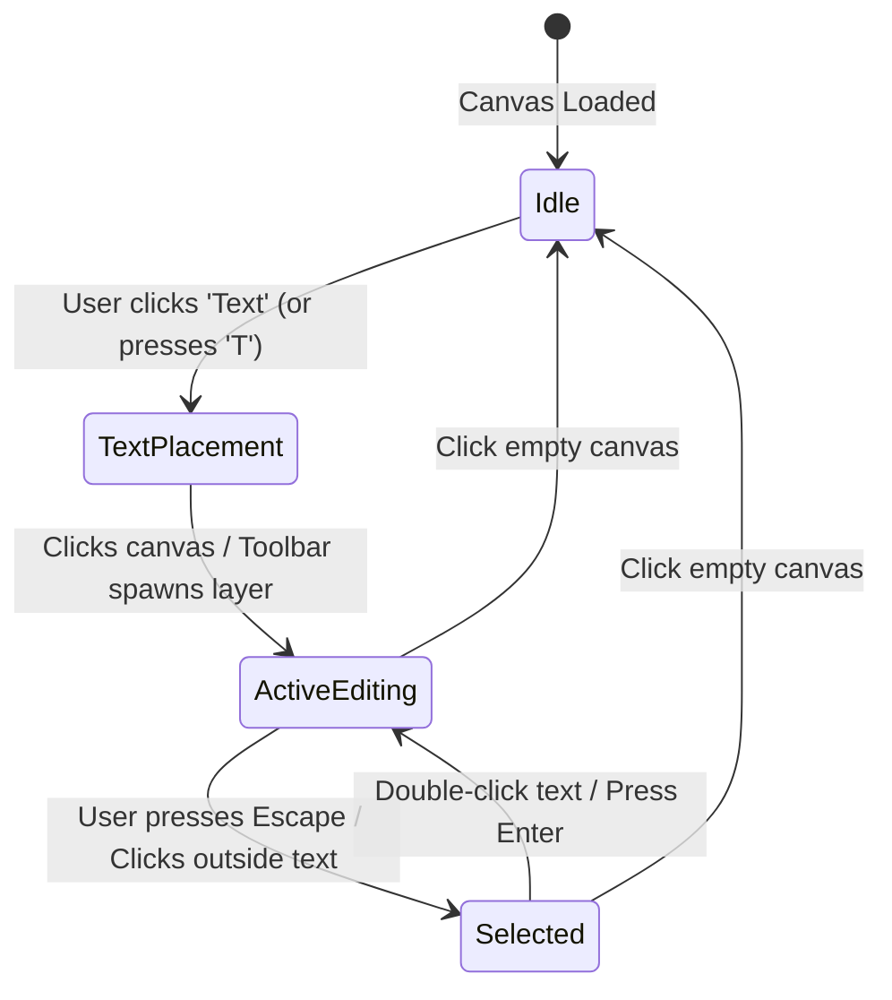

# CANVAS_UX_SPEC.MD: Figma-Grade Canvas UX & Contextual Micro-Interactions

This document specifies the complete canvas interaction model, contextual micro-interactions, state machines, and mathematical models for **Motion Studio (Choreo)**. It reflects the modern, friction-free paradigms of **Figma, FigJam, Miro, and Jitter.video**, prioritizing immediacy, visual proximity, and zero cognitive overhead.

---

## 1. Core Philosophy: "Proximity Over Distance"

In traditional tools, changing a font size or text color requires a 1000px mouse trip to a distant right sidebar. In high-velocity creative workflows:
* **90% of styling and manipulation occurs directly on-canvas** via a **Contextual Floating Action Bar (HUD)** that follows the active element.
* The **Right Sidebar** is reserved for advanced, comprehensive property tweaking (exact letter-spacing, advanced CSS, shadows, procedural timing curves).
* **Creation is 1-click immediate**: Tools never present interrogating dropdowns (e.g. "Do you want a Heading or Body?"). The user types first; styling follows in-place.

---

## 2. Contextual Floating Action Bar (HUD) Specification

When an element is selected or actively edited on the canvas, a sleek pill-shaped toolbar automatically docks **10px above the top-center of the layer** (or flips 10px below if the layer is within 60px of the canvas top edge).

```
┌────────────────────────────────────────────────────────────────────────────────────────┐
│  (●)▾  │  Aa ▾  │  Small ▾  │  B   S̶   ⚡ Chunks  │  ≡ ▾  │  Pop In ▾  │  ⧉   🗑        │
└────────────────────────────────────────────────────────────────────────────────────────┘
                                     │ (10px gap)
                           ┌─────────┴─────────┐
                           │ |Add text         │  <-- Active text box
                           └───────────────────┘
```

### Visual Token Styling:
* **Background**: `bg-[#111111]/95 backdrop-blur-md` (Night Card).
* **Border**: `border border-[#222222]` (Night Line 1px hairline rule).
* **Shadow**: `shadow-2xl shadow-black/80`.
* **Shape**: `rounded-full px-2.5 py-1.5 flex items-center gap-1`.
* **Z-Index**: `z-50` (floats above bounding box and canvas content).

---

### A. Contextual Controls by Element Type

#### 1. Text Layer (Single Text or Chunk)
| Control | Icon / UI | Interaction & Function |
| :--- | :--- | :--- |
| **Color Swatch** | `(●) ▾` | Round 16px color circle filled with current text color + mini chevron. Clicking opens a compact 6-swatch popover (`#eee8d5`, `#e8c547`, `#f5f0e8`, `#ef4444`, `#34d399`, `#0a0a0a`) + hex input. |
| **Font Family** | `Aa ▾` | Dropdown showing current font (`Inter`, `Roboto`, `Space Grotesk`, `Playfair Display`, `JetBrains Mono`). Live preview on hover. |
| **Font Size Preset** | `Small ▾` | Presets dropdown matching FigJam/Miro:<br>• `Tiny` (16px)<br>• `Small` (24px)<br>• `Medium` (36px)<br>• `Large` (54px)<br>• `Title` (72px)<br>• `Hero` (96px)<br>Also accepts direct numeric input. |
| *Divider* | `│` | 1px vertical hairline rule (`bg-[#222222] h-4`). |
| **Bold Toggle** | `B` | Toggles `fontWeight: 700` vs `fontWeight: 400`. Active state highlighted in Stamp Gold (`#e8c547`). |
| **Strikethrough** | `S̶` | Toggles `textDecoration: line-through`. |
| **Kinetic Splitter** | `⚡ Chunks` | **Motion Studio Standout**: 1-click splits paragraph into kinetic chunks, wraps in flex container, and applies cascade stagger! |
| *Divider* | `│` | 1px vertical hairline rule. |
| **Text Alignment** | `≡ ▾` | Dropdown or cycle button for `Left`, `Center`, `Right`. |
| **Quick Animate** | `Pop In ▾` | Quick-swap entrance animation preset (`None`, `Pop In`, `Fade`, `Slide Up`, `Blur In`) without opening Animate mode. |
| **Micro-Actions** | `⧉   🗑` | Duplicate (`Ctrl+D`) and Delete (`Del`). |

#### 1B. Substring Highlighted (When User Drags to Select Text in a Paragraph)
When a user highlights a specific text span (e.g. dragging mouse over `"I've got something big for you"`):
The floating bar immediately morphs to prioritize span-level operations:
| Control | Icon / UI | Interaction & Function |
| :--- | :--- | :--- |
| **Split Selection** | `✂ Split into Chunk` | **1-Click Extraction**: Converts the highlighted text span into its own independent `<Chunk>` layer inside the parent `<Group>`, leaving prefix and suffix as siblings with 0px visual shift! |
| **Highlight Color** | `(●) ▾` | Applies distinct color (e.g. Stamp Gold `#e8c547`) to the selected text segment. |
| **Bold Selection** | `B` | Bolds only the selected text segment. |
| **Span Preset** | `Pop In ▾` | Assigns a staggered entrance animation specifically to this segment. |

#### 2. Shape / Card Container (`<Shape>` or `<Group>`)
| Control | Icon / UI | Interaction & Function |
| :--- | :--- | :--- |
| **Fill Color** | `(●) ▾` | Fill swatch with transparency slider and palette. |
| **Border / Stroke** | `▢ ▾` | Border color and width (0px, 1px, 2px, 4px). |
| **Corner Radius** | `╭╮ ▾` | Pill toggle: Sharp (0px), Subtle (8px), Card (20px), Full Pill (9999px). |
| **Divide Card** | `◫ Split Columns` | Divides card horizontally or vertically into 2 equal sibling container columns with configurable gap. |
| **Auto-Fit (FLIP)** | `📐 Auto-fit` | (For Groups) Toggles FLIP reactive morphing as children animate in. |
| **Auto-Link (🔗)** | `🔗 Cascade` | (For Groups) Toggles ripple stagger timing on child tracks. |
| **Quick Animate** | `Slide Up ▾`| Quick motion preset picker. |
| **Micro-Actions** | `⧉   🗑` | Duplicate (`Ctrl+D`) and Delete (`Del`). |

#### 3. Multi-Selection (2+ Layers Selected)
| Control | Icon / UI | Interaction & Function |
| :--- | :--- | :--- |
| **Group Selection** | `⊞ Group (Ctrl+G)` | Wraps selected items in a `<Group>` container with unified bounding box. |
| **Align Horizontal** | `⇤  ⇥  ⇿` | Align Left, Align Center, Align Right. |
| **Align Vertical** | `⤓  ⤒  ⇕` | Align Top, Align Middle, Align Bottom. |
| **Distribute** | `⋮⋮ Distribute` | Equalizes horizontal or vertical gap between items. |
| **Batch Preset** | `⚡ Stagger ▾` | Applies staggered entrance animations across all selected items. |
| **Delete** | `🗑` | Deletes all selected layers (`Del`). |

---

## 3. Text Tool & Inline Caret Lifecycle

### A. Point Text vs Area Text (Figma Standard)
1. **Single Click on Canvas (`Point Text`)**:
   * Creates an **Auto-Width** text layer.
   * Text expands horizontally as the user types; wraps only when user hits `Enter`.
   * Default text: `"Add text"`.
2. **Click & Drag on Canvas (`Area Text`)**:
   * Creates a **Fixed-Width** text layer matching the drag rectangle.
   * Text automatically wraps to the next line when reaching the right boundary.

### B. The 4-State Text Interaction Machine



1. **State 1: Idle**:
   * Standard selection pointer. Elements render naturally without bounding boxes.
2. **State 2: Text Tool Active (`T`)**:
   * Cursor changes to text crosshair (`cursor: text`).
   * Clicking anywhere on the canvas instantly instantiates a text layer at `(clickX, clickY)` and transitions directly into **ActiveEditing**.
   * Clicking the "Text" button in the bottom dock spawns text at the center of the current canvas viewport and transitions to **ActiveEditing**.
3. **State 3: ActiveEditing**:
   * Content is an editable `<textarea>` or `contenteditable` span with identical typography styles.
   * The text `"Add text"` is highlighted by default on creation, so the user's first keystroke replaces it.
   * A blinking vertical cursor `|` is active.
   * Bounding box handles are hidden to avoid visual vibration.
   * Contextual Floating Action Bar is docked 10px above the text.
   * Native text selection (drag to highlight words, double-click word, arrow keys, Backspace, Ctrl+A) works flawlessly.
4. **State 4: Selected (Resting State)**:
   * 1px bounding ring appears around the text with 8 resize handles.
   * Contextual Floating Action Bar remains visible above the text.
   * User can drag to reposition or grab handles to resize.
   * **Double-clicking** directly re-enters **ActiveEditing** with the cursor placed at the clicked character.

### C. The Universal Splitting Architecture: How "Split" Works for Every Element Type

Splitting is one of Motion Studio's primary differentiators. Rather than an ambiguous generic action, **Split is designed with distinct, predictable semantics for every single element type**:

```
1. TEXT (Highlight-to-Split):
   [ "Hey Team, " ] + [ HIGHLIGHTED: "I've got something big" ] + [ " for you!" ]
                               │
                               ▼ 1-Click Split Selection
   ┌─ <Group layout="flex-row wrap" autoLink=true> ─────────────────────────────┐
   │  Chunk 1: "Hey Team, "                                                     │
   │  Chunk 2: "I've got something big"   <-- Distinct layer! Stamp Gold & Pop  │
   │  Chunk 3: " for you!"                                                      │
   └────────────────────────────────────────────────────────────────────────────┘

2. TEXT (Split at Caret):
   "Hello World|This is Choreo"  ──▶  Chunk 1: "Hello World" + Chunk 2: "This is Choreo"

3. GROUP / CONTAINER (Extract & Dissolve):
   Select child in group  ──▶  "Extract from Group": Child becomes independent root layer
   Select group           ──▶  "Ungroup" (Ctrl+Shift+G): Dissolves group, keeps layer positions

4. CARD / SHAPE (Divide Container):
   [     Card Container     ]  ──▶  [ Col 1 (50%) ] [gap] [ Col 2 (50%) ]

5. TIMELINE ANIMATION CLIP (Razor Cut at Playhead):
   [==== 0.0s - 3.0s (Pop In) ====]  ──(Playhead at 1.2s)──▶  [0.0-1.2s] + [1.2-3.0s]
```

#### 1. Text Layer Splitting
* **Case 1: Highlight-to-Split (The Primary Workflow)**:
  * User drags cursor across any span of words or characters in a text layer.
  * Browser registers range $[i_{\text{start}}, i_{\text{end}}]$.
  * The Contextual Floating HUD (and Right-Click menu) shows `[ ✂ Split Selection ]`.
  * Clicking it slices the text into 3 parts (Prefix, Selected Span, Suffix).
  * The original `<TextLayer>` is converted into a `<Group>` container with `display: flex, flexWrap: wrap`.
  * The 3 parts become sibling `<Chunk>` layers inside that group.
  * **0px Layout Jump Guarantee**: Spacing, font styles, line breaks, and relative positioning are mathematically preserved.
  * The selected chunk is automatically assigned a stagger delay and can be styled (e.g. Stamp Gold) independently.
* **Case 2: Split at Cursor / Caret (`Ctrl+Enter`)**:
  * User clicks between two words without highlighting a range.
  * Pressing `Ctrl+Enter` or selecting "Split at Cursor" cuts the sentence into Chunk A (before caret) and Chunk B (after caret).
* **Case 3: Split into Lines (`Ctrl+Shift+L`)**:
  * Cuts text by newline `\n` into a vertical flex column of chunks.
* **Case 4: Split into Words (`Ctrl+Shift+W`)**:
  * Cuts every word into its own chunk inside a wrapping flex row for kinetic lyric/subtitle effects.
* **Case 5: Merge Sibling Chunks (`Alt+[` or `Alt+]`)**:
  * The reverse of split: selects two sibling chunks and merges their text back into a single unified chunk.

#### 2. Group / Container Splitting
* **Extract Child from Group (`Ctrl+Shift+E`)**:
  * Moves the selected child out of the flex container onto the parent canvas, translating its relative coordinate $(x_{\text{rel}}, y_{\text{rel}})$ to canvas absolute coordinate $(x_{\text{group}} + x_{\text{rel}}, y_{\text{group}} + y_{\text{rel}})$ with zero visual jump.
* **Ungroup / Dissolve (`Ctrl+Shift+G`)**:
  * Completely dissolves the parent `<Group>` container and promotes all child layers to root canvas layers.

#### 3. Card & Shape Splitting (Container Grid Division)
* **Split Card into Columns (`◫ Split Columns`)**:
  * Divides a card shape horizontally into 2 equal sibling columns with the active flex gap (e.g., two 50% width cards).
  * Ideal for instantly creating side-by-side pricing tables, feature comparisons, or split-screen motion cards.

#### 4. Timeline Animation Clip Splitting (Playhead Razor Cut)
* **Split Clip at Playhead (`Ctrl+K` or `✂`)**:
  * When scrubbing the timeline in Animate Mode, positioning the playhead over an animation block and pressing `Ctrl+K` slices the animation into two sequential timing clips.
  * Clip 1: start offset $T_0 \to T_{\text{playhead}}$.
  * Clip 2: start offset $T_{\text{playhead}} \to T_{\text{end}}$.
  * Enables chaining two different motion presets or speeds sequentially on the same layer without keyframe expression spaghetti!

---

## 4. Non-Blocking Bounding Box (`TransformBox`) Architecture

### The Problem in Legacy Code:
In the previous implementation, `TransformBox` rendered a full-size invisible `cursor-move` div over the entire bounding box with `pointer-events: auto`. This acted as a "glass shield" that swallowed all mouse events, preventing the user from clicking into the text or double-clicking.

### The Non-Blocking Solution:
1. **Hollow Interior**:
   * The bounding box container has `pointer-events: none`.
   * Mouse clicks inside the element pass directly through to the underlying `<TextRenderer>`, `<ShapeRenderer>`, or `<GroupRenderer>`.
2. **Interactive Perimeter Only**:
   * Only the 8 resize handles (4 corners, 4 edges) and the top rotation pin have `pointer-events: auto`.
   * The 1px outline has a 4px transparent stroke padding for easy edge-grabbing.
3. **Double-Click Forwarding**:
   * If the user double-clicks anywhere on the boundary or element, the system calls `setEditingLayerId(layer.id)` to instantly initiate text editing.

---

## 5. Canvas Navigation & Zoom Engine

### A. Mathematical Formulation for Cursor-Centered Zoom
When zooming with a trackpad pinch or mouse wheel, the point on the canvas directly beneath the cursor must remain stationary relative to the screen.

Let:
* $(M_x, M_y)$ be the mouse position relative to the canvas viewport center.
* $S_{\text{old}}$ be the current effective scale, and $S_{\text{new}}$ be the target scale.
* $(P_x, P_y)$ be the current canvas pan offset.

The compensated pan coordinates $(P_x', P_y')$ are calculated as:

$$P_x' = M_x - (M_x - P_x) \times \frac{S_{\text{new}}}{S_{\text{old}}}$$

$$P_y' = M_y - (M_y - P_y) \times \frac{S_{\text{new}}}{S_{\text{old}}}$$

### B. Event Handling Matrix
| Gesture / Input | Event Detected | Action Executed |
| :--- | :--- | :--- |
| **Trackpad 2-finger Pinch** | `wheel` with `e.ctrlKey === true` | Smooth cursor-anchored zoom in/out with continuous scaling ($0.2\times$ to $4.0\times$). |
| **Mouse Wheel + Ctrl** | `wheel` with `e.ctrlKey === true` | Smooth cursor-anchored zoom in/out. |
| **Trackpad 2-finger Scroll** | `wheel` with `e.ctrlKey === false` | Smooth 2D pan: $P_x \mathrel{-}= \Delta X$, $P_y \mathrel{-}= \Delta Y$. |
| **Mouse Wheel (No Ctrl)** | `wheel` with `e.ctrlKey === false` | Vertical pan ($P_y \mathrel{-}= \Delta Y$). With `Shift`: horizontal pan. |
| **Spacebar + Left Drag** | `mousedown` + `mousemove` while `Space` held | Freeform 2D pan with `cursor: grabbing`. |
| **Middle Mouse Drag** | `mousedown` (Button 1) + `mousemove` | Freeform 2D pan without requiring keyboard. |

### C. Floating Zoom & Viewport Widget
Positioned at **bottom-right** of the canvas viewport:
```
┌──────────────────────────────────────────────┐
│  [ − ]   [ 100% ▾ ]   [ + ]   │   [ ⊡ Fit ]  │
└──────────────────────────────────────────────┘
```
* **`[ − ]` / `[ + ]`**: Steps zoom by 10% increments.
* **`[ 100% ▾ ]`**: Preset dropdown: `50%`, `75%`, `100%`, `150%`, `200%`, `400%`.
* **`[ ⊡ Fit ]` (`Shift + 1`)**: Auto-calculates viewport bounding box and scales/centers the entire artboard with 40px margin:
  $$S_{\text{fit}} = \min\left(\frac{W_{\text{viewport}} - 80}{W_{\text{scene}}}, \frac{H_{\text{viewport}} - 80}{H_{\text{scene}}}\right)$$
* **`Ctrl + 0`**: Resets zoom to exactly 100% ($1.0\times$) and centers pan at $(0,0)$.

---

## 6. Bottom Creation Toolbar Restructuring

### The Anti-Pattern: "Group" as a Tool
In the legacy toolbar, a "Group" button existed alongside creation primitives. In Figma, FigJam, and Canva, grouping is never a creation tool—it is an **operation performed on existing selections**. 

### The Restructured Creation Dock:
```
┌────────────────────────────────────────────────────────────────────────────────────────┐
│  [ ↖ Select (V) ]  │  [ ⊡ Frame (F) ]  │  [ T Text (T) ]  │  [ ◇ Shapes (R) ▾ ]  │  [ 🖼 Media ]  │  [ ❖ Components ]  │
└────────────────────────────────────────────────────────────────────────────────────────┘
```

1. **`↖ Select (V)`**: Pointer / selection tool. Clears active placement crosshairs.
2. **`⊡ Frame / Card (F)`**: Places a layout container card with auto-fit padding and subtle borders.
3. **`T Text (T)`**: **1-Click Instant Text Tool**. Spawns `"Add text"` and enters live typing immediately.
4. **`◇ Shapes (R) ▾`**: Dropdown menu with icons for:
   * Rectangle / Card (`R`)
   * Circle / Ellipse (`O`)
   * Triangle
   * Star
5. **`🖼 Media`**: Asset picker for images, videos, and SVGs.
6. **`❖ Components`**: Opens the custom reusable motion component drawer.

---

## 7. Keyboard Shortcuts Reference Matrix

| Action | Shortcut | Scope |
| :--- | :--- | :--- |
| **Text Tool** | `T` | Global |
| **Select Tool** | `V` | Global |
| **Frame Tool** | `F` | Global |
| **Rectangle Tool** | `R` | Global |
| **Group Selected Layers** | `Ctrl + G` | Multi-selection |
| **Ungroup Selected** | `Ctrl + Shift + G` | Group selected |
| **Inline Edit Selected Text** | `Enter` or `Double-Click` | Text selected |
| **Commit Edit / Deselect** | `Escape` | Active editing |
| **Deep Select Nested Child** | `Ctrl + Click` | Click on grouped element |
| **Split Selection into Chunk**| `Ctrl + Shift + S` | Highlighted text range |
| **Split at Caret** | `Ctrl + Enter` | Active text caret |
| **Split into Chunks** | `Ctrl + Shift + C` | Text layer |
| **Split into Words** | `Ctrl + Shift + W` | Text layer |
| **Merge with Previous Chunk** | `Backspace` (at pos 0) / `Alt + [` | Active chunk |
| **Merge with Next Chunk** | `Alt + ]` | Active chunk |
| **Extract Child from Group** | `Ctrl + Shift + E` | Child inside group |
| **Zoom to Fit** | `Shift + 1` | Global |
| **Zoom to Selection** | `Shift + 2` | 1+ layers selected |
| **Zoom to 100%** | `Ctrl + 0` | Global |
| **Zoom In / Zoom Out** | `Ctrl + =` / `Ctrl + -` | Global |
| **Pan Canvas** | `Space + Drag` or Middle Click | Global |
| **Duplicate Layer** | `Ctrl + D` or `Alt + Drag` | Layer selected |
| **Delete Layer** | `Delete` or `Backspace` | Layer selected |
| **Measure Distances** | Hold `Alt` | Canvas hover |
| **AI Command Bar** | `Ctrl + K` | Global |
| **Toggle Design / Animate**| `Tab` | Global |

---

## 8. Direct Canvas Manipulation on Shapes & Cards

### A. Inner Corner Radius Handles (Figma Standard)
For any `<Shape>` (Rectangle) or `<Group>` (Card/Frame):
* When selected, 4 subtle circular handles (`w-2.5 h-2.5 bg-[#eee8d5] border border-[#111111] rounded-full`) appear **12px inside each of the 4 inner corners**.
* **Dragging any corner dot inwards**:
  * Dynamically modifies `borderRadius` in real time with a live tooltip badge displaying `R: 16px`.
  * Clamps between `0px` (sharp) and `min(width, height) / 2` (full pill/capsule).
  * Holding `Alt` while dragging adjusts only that specific corner instead of all four corners uniformly.

### B. Corner Rotation Hover Zone
* Hovering within a **12px to 28px radial band** outside any of the 4 corner resize handles transforms the cursor into a curved circular arrow (`cursor: grab` with custom rotate icon).
* **Dragging in this zone**:
  * Rotates the element around its geometric center origin $(X + W/2, Y + H/2)$.
  * Live HUD tooltip displays the current angle: `∠ 45.0°`.
  * **Holding `Shift`**: Snaps rotation angle to strict **15° increments** (`0°`, `15°`, `30°`, `45°`, `90°`, etc.).

### C. Proportional & Center Scaling Modifiers
* **Holding `Shift` while dragging any corner resize handle**:
  * Constrains aspect ratio to strictly $1:1$ (for squares and circles) or preserves the natural aspect ratio of images and custom frames.
* **Holding `Alt` while dragging any resize handle**:
  * Scales the element symmetrically around its geometric center, expanding or contracting both sides equally.
* **Combining `Shift + Alt`**:
  * Scales proportionally around the center point.

### D. Interactive Canvas Reparenting (Drag into Container)
* When dragging any element (Text, Shape, Image) over an existing `<Group>` or `<Frame>` container:
  * The target container's perimeter illuminates with a glowing Stamp Gold stroke (`border-2 border-[#e8c547] shadow-[0_0_12px_rgba(232,197,71,0.3)]`).
  * Releasing the mouse automatically inserts the dragged element into the container's children array, translating absolute canvas coordinates into container-relative flex/offset coordinates with **0px visual shift**.

---

## 9. Deep Selection & Canvas Marquee Selection

### A. The Group Drill-Down Architecture: "Deep Selection" via `Ctrl + Click`
In complex motion graphics, deeply nested groups can make selecting individual children frustrating:
1. **Single Click on Grouped Element**:
   * Selects the highest-level parent container or group, showing the container bounding box.
2. **Double Click on Grouped Element**:
   * Drills down one level into the hierarchy, selecting the clicked child.
3. **`Ctrl + Click` (Direct Deep Selection)**:
   * **The Power-User Figma Standard**: Bypasses all parent containers and immediately selects the deepest child element directly under the mouse cursor!
4. **Hierarchical Keyboard Navigation**:
   * When a child is selected, pressing `Shift + Enter` climbs up to select its parent container.
   * When a group is selected, pressing `Enter` drills down to select its first child.

### B. Canvas Marquee Selection Box (Lasso)
* Clicking and dragging on empty canvas background initiates a selection marquee.
* **Visual Styling**:
  * Translucent gold fill: `bg-[#e8c547]/10`.
  * Hairline dashed rule: `border border-dashed border-[#e8c547]/80`.
* **Selection Rules**:
  * Any element whose bounding box intersects with or is completely enclosed by the marquee box is added to `selectedLayerIds`.
  * **Holding `Shift` while dragging marquee**: Performs an additive selection, preserving currently selected layers and toggling intersected layers.
* The Contextual Floating HUD immediately renders the **Multi-Selection HUD** (`⊞ Group (Ctrl+G)`, `Align Left`, `Align Center`, `Distribute`, `⚡ Stagger`).

### C. `Shift + 2`: Instant Zoom to Selection
* Pressing `Shift + 2` computes the bounding box enclosing all currently selected layers:
  $$S_{\text{sel}} = \min\left(\frac{W_{\text{viewport}} - 100}{W_{\text{bbox}}}, \frac{H_{\text{viewport}} - 100}{H_{\text{bbox}}}, 3.0\right)$$
* Smoothly animates zoom and pan to center the selected elements in the viewport with 50px visual breathing margin.

---

## 10. Reverse Splitting & Notion/Google Docs Backspace Mechanics

To ensure users never feel trapped when splitting text into chunks, Motion Studio implements bidirectional text fluid mechanics:

### A. The Backspace Merge Rule (Index 0 Reverse Split)
When editing inside a chunk within a text `<Group>`:
1. **Caret at Position 0**:
   * If the user places the cursor at index `0` of Chunk $N$ ($N \ge 2$) and presses `Backspace`:
   * Chunk $N$'s text is immediately concatenated onto the end of Chunk $N-1$:
     $$S_{N-1}^{\text{new}} = S_{N-1} + S_N$$
   * Chunk $N$ is removed from the parent group.
   * Caret position in Chunk $N-1$ is set to the exact concatenation boundary: $\text{caret} = \text{length}(S_{N-1})$.
   * Sibling animation tracks ripple smoothly via **Auto-Link (🔗)** without timing collisions.
2. **Delete Key at End of Chunk**:
   * If the user presses `Delete` at the final character index of Chunk $N$, it pulls the contents of Chunk $N+1$ into Chunk $N$ and dissolves Chunk $N+1$.
3. **Single Remaining Chunk Cleanup**:
   * If merging leaves only 1 child chunk inside a `<Group>`, the group container automatically dissolves, promoting the chunk back to a standard root `<TextLayer>` with 0px visual shift!

### B. Ghost Layer Prevention (Empty Text Blur Cleanup)
* If a user creates a text layer (`"Add text"`) and either deletes all content or clicks away without typing anything:
* The system automatically removes the empty text layer from the scene tree.
* Prevents the common design tool frustration of invisible ghost layers cluttering the layer tree.

---

## 11. External Asset Ingestion & Media Handling

### A. Desktop Drag & Drop (Windows Explorer / macOS Finder)
* Users can drag image files (`.png`, `.jpg`, `.jpeg`, `.webp`, `.svg`, `.gif`) or video files (`.mp4`, `.webm`) directly from the OS file manager onto the canvas.
* The drop coordinates are converted to scene canvas coordinates:
  $$X_{\text{scene}} = (X_{\text{mouse}} - W_{\text{viewport}}/2 - P_x) / S + W_{\text{scene}}/2$$
  $$Y_{\text{scene}} = (Y_{\text{mouse}} - H_{\text{viewport}}/2 - P_y) / S + H_{\text{scene}}/2$$
* Natural pixel dimensions are measured asynchronously and scaled proportionally to fit within a max bounding box of `600px × 600px`.

### B. Direct System Clipboard Paste (`Ctrl + V`)
* If the user copies an image from a browser, Photoshop, or screenshot tool and presses `Ctrl + V`:
* The clipboard listener inspects `event.clipboardData.items`.
* Detects image blobs, reads them into local data URLs or project asset storage, and instantiates an `<ImageLayer>` centered on the current canvas view.

### C. Double-Click Image Crop Mode
* Double-clicking an image layer activates **Crop Mode**:
  * The 8 outer handles switch to thick corner crop brackets (`border-2 border-[#e8c547]`).
  * The uncropped area outside the crop box displays a 40% dimmed overlay.
  * Dragging handles crops the visible mask (`clipPath: inset(...)`) without distorting original image aspect ratio.
  * Pressing `Enter` or clicking outside commits the crop.

---

## 12. Smart Magnetic Snapping & Distance Badges

To make layout assembly effortless without manual alignment math:

### A. Snapping Axes
When dragging any layer across the canvas:
1. **Canvas Center Axes**:
   * Snaps when layer center aligns with canvas horizontal center ($X = W_{\text{scene}}/2$) or vertical center ($Y = H_{\text{scene}}/2$).
   * Renders a full-bleed glowing gold guideline with center tick mark.
2. **Sibling Bounding Alignment**:
   * Snaps to Left, Center, Right, Top, Middle, Bottom of all visible sibling layers on the screen.
   * Snapping threshold: $6\text{px}$ in screen coordinates ($6 / S$ in canvas coordinates).

### B. Equal Spacing Distribution Badges
* When dragging an element between two other elements:
* If the left gap equals the right gap (e.g. $gap_1 = gap_2 = 24\text{px}$):
  * Displays two red/gold measurement lines between the cards with floating badges: `[ 24 ]`.
  * Snaps the element into equal distribution alignment.

### C. The `Alt` Measurement Tool (Figma Spec Inspection)
* Holding down the `Alt` key while hovering the mouse over any canvas element:
* Calculates Euclidean bounding box distance from the currently selected layer to the hovered layer.
* Draws red hairline measurement arrows with pixel badges:
  * Top offset ($dY_{\text{top}}$)
  * Bottom offset ($dY_{\text{bottom}}$)
  * Left offset ($dX_{\text{left}}$)
  * Right offset ($dX_{\text{right}}$)

---

## 13. Transactional Undo/Redo Engine & Operation Batching

### A. The Compound Action Rule (Atomic Undo)
In modern creative software, a single user intent must map to **exactly one entry** in the undo stack.
* **Highlight-to-Split Example**:
  * An atomic split involves:
    1. Deleting the original `<TextLayer>`
    2. Creating the parent `<Group>`
    3. Creating Chunk 1 (prefix), Chunk 2 (target), Chunk 3 (suffix)
    4. Attaching cascade animations and enabling Auto-Link
  * In Motion Studio, this entire composite modification is packaged into a **single transactional undo frame**:
    $$\text{UndoStack.push}(\{ \text{action: 'SPLIT_TEXT_SPAN'}, \text{previousState}, \text{newState} \})$$
  * Pressing `Ctrl + Z` **instantly restores the original text layer in a single keystroke**. The user never has to press `Ctrl + Z` 5 times to undo 1 split!

### B. Keystroke Debounce Batching
* Typing text into an inline layer emits continuous character changes.
* Keystrokes occurring within an **800ms sliding debounce window** are coalesced into a single undo frame.
* Explicit blur (`click outside`), `Enter`, or `Escape` immediately finalizes the transaction.

### C. Drag and Transform Finalization
* `mousemove` during dragging, resizing, or rotating continuously updates layer transform values for 60fps fluidity.
* An undo snapshot is committed **strictly on `mouseup`**, ensuring a continuous drag operation registers as a single undo step.
