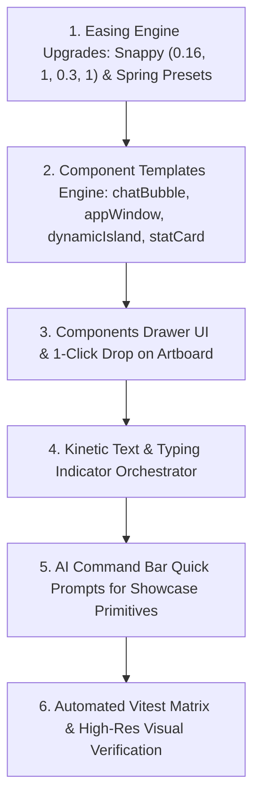

# Motion Studio: Next Session Handoff Briefing

**Session Target**: Achieving Top-Tier Showcase Motion Graphics (Apple, Linear, Stripe Caliber)  
**Current Baseline**: 4-Suite Architecture Live (`DESIGN`, `MOTION`, `3D Soon`, `EDITOR Soon`) • **112/112 Vitest Tests Passing (18 Suites)** • **Production Build 100% Clean** • Universal Reactive Dependency Engine (5 Modes) • Precision 2-Element Split Paradigm • Artboard vs. Infinite Pasteboard Isolation Active with "Send to Motion 🎬"  
**Primary Briefing Rules**: Adhere strictly to [AGENTS.md](file:///c:/Users/Sam/Documents/CODE/MOTION-STUDIO/AGENTS.md), [docs/IMPLEMENTATION_PLAN.md](file:///c:/Users/Sam/Documents/CODE/MOTION-STUDIO/docs/IMPLEMENTATION_PLAN.md), and [docs/WORKFLOWS_AND_INTERACTIONS_MAP.md](file:///c:/Users/Sam/Documents/CODE/MOTION-STUDIO/docs/WORKFLOWS_AND_INTERACTIONS_MAP.md).

---

## 1. Executive Summary & Where We Stand

In today's session, we completed major foundational milestones:
1. **Pipeline Restructuring into 4 Operational Suites**:
   - Replaced the generic "Animate" toggle with the 4-stage pipeline: **DESIGN** (staging & visual layout), **MOTION** (temporal sequencing & camera viewport), **3D** (badge: Soon), and **EDITOR** (badge: Soon).
2. **Universal Reactive State Dependency & Linking Engine**:
   - Built a comprehensive cross-element dependency solver (`dependencyEngine.ts`) supporting all 5 atomic linking modes across all element types (`text`, `shape`, `group`, `image`, `chunk`):
     - 📍 **`pin`**: 9-point spatial anchor locking with $[dx, dy]$ offset.
     - 📐 **`hug`**: Dynamic bounding-box hugging with 2D padding $[padX, padY]$ (e.g. chat bubbles expanding as text reveals).
     - 🔗 **`match`**: Direct linear property proportionality ($v_{\text{target}} = v_{\text{driver}} \times M + O$).
     - 🎚️ **`remap`**: Source $[s_{\min}, s_{\max}] \to$ target $[t_{\min}, t_{\max}]$ range remapping with easing.
     - 🌊 **`lag`**: Temporal follower tracking driver motion with delay or spring inertia.
   - Deterministic topological sort with cycle breaking via Kahn's algorithm; integrated at root of `evaluator.ts` for 100% deterministic 60fps playback and headless export.
   - Dedicated **LINKED DEPENDENCIES** inspector panel (`BindingsSection.tsx`) and on-canvas glowing cyan dashed Bézier curve overlay with mode badge (`BindingConnectionOverlay.tsx`).
3. **Precision 2-Element Selection Splitting & 1-Click Removal**:
   - Removed artificial "Split Chunks" and "Split Words" 1-click buttons from Inspector and context menus.
   - Implemented strict 2-element split: selecting text $\to$ right-click $\to$ Split (`Ctrl+Shift+S`) creates a `<Group>` containing exactly (1) the selected text chunk and (2) the unselected remainder chunk.
4. **Infinite Pasteboard vs. Camera Artboard Separation**:
   - The infinite canvas is an unrestricted staging ground outside the camera boundaries ($x < 0$, $y < 0$, $x > W$, $y > H$).
   - Explicit **"Send to Motion 🎬"** action tests geometric intersection via `isLayerOnArtboard` and populates `motionLayerIds`.
   - In MOTION mode, a 75% dark camera matte overlay (`boxShadow: 0 0 0 9999px rgba(9, 9, 11, 0.75)`) frames the artboard 1:1.
5. **Rock-Solid Stability & Verification**:
   - **112 / 112 unit tests passing** across 18 Vitest test suites.
   - Production build `tsc -b && vite build` transforms 2,457 modules in 12.48s with 0 errors.

---

## 2. Tomorrow's Mission: World-Class Motion Graphics & Component Library

Tomorrow's core goal is to elevate Motion Studio from a tool that *can* animate elements to an engine that effortlessly outputs **billion-dollar product showcase animations** (the signature aesthetic of Apple keynotes, Linear release videos, Stripe Sessions showcases, and CashApp promos).

Modern motion design does not rely on arbitrary constant-speed movement or generic slide-ins. It is defined by two foundational pillars:
1. **The Signature Kinetic Dynamics ("The Apple / Linear Snappy Curve")**:
   - Non-linear velocity profiles where elements launch with high speed, cover ~75% of the distance in the first 40–50% of the duration, and coast with luxurious deceleration into resting position.
2. **Pre-Cooked Reusable UI Motion Components**:
   - A library of production-ready components that modern tech showcases use constantly (e.g. asymmetric Chat Bubbles with typing indicators, macOS/Browser App Windows, Dynamic Island notification pills, KPI count-up metric cards, morphing segmented controls, and animated code terminals).

---

## 3. Kinetic Easing Curves & Default Motion Dynamics

### A. The "75% Distance in 50% Time" Curve: The Snappy Quintic Ease-Out
The curve the user highlighted ("instead of moving at constant speed, it goes fast like cover the 75 percent distance in first 50 percent of time and 25 percent in last 50, most used") is the undisputed gold standard of modern motion UI:
* **Industry Standard Names**: **"Snappy Ease-Out"**, **"Quintic Out" (`ease-out-quint`)**, **"Apple / Linear Motion Curve"**, or **"Fast-Start Decelerate"**.
* **Cubic-Bézier Formula**: `cubic-bezier(0.16, 1, 0.3, 1)`
  * $P_1 = (0.16, 1.0)$: Extremely steep initial slope $\to$ initial velocity $v_0$ is high. The element covers $75\%\text{--}80\%$ of its displacement within the first $40\%\text{--}50\%$ of time elapsed.
  * $P_2 = (0.30, 1.0)$: Flat landing trajectory $\to$ the remaining $20\%\text{--}25\%$ of distance is spent smoothly decelerating to a whisper-quiet stop with $C^1$ velocity continuity ($v \to 0$).
* **Why it works**:
  * Linear motion ($v = \text{const}$) feels robotic, cheap, and amateurish.
  * Standard `ease-in-out` is sluggish because it starts too slowly, making UI feel laggy.
  * `cubic-bezier(0.16, 1, 0.3, 1)` feels instantly responsive to the human eye, commanding attention immediately, while the long-tail deceleration conveys premium luxury and weight.

### B. The Quintessential Showcase Easing Suite
Tomorrow we will codify these 5 core kinetic profiles into first-class presets and defaults:

```
┌─────────────────┬──────────────────────────────────┬────────────────────────────────────────────────────────┐
│ CURVE NAME      │ BÉZIER / SPRING FORMULA          │ KINETIC INTENT & USE CASE                              │
├─────────────────┼──────────────────────────────────┼────────────────────────────────────────────────────────┤
│ 1. Snappy Out   │ cubic-bezier(0.16, 1, 0.3, 1)    │ Apple/Linear default. Covers 75% in 50% time. Slides,  │
│    (Primary)    │                                  │ card entrances, dialog pops, drawer expansions.        │
├─────────────────┼──────────────────────────────────┼────────────────────────────────────────────────────────┤
│ 2. Damped Spring│ f_spring(t) with ζ=0.72, ω=14    │ Organic physical feel. Slight 5-8% overshoot before    │
│    (Bouncy)     │                                  │ settling. Ideal for buttons, badge pops, icons.        │
├─────────────────┼──────────────────────────────────┼────────────────────────────────────────────────────────┤
│ 3. Anticipation │ cubic-bezier(0.34, 1.56, 0.64, 1)│ "Pull back & whip forward". Anticipates slightly (-5%) │
│    Whip         │                                  │ before accelerating forward with dynamic snap.         │
├─────────────────┼──────────────────────────────────┼────────────────────────────────────────────────────────┤
│ 4. Cinematic S  │ cubic-bezier(0.65, 0, 0.35, 1)   │ Elegant S-curve. Perfect for camera pans, smooth       │
│    (Smooth)     │                                  │ background morphs, and long ambient transitions.       │
├─────────────────┼──────────────────────────────────┼────────────────────────────────────────────────────────┤
│ 5. Elastic Jelly│ Volume-preserving oscillation    │ Scale X stretches (1.15) while Scale Y squashes (0.85) │
│    Squash       │ scaleX/scaleY out-of-phase       │ on landing impact. Perfect for playful UI & stickers.  │
└─────────────────┴──────────────────────────────────┴────────────────────────────────────────────────────────┘
```

---

## 4. Reusable UI Motion Components Library ("Showcase Primitives")

To make billion-dollar showcase videos effortless for both humans and AI agents, we will create a dedicated collection of pre-built, production-ready components in `src/components/components/` (accessible via the Components Drawer `ComponentsDrawer.tsx` and the AI Command Bar):

### 1. The Chat / Message Bubble Card
* **Visual Blueprint**:
  * Asymmetric corner radii: Sent bubble (`[18, 18, 4, 18]`), Received bubble (`[18, 18, 18, 4]`).
  * Subtle 1px translucent border (`rgba(255, 255, 255, 0.1)`), deep background drop shadow.
  * Avatar icon + sender handle badge.
* **Kinetic Choreography**:
  * **Phase 1: Typing Indicator**: 3 animated bouncing dots (`● ● ●`) oscillating with 0.15s sinusoidal phase offsets inside an auto-fitting pill container.
  * **Phase 2: Bubble Entrance**: The typing pill morphs via FLIP into the message bubble using `cubic-bezier(0.16, 1, 0.3, 1)` scale & slide-up ($+24\text{px} \to 0\text{px}$).
  * **Phase 3: Kinetic Text Reveal**: Words or semantic chunks stagger in with the Snappy curve and 0.08s cascade delay.

### 2. The Dynamic Island / Notification Toast Pill
* **Visual Blueprint**:
  * Compact pill shape (`borderRadius: 9999px`, height `36px`, dark obsidian glass `#09090b` with `backdrop-filter: blur(20px)`).
  * Left: Pulsing status indicator dot (Emerald green `#34d399` or Electric Blue `#60a5fa`).
  * Center: Clean typography (`Inter SemiBold 13px`).
  * Right: Micro action badge or chevron.
* **Kinetic Choreography**:
  * Morphs dynamically from compact icon pill to expanded interactive banner (`width: 140px \to 380px`, `height: 36px \to 72px`) with spring overshoot.

### 3. macOS & Browser App Window Chrome
* **Visual Blueprint**:
  * Framed app card with macOS traffic light buttons (Close `#ff5f56`, Minimize `#ffbd2e`, Zoom `#27c93f`).
  * Centered subtle URL bar / search pill.
  * Inner content area with `clipContent: true` (overflow masked).
* **Kinetic Choreography**:
  * Window expands smoothly with 3D tilt perspective entrance (`rotationX: 12deg \to 0deg`, `scale: 0.92 \to 1.0`).
  * Inner child layers slide up with staggered depth parallax.

### 4. Interactive KPI Metric & Stat Count-Up Card
* **Visual Blueprint**:
  * Gradient dark background, subtle Stamp Gold border highlight.
  * Stat label ("Monthly Recurring Revenue"), huge numerical display (`$124,500`), trend badge (`+34.2% ↑`).
* **Kinetic Choreography**:
  * Numerical counter ticks up smoothly from $0 to target value using logarithmic easing.
  * Sparkline path draws itself with SVG `stroke-dashoffset` wipe.

### 5. Interactive Segmented Switch / Tab Slider
* **Visual Blueprint**:
  * Container pill (`#18181b`, padding `4px`).
  * Floating active indicator pill (`#27272a` with subtle glow) sliding behind text options.
* **Kinetic Choreography**:
  * Indicator pill morphs $X$-position and width smoothly between tabs with organic spring inertia.

### 6. Terminal & Code Editor Window
* **Visual Blueprint**:
  * Dark monokai theme, line numbers, syntax-highlighted code chunks.
* **Kinetic Choreography**:
  * Line-by-line typewriter entrance with authentic blinking vertical bar caret (`opacity: 0 \leftrightarrow 1`).

---

## 5. Smart Default Animation Choreography

When a user or AI drops a component or splits text, Motion Studio must never leave elements dead or statically appearing all at once. It must automatically assign **tasteful, cinematic defaults**:

1. **Directional Coherence & Parallax Depth**:
   - Parent container enters with a subtle $+20\text{px}$ slide-up.
   - Child elements enter with $+10\text{px}$ slide-up and $0.1\text{s}$ stagger delay, creating instantaneous depth.
2. **Dynamic Duration Proportionality**:
   - Small micro-elements (badges, icons, pills) default to **0.4s – 0.5s** duration.
   - Medium cards, chat bubbles, and modal frames default to **0.6s – 0.7s** duration.
   - Full-screen scene wipes and backdrop transitions default to **0.8s – 1.0s** duration.
3. **The 3-Phase Lifecycle Architecture**:
   - **In (Entrance)**: How the element arrives on screen (`Pop In`, `Snappy Slide Up`, `Blur Reveal`, `3D Flip`).
   - **Emphasis (Idle Attention)**: Subtle living loops during rest (`Pulse`, `Float Wave`, `Glow Shimmer`, `Heartbeat`).
   - **Out (Exit)**: Clean, purposeful dismissal (`Snappy Slide Down`, `Fade Shrink`, `Blur Out`).

---

## 6. Actionable Implementation Checklist for Tomorrow



### Specific Steps:
1. **Engine Updates (`src/engine/easings.ts`, `src/engine/evaluator.ts`)**:
   - Make `snappy` (`cubic-bezier(0.16, 1, 0.3, 1)`) the default curve for all slide and scale presets.
   - Expose explicit `snappy` easing pill in `AnimateInspector.tsx`.
2. **Component Templates Data Model (`src/types/components.ts` / `src/store/componentTemplates.ts`)**:
   - Define declarative JSON recipes for:
     - `chatBubbleSent` & `chatBubbleReceived`
     - `typingIndicator`
     - `appWindow`
     - `dynamicIslandPill`
     - `kpiMetricCard`
     - `codeTerminal`
3. **Components Drawer (`src/components/components/ComponentsDrawer.tsx`)**:
   - Populate visual preview cards for each showcase primitive.
   - Clicking a component inserts it directly onto the active Artboard with resting styles and pre-wired kinetic animations.
4. **Typing Indicator & Text Stagger Enhancements**:
   - Add pulsating dots animation recipe in `evaluator.ts`.
   - Ensure typing indicator seamlessly connects to the chat bubble appearance.
5. **AI Assistant Integration (`AICommandBar.tsx`)**:
   - Enable commands like *"Add chat message saying 'Welcome to Motion Studio!' with typing indicator"* to auto-compose the full component and timeline tracks.
6. **Full Test & Visual Verification**:
   - Maintain 100% test pass rate across all Vitest test suites.
   - Capture high-resolution Playwright screenshots of each new showcase primitive in motion.

---

## 7. Quick Context & Commands Cheat Sheet

* **Run Dev Server**: `npm run dev`
* **Run Vitest Test Suite**: `npm test`
* **Run Production Build**: `npm run build`
* **Run Playwright Verification**: `node src/test/verify_architecture_ui.js`
* **Key Store Actions**:
  - `sendScreenToMotion(screenId)`: registers artboard layers and enters MOTION mode.
  - `setUiMode("design" | "motion")`: switches operational suite.
  - `updateLayerStyle(layerId, { borderRadius, clipContent, ... })`: updates design styles with live two-way sync.
