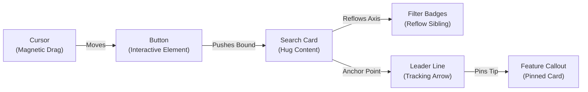

# Relational Linking: Architecture, Physics & Interaction Specification
**Motion Studio Technical Blueprint & Design Vision**
*Status: Authoritative Engineering Specification*

---

## Executive Summary

Traditional motion design software operates on an archaic, frame-by-frame paradigm: every layer is an isolated island of numeric values. If Layer A expands, the designer must manually calculate, keyframe, and ease Layer B, Layer C, and Layer D to prevent collisions, desynchronization, and visual breakage. 

**Relational Linking** in Motion Studio fundamentally transforms this model. By simply dragging a layer under another in the sidebar hierarchy (Parent-Child nesting), the user declares a **physical, geometric, or semantic relationship**. The Motion Studio engine then resolves this relationship deterministically at any point in time $t$ ($O(1)$ evaluation) using closed-form analytical spring physics and topological graph resolution.

This document outlines the fatal flaws of manual motion graphics, defines the exhaustive 10-pairing relational matrix, details the mathematical mechanics and real-world showcases for each pairing, and presents the architecture for multi-link compound choreography.

---

## 1. The Nightmare of Manual Motion Graphics

In tools like Adobe After Effects, Jitter, Principle, and Figma Smart Animate, animating reactive or multi-element product UI is notoriously painful. The breakdown occurs across five fundamental failure modes:

### 1.1 Sub-Pixel Drift & Visual Clutter
When two connected elements (e.g. an arrow pointing to a card) are animated independently with standard Bezier curves, their cubic polynomial equations ($B(t) = (1-t)^3 P_0 + 3(1-t)^2 t P_1 + 3(1-t)t^2 P_2 + t^3 P_3$) rarely match in continuous curvature. Even with identical easing presets, floating-point roundoff and differing spatial distances cause the arrow tip to detach by 1–4 pixels during mid-transition before snapping back at the end. This "rubber swimming" instantly destroys product craft.

### 1.2 Desynchronized Spring Oscillations
Realistic interfaces do not move linearly; they move with physical mass, stiffness, and damping. When a parent container expands with a spring ($\omega_n = 28\text{ rad/s}, \zeta = 0.75$), an adjacent element must not only move out of the way—it must absorb the impact and inherit the parent's momentum. In manual tools, recreating this requires guessing secondary keyframes with diminishing amplitudes. If the designer alters the parent's spring damping by 5%, all downstream hand-animated oscillations are immediately out of phase.

### 1.3 Text Copy & Localization Fragility
In product motion graphics (e.g. Stripe checkout demos, Apple Siri reveals), text content frequently updates. In keyframed software, if the headline changes from "Fast" (4 letters) to "Instantaneous" (13 letters), or is localized into German ("Augenblicklich"), the enclosing card, the trailing text, the drop shadow, and the adjacent button are all broken. The animator must spend hours shifting 50+ keyframes across 10 layers.

### 1.4 Compounding Multi-Channel Recalculation
A simple interaction—such as a cursor clicking a card that expands while an arrow tracks its corner—involves at least 16 separate property channels:
* Cursor: `x`, `y`, `scale`
* Card: `x`, `y`, `width`, `height`, `borderRadius`, `shadowElevation`
* Text: `x`, `y`, `opacity`
* Arrow: `x1`, `y1`, `x2`, `y2`, `rotation`
Every single edit multiplies the coordination complexity exponentially: $O(N \cdot K)$ where $N$ is layer count and $K$ is keyframe count.

---

## 2. The Comprehensive Element Pairing Matrix

The table below catalogs every critical pairing in world-class product motion graphics and the relational mode it unlocks:

| Driver Element (Parent) | Driven Element (Child / Target) | Relational Linking Mode | Physical / Geometric Constraint | Primary Use Cases |
| :--- | :--- | :--- | :--- | :--- |
| **Card / Surface** | **Text / Number Counter** | `hug` (Auto-Dilation) | $W_{\text{card}}(t) = W_{\text{text}}(t) + 2P_x$ with analytical spring | Spotlight search, dynamic badges, currency counters |
| **Cursor / Pointer** | **Interactive Target** | `magnetic-snap` / `tilt` | Attraction field $\mathbf{F} = -k\mathbf{x} - c\mathbf{v}$, Euler pitch/roll | iPadOS/VisionOS pointer, button depress, drag-and-drop |
| **Line / Arrow** | **Any Target Element** | `leader-line` / `connect` | Dynamic ray tracing $\mathbf{A}_1 \to \mathbf{A}_2$, angle $\theta = \text{atan2}(\Delta y, \Delta x)$ | Hardware callout pins, flowchart noodles, feature tags |
| **Ring / Progress Arc** | **Value Counter / Text** | `remap` (Value Link) | $\tau(t) = \text{Norm}(v(t)) \to \text{strokeEnd} = \tau, \text{text} = \text{fmt}(v)$ | Apple Watch activity rings, milestone gauges, downloaders |
| **Mask / Stencil** | **Content Layer** | `stencil-clip` / `world-lock` | Dual-space transform $\mathbf{x}_{\text{content}} = \mathbf{M}_{\text{mask}}^{-1} \mathbf{x}_c$, zero-slip | Aperture reveals, bezel window reveals, uncropped morph |
| **Sibling Element** | **Sibling Element** | `reflow` (Push / Accordion) | 1D Contact manifold $x_i(t) = x_{i-1}(t) + w_{i-1}(t) + G$ + impulse | Linear task lists, notification stacks, accordion menus |
| **Typographic Token** | **Trailing Suffix / Copy** | `word-morph-reflow` | Glyphic advance tracking $x_{\text{suffix}}(t) = x_{\text{tok}} + \text{Adv}(\text{tok}) + G$ | Stripe headline morphs, dynamic keyword cycles |
| **3D Device Mockup** | **2D Canvas Layer / UI** | `fbo-project` / `screen-pin` | Perspective projection $\mathbf{P} \cdot \mathbf{V} \cdot \mathbf{M} \cdot \mathbf{x}_{3D} \to \mathbf{x}_{2D}$ | Hardware reveals, floating UI pins on tilting screens |
| **Audio Waveform** | **Visual Scale / Glow** | `audio-pulse` (FFT Driver) | Envelope follower $E(t) = \text{RMS}(\mathcal{F}_{\text{band}})$, attack/decay | Beat drops, voice AI waveforms (Siri orb), music hardware |
| **Media (Image/Video)** | **Frame / Backdrop** | `parallax-tilt` / `focal-zoom` | $\mathbf{x}_{\text{img}} = \mathbf{x}_{\text{frm}} - d \cdot \tan(\boldsymbol{\theta})$; fixed focal point $\mathbf{F}$ | Recessed glass bezels, hero zoom without subject drift |

---

## 3. Deep-Dive Specification by Link Type

### 3.1 Card / Surface $\longleftrightarrow$ Text / Number Counter (`hug`)

#### The Physical & Relational Mechanism
The card's bounding box dimensions are driven dynamically by the content size of its child text or numeric counter:
$$W_{\text{card}}(t) = \max\left(W_{\min}, \min\left(W_{\max}, \mathcal{M}_x(\text{Text}(t)) + P_{\text{left}} + P_{\text{right}}\right)\right)$$
$$H_{\text{card}}(t) = \max\left(H_{\min}, \min\left(H_{\max}, \mathcal{M}_y(\text{Text}(t)) + P_{\text{top}} + P_{\text{bottom}}\right)\right)$$
When text animates via typewriter or numeric rolling, the width does not snap discretely. Instead, the card's target width $W^*(t)$ feeds into an analytical second-order harmonic oscillator:
$$\ddot{W}(t) + 2\zeta\omega_n \dot{W}(t) + \omega_n^2 (W(t) - W^*(t)) = 0$$
where $\omega_n$ (stiffness) is typically $260\text{ rad/s}$ and $\zeta$ (damping) is $0.85$, yielding a responsive, snappy expansion with micro-cushioning.

#### Why It Is Impossible Manually
When animating a live counter from `$0` to `$1,429,500.00`, the text width changes non-linearly across every decade (1 digit $\to$ 7 digits). Monospace fonts are clunky, while proportional fonts experience glyph width variance. In After Effects, animating the card width to match this requires hundreds of manual keyframes or complex expressions (`sourceRectAtTime()`) that break during playback scrubbing and fail to add natural spring momentum.

#### Real-World Showcase
* **Apple Spotlight / Siri**: The glowing translucent glass pill smoothly expands from a tight 200px search bar to an 800px rich card as search tokens appear.
* **Stripe Live Billing**: An invoice card effortlessly resizes as line items populate and the total counter rolls upward.

#### The Dead-Simple Sidebar UX
1. Drag the `Text` layer under the `Card` layer in the sidebar.
2. The card immediately enters `Hug Content` mode.
3. In the Inspector, the user sees only two clean parameters:
   * **Padding**: Compact 2D scrubbers `[X: 16px, Y: 12px]`.
   * **Physics**: Toggle: `Spring` (Smooth, Snappy, Bouncy) vs `Instant`.
Zero keyframes required.

---

### 3.2 Cursor / Pointer $\longleftrightarrow$ Interactive Target (`magnetic-snap` & `tilt`)

#### The Physical & Relational Mechanism
The cursor's position $\mathbf{p}_c(t)$ influences the target layer $\mathbf{p}_t(t)$ through a two-stage field equation:
1. **Magnetic Capture**: When $\|\mathbf{p}_c - \mathbf{c}_t\| < R_{\text{capture}}$, the cursor position snaps toward the target centroid $\mathbf{c}_t$ via an exponential attractor:
   $$\mathbf{p}_{\text{rendered\_cursor}} = \mathbf{c}_t + (\mathbf{p}_c - \mathbf{c}_t) \cdot e^{-\frac{\|\mathbf{p}_c - \mathbf{c}_t\|^2}{2\sigma^2}}$$
2. **Surface 3D Tilt**: The target layer rotates slightly toward the cursor:
   $$\theta_x = -\left(\frac{y_c - y_t}{H_t / 2}\right) \cdot \theta_{\max}, \quad \theta_y = \left(\frac{x_c - x_t}{W_t / 2}\right) \cdot \theta_{\max}$$
3. **Contact Depress**: When the cursor's `scale` dips below $0.9$ (simulating a click/tap), the target layer inherits a proportional squash: `target.scale = 0.96`.

#### Why It Is Impossible Manually
In standard video editors, coordinating a cursor glide with the button's hover glow, subtle 3D tilt, shadow contraction, and click squash requires synchronizing 6 independent animation channels. If the director decides the cursor should arrive 10 frames earlier, all 6 channels desync, creating an uncanny disconnect where the button tilts before the cursor touches it.

#### Real-World Showcase
* **Apple VisionOS / iPadOS UI**: The translucent pointer snaps dynamically into icons, with the icon surface pitching and rolling under the glass cursor.
* **Linear Command Menu**: The selection cursor glides between items, magnetically conforming to each row's width with fluid spring elasticity.

#### The Dead-Simple Sidebar UX
1. Drag `Cursor` onto `Button` in the sidebar.
2. The system infers `Interactive Target`.
3. Inspector shows a single segmented control:
   * **Interaction**: `[Magnetic Hover | Elastic Drag | Press Only]`
   * **Intensity**: Slider from Subtle to Pronounced.

---

### 3.3 Line / Arrow / Connector $\longleftrightarrow$ Any Target Element (`leader-line` & `connect`)

#### The Physical & Relational Mechanism
The line calculates its origin $\mathbf{A}_1$ and terminus $\mathbf{A}_2$ dynamically from the bounding boxes of Driver A and Driver B:
$$\mathbf{A}_1 = \text{Anchor}(\text{Box}_A, \text{anchor}_A), \quad \mathbf{A}_2 = \text{Anchor}(\text{Box}_B, \text{anchor}_B)$$
The line's transform is resolved in $O(1)$:
$$\mathbf{p}_{\text{origin}} = \mathbf{A}_1, \quad L = \|\mathbf{A}_2 - \mathbf{A}_1\|, \quad \theta = \operatorname{atan2}(A_{2,y} - A_{1,y}, A_{2,x} - A_{1,x})$$
For orthogonal / Manhattan routing:
$$\text{Path} = \left[\mathbf{A}_1, \left(A_{1,x} + \frac{\Delta x}{2}, A_{1,y}\right), \left(A_{1,x} + \frac{\Delta x}{2}, A_{2,y}\right), \mathbf{A}_2\right]$$
with rounded fillet corners calculated via continuous circular arcs of radius $R$.

#### Why It Is Impossible Manually
In After Effects, connecting two moving objects with a line requires writing complex multi-line ExtendScript/Expression links (`toComp([0,0])`) or keyframing path vertices. Vertex keyframes lack continuous tangents, causing lines to buckle, stretch unevenly, and lose their stroke caps.

#### Real-World Showcase
* **Apple Hardware Teardowns**: Annotations pointing to the M-series CPU die, where callout lines stay perfectly locked to the chip pin while the camera zooms in isometric 3D.
* **Architecture / Node Graph Demos**: Flowchart nodes dynamically repositioning while connecting wires smoothly flex and re-route without vertex drift.

#### The Dead-Simple Sidebar UX
1. Drag `Arrow` under `Target Layer`.
2. Arrow automatically pins its endpoint to the target's nearest edge anchor (`middle-left`, `top-center`, etc.).
3. Inspector exposes:
   * **Routing**: `[Direct Ray | Orthogonal Bus | Catenary Curve]`
   * **Offset Gap**: `8px` (prevents arrow from touching the card edge directly).

---

### 3.4 Ring / Progress Arc $\longleftrightarrow$ Value Counter / Text (`remap`)

#### The Physical & Relational Mechanism
A single driver variable $\tau(t) \in [0, 1]$ simultaneously drives the visual geometry and the typographic representation:
1. **Geometry Channel**:
   $$\text{strokeEnd}(t) = \tau(t), \quad \text{sweepAngle}(t) = 360^\circ \cdot \tau(t)$$
2. **Typographic Channel**:
   $$\text{Value}(t) = \text{Min} + \tau(t) \cdot (\text{Max} - \text{Min})$$
   $$\text{FormattedText}(t) = \text{FormatString}(\text{Value}(t), \text{decimals}, \text{currency})$$
3. **Monotonicity Guard**:
   While the ring's stroke can have physical spring overshoot ($\tau > 1.0$), the numeric display is clamped monotonically to prevent illogical counter values (e.g. counting to 102% then falling back to 100%).

#### Why It Is Impossible Manually
Matching the exact ease of an animated stroke with an animated text counter in conventional software requires manually copying Bezier control points between a Shape Layer and an Expression Slider. If the client asks to change the animation duration from 1.5s to 2.2s, both layers must be manually re-adjusted.

#### Real-World Showcase
* **Apple Fitness Rings**: The circular activity ring closes with high-velocity snap while the active calorie number spins dynamically up to 650 kcal.
* **Vercel / Next.js Build Meter**: Progress bar sweeps to 100% while build step timer and percentage tick in lockstep.

#### The Dead-Simple Sidebar UX
1. Drag `Text` into `Progress Arc`.
2. System auto-binds `Value Link`.
3. Inspector shows:
   * **Range**: `[0 -> 100%]` or `[$0 -> $50,000]`
   * **Format**: `Percentage`, `Currency`, `Time`, `Integer`.

---

### 3.5 Mask / Stencil $\longleftrightarrow$ Content Layer (`stencil-clip` & `world-lock`)

#### The Physical & Relational Mechanism
In standard parenting, when a mask moves, its children move with it. In **Relational Stencil Mode**, the parent mask defines the visible viewport aperture, but the child content can choose its spatial reference frame:
* **Option A: Local Frame**: Content moves with the mask.
* **Option B: World Frame (Zero-Slip Parallax)**: Content maintains world-space coordinates $\mathbf{x}_{\text{content\_world}}$ invariant of the mask's motion:
  $$\mathbf{x}_{\text{content\_rendered}} = \mathbf{M}_{\text{mask}}^{-1} \cdot \mathbf{x}_{\text{world}}$$
This allows the mask to slide across the screen like a spotlight revealing a stationary high-resolution UI underneath.

#### Why It Is Impossible Manually
In After Effects, keeping masked content still while the mask moves requires adding an expression to the child: `value - parent.transform.position`. When rotation, scaling, and spring physics are added, the expression math becomes a matrix inversion nightmare that frequently fails in 3D or nested precomps.

#### Real-World Showcase
* **Google Material You Launch**: Smooth pill and circle cutouts glide across app interfaces, revealing underlying features without the underlying content sliding or jittering.
* **Stripe Radar Security Scan**: A scanning aperture sweeps over a credit card texture, highlighting encrypted data points beneath the beam.

#### The Dead-Simple Sidebar UX
1. Drag any `Layer` into a `Shape` designated as a Mask.
2. In the hierarchy, a subtle stencil icon appears.
3. Toggle in Inspector:
   * **Content Anchor**: `[Lock in Screen Space | Follow Mask]`

---

### 3.6 Sibling Elements $\longleftrightarrow$ Sibling Elements (`reflow` & `push`)

#### The Physical & Relational Mechanism
Sibling elements are governed by a 1D elastic layout solver. When Sibling $A$ changes width or height, Sibling $B$ updates its position along the active axis:
$$x_B(t) = x_A(t) + W_A(t) + \text{Gap} + \Delta x_{\text{momentum}}(t)$$
where $\Delta x_{\text{momentum}}(t)$ is an analytical spring impulse derived from the instantaneous expansion velocity $\dot{W}_A(t)$:
$$\Delta x_{\text{momentum}}(t) = \frac{\dot{W}_A(t_{\text{peak}})}{\omega_n} e^{-\zeta \omega_n t} \sin(\omega_d t)$$
This produces the signature Apple/Linear feel: expanding an item doesn't just push its neighbor; it physically "bumps" it with momentum before both settle smoothly into place.

#### Why It Is Impossible Manually
If you have a vertical list of 5 cards and Card 2 expands from 60px to 240px:
* Card 3 must move down by 180px.
* Card 4 must move down by 180px with a 50ms stagger.
* Card 5 must move down by 180px with a 100ms stagger.
If you later decide Card 2 should expand to 300px instead, you must manually edit the keyframes on Cards 3, 4, and 5.

#### Real-World Showcase
* **Linear Task Board**: Opening an issue card smoothly pushes adjacent issues down and to the side with physics-based gap preservation.
* **iOS Notification Stack**: Dismissing or expanding a top banner causes the lower banners to cascade upward with tactile spring damping.

#### The Dead-Simple Sidebar UX
1. Select two or more sibling layers and press `Cmd+G` (or drag into a `Reflow Stack`).
2. Inspector exposes:
   * **Axis**: `[Horizontal | Vertical]`
   * **Gap**: Scrubbable pixel value (e.g. `16px`).
   * **Momentum Transfer**: `[Off | Subtle | Snappy]`.

---

### 3.7 Typographic Token $\longleftrightarrow$ Trailing Suffix (`word-morph-reflow`)

#### The Physical & Relational Mechanism
A headline contains a dynamically switching keyword:
`"Build faster with "` + `[AI | Python | Rust | Motion Studio]` + `" on any device."`
When the keyword switches:
1. The old word exits (e.g. slide-up + fade-out).
2. The new word enters (slide-up + pop-in).
3. The trailing suffix (`" on any device."`) dynamically tracks the continuous width of the keyword:
   $$x_{\text{suffix}}(t) = x_{\text{keyword}} + W_{\text{active\_word}}(t) + \text{KerningGap}$$
The width transition is evaluated using a continuous spring curve so the trailing sentence glides left or right to accommodate the new word's length.

#### Why It Is Impossible Manually
Typographic advance varies by font size, letter count, and kerning pairs. Manually positioning the trailing text for 4 different word changes requires 4 separate keyframe sets. Any change to font family or font size invalidates every single keyframe.

#### Real-World Showcase
* **Stripe / Vercel Landing Page Videos**: Dynamic text morphs where marketing copy flows seamlessly around cycling nouns.

#### The Dead-Simple Sidebar UX
1. Drag the `Suffix Text` under the `Dynamic Keyword` layer.
2. The mode defaults to `Inline Flow`.
3. Inspector shows:
   * **Tracking Gap**: `8px`.
   * **Gliding Physics**: `[Smooth | Snappy]`.

---

### 3.8 3D Device Mockup $\longleftrightarrow$ 2D Canvas Layer (`fbo-project` & `screen-pin`)

#### The Physical & Relational Mechanism
Bridges the Three.js 3D viewport with the Pixi/DOM 2D stage:
1. **FBO Screen Texture**: The 2D child layer is rendered directly into an offscreen Framebuffer Object (FBO) and bound to the device's PBR glass screen material as an emissive/albedo map.
2. **Screen Surface Anchor Pinning**: 2D UI elements (like a magnifying glass callout or a floating cursor) track points on the 3D phone screen:
   $$\mathbf{v}_{\text{3D\_world}} = \mathbf{M}_{\text{device}} \cdot \mathbf{v}_{\text{screen\_local}}$$
   $$\mathbf{v}_{\text{clip}} = \mathbf{P}_{\text{cam}} \cdot \mathbf{V}_{\text{cam}} \cdot \mathbf{v}_{\text{3D\_world}}$$
   $$\mathbf{p}_{\text{canvas\_2D}} = \left(\frac{v_{\text{clip},x} + 1}{2} \cdot W_{\text{stage}}, \frac{1 - v_{\text{clip},y}}{2} \cdot H_{\text{stage}}\right)$$

#### Why It Is Impossible Manually
Tracking 2D graphics onto a 3D rotating device in After Effects requires mocha planar tracking or complex 3D camera exports. Even slight tracking errors cause the 2D elements to slip or jitter on the device screen.

#### Real-World Showcase
* **Apple iPhone Pro Announcements**: The phone spins in 3D space while UI elements (Dynamic Island, Control Center) operate crisply on the screen, and callout labels float pinned in space above the camera lens.

#### The Dead-Simple Sidebar UX
1. Drag any 2D UI frame into a `3D Phone/Laptop` layer.
2. Studio prompts:
   * `[Map to Device Screen]` or `[Pin to 3D Anchor]`
3. If pinned, click on the 3D phone model in the canvas to set the anchor vertex.

---

### 3.9 Audio Waveform $\longleftrightarrow$ Visual Scale / Glow (`audio-pulse`)

#### The Physical & Relational Mechanism
An audio track layer drives visual parameters via real-time spectral decomposition:
1. Short-Time Fourier Transform (STFT) splits audio into sub-bass ($20\text{--}80\text{Hz}$), midrange ($500\text{--}2000\text{Hz}$), and treble ($6\text{--}16\text{kHz}$).
2. An envelope follower computes instantaneous energy with asymmetric attack and decay:
   $$E(t) = \begin{cases} E(t-\Delta t) + \alpha_{\text{att}} (x_{\text{in}} - E(t-\Delta t)) & \text{if } x_{\text{in}} > E(t-\Delta t) \\ E(t-\Delta t) - \alpha_{\text{dec}} E(t-\Delta t) & \text{otherwise} \end{cases}$$
3. The smoothed envelope drives visual scale, bloom intensity, or border glow:
   $$\text{Scale}(t) = 1.0 + \kappa \cdot E_{\text{bass}}(t), \quad \text{GlowBlur}(t) = 8\text{px} + 24\text{px} \cdot E_{\text{bass}}(t)$$

#### Why It Is Impossible Manually
Keyframing visual pulses to a music beat manually takes hours of tedious placement on every drum hit. Built-in AE audio keyframing generates thousands of raw keyframes that cause harsh, jittery movement without proper attack/decay filtering.

#### Real-World Showcase
* **Siri / AI Voice Visualizers**: Fluid orb pulsating smoothly in response to voice frequency and amplitude.
* **Product Teasers / Beat Drops**: Clean tech hardware promo where UI cards bounce subtly on every kick drum hit.

#### The Dead-Simple Sidebar UX
1. Drag any `Card` or `Shape` under an `Audio Track` layer.
2. Select frequency focus: `[Sub-Bass / Kick | Voice / Mid | Crisp / Treble]`.
3. Set driven property: `[Scale | Glow | Elevation]`.

---

### 3.10 Media $\longleftrightarrow$ Frame / Backdrop (`parallax-tilt` & `focal-zoom`)

#### The Physical & Relational Mechanism
Governs how photos and videos behave inside containers during card tilts and zooms:
1. **Focal-Point Zoom Invariance**: When the card zooms, the image scales around a user-defined normalized focal point $\mathbf{F} = (f_x, f_y) \in [0, 1]^2$. The image translates continuously to keep $\mathbf{F}$ fixed at screen coordinate $\mathbf{p}_{\text{focal}}$:
   $$\mathbf{p}_{\text{img}}(t) = \mathbf{p}_{\text{focal}} - \mathbf{F} \odot \text{Size}_{\text{img}}(t)$$
2. **Bezel Parallax**: The card tilts in 2.5D space ($\theta_x, \theta_y$); the interior image translates in the opposite direction by depth factor $d$:
   $$\Delta \mathbf{p}_{\text{parallax}} = -d \cdot \begin{pmatrix} \sin(\theta_y) \\ \sin(\theta_x) \end{pmatrix}$$
This creates the physical illusion that the image is recessed beneath a thick pane of glass.

#### Why It Is Impossible Manually
Scaling an image inside a mask while keeping a person's face stationary requires simultaneous counter-animation of position and anchor point. If the scale curve is eased, the position curve must match identically; any slight divergence causes the face to wander across the frame.

#### Real-World Showcase
* **Apple Photos Memories**: Ambient zoom into a photograph where the subject stays perfectly centered while the frame borders expand.
* **Airbnb Showcase Cards**: Subtle 3D tilt on card hover with deep interior photo parallax.

#### The Dead-Simple Sidebar UX
1. Drag `Image` into `Card Frame`.
2. Click the image in the canvas to drop a **Focal Target** crosshair (e.g. on a person's face).
3. The image now auto-anchors all zooms and tilts around that exact point.

---

## 4. Multi-Link & Compound Choreography (The Domino Chain)

### 4.1 The Compounding Pipeline
The true breakthrough of Relational Linking is not just 1-to-1 links, but **compound choreography chains**. Because links are resolved through a Directed Acyclic Graph (DAG), complex multi-element chain reactions happen automatically:

### 4.2 A Real-World Domino Scenario
1. **The Animator's Intent**: "The user drags a slider button to the right."
2. **The Automatic Chain Reaction**:
   * **Stage 1**: The user animates only **one layer**: `Cursor.x` moves from 200px to 450px.
   * **Stage 2**: The `Button` is linked to the cursor via `elastic-drag` $\to$ it tracks the cursor with subtle spring lag.
   * **Stage 3**: The `Slider Track` fills dynamically, linked via `progress` $\to$ stroke length matches button X.
   * **Stage 4**: The `Value Counter` is linked via `remap` $\to$ text rolls from `$100` to `$850`.
   * **Stage 5**: The `Summary Card` is linked to the counter via `hug` $\to$ card width expands by 42px with a soft spring.
   * **Stage 6**: The `Adjacent Badge` is linked via `reflow` $\to$ it shifts right by 42px to maintain its 16px gap.
   * **Stage 7**: A `Callout Line` pinned to the badge corner automatically stretches and rotates to follow the badge.

**Total authored keyframes**: Exactly **2 keyframes** on the cursor.
**Total animated layers**: **7 layers**, completely in sync, physically plausible, and 100% scrubbable.

### 4.3 Why This Prevents "Graph Spaghetti"
Node-based systems (like Unreal Blueprints or Nuke) quickly degenerate into unreadable tangles of wires. Motion Studio eliminates graph spaghetti by adhering to **The Single-Parent Rule**:
* **Every link is expressed as a simple hierarchical parent-child relationship in the sidebar tree.**
* A layer can have only one primary spatial parent, while secondary bindings (like leader lines) are displayed as clean inline badges.
* The designer never looks at a canvas full of wires; they look at a clean, structured layer list that mirrors standard design tools.

---

## 5. Architectural & Mathematical Implementation

### 5.1 $O(1)$ Scrubbability & Evaluation Architecture
To guarantee deterministic scrubbing and zero frame-rate dependence, Motion Studio evaluates all relational bindings as pure mathematical functions of time:
$$\mathbf{State}(t) = \text{EvaluateScene}(\text{SceneGraph}, t)$$

The evaluation follows a strict three-phase cycle:
1. **Phase 1: Base State Evaluation**:
   Compute intrinsic layer properties (unbound positions, active animations, text values) at time $t$.
2. **Phase 2: Topological Sort (Kahn's Algorithm)**:
   Order layers such that all driver layers are evaluated before their driven children. If a circular dependency is detected, the engine breaks the loop gracefully and issues a non-blocking linter warning.
3. **Phase 3: Relational Constraint Resolution**:
   Iterate through the sorted queue and execute the specific constraint solver (`hug`, `pin`, `reflow`, `connect`) using analytical spring formulas.

### 5.2 Analytical Spring Solver Formula
Instead of Euler integration loops that drift with frame rate, Motion Studio uses the closed-form analytical solution for underdamped harmonic oscillators ($\zeta < 1$):
$$x(t) = x_{\text{target}} - e^{-\zeta \omega_n t} \left( (x_{\text{target}} - x_0) \cos(\omega_d t) + \frac{\zeta \omega_n (x_{\text{target}} - x_0) - v_0}{\omega_d} \sin(\omega_d t) \right)$$
where $\omega_d = \omega_n \sqrt{1 - \zeta^2}$ is the damped angular frequency.
This guarantees that scrubbing forward, backward, or jumping to any random timestamp yields **the exact same sub-pixel position every single time**.

---

## 6. Conclusion & Roadmap Alignment

Relational Linking is the cornerstone of Motion Studio's vision as an **Aesthetic Compiler**. By replacing tedious, error-prone manual keyframing with high-level relational constraints, Motion Studio allows both human designers and autonomous AI agents to author motion graphics of extraordinary sophistication with zero friction.

### Immediate Engineering Next Steps
1. **Sidebar Drag-and-Drop Parenting Enhancement**:
   Enable dropping any layer onto any layer in `LeftSidebar.tsx` to automatically prompt and configure relational linking modes.
2. **Canvas Visual Constraint Connectors**:
   Render subtle, non-intrusive interactive link badges and spring handles on selected canvas layers.
3. **Compound DAG Linter in Perception Pipeline**:
   Integrate relational chain validation into `src/engine/perception/` to prevent cyclic loops and guarantee 60fps evaluation performance.
