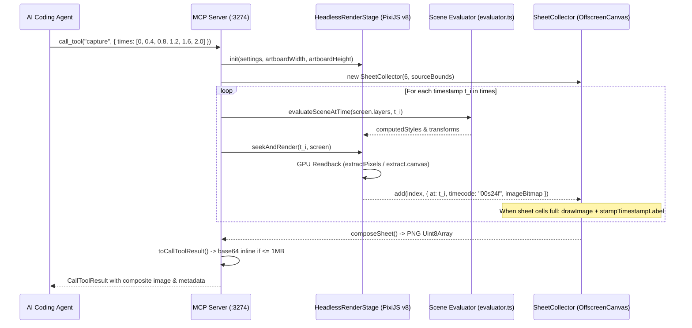
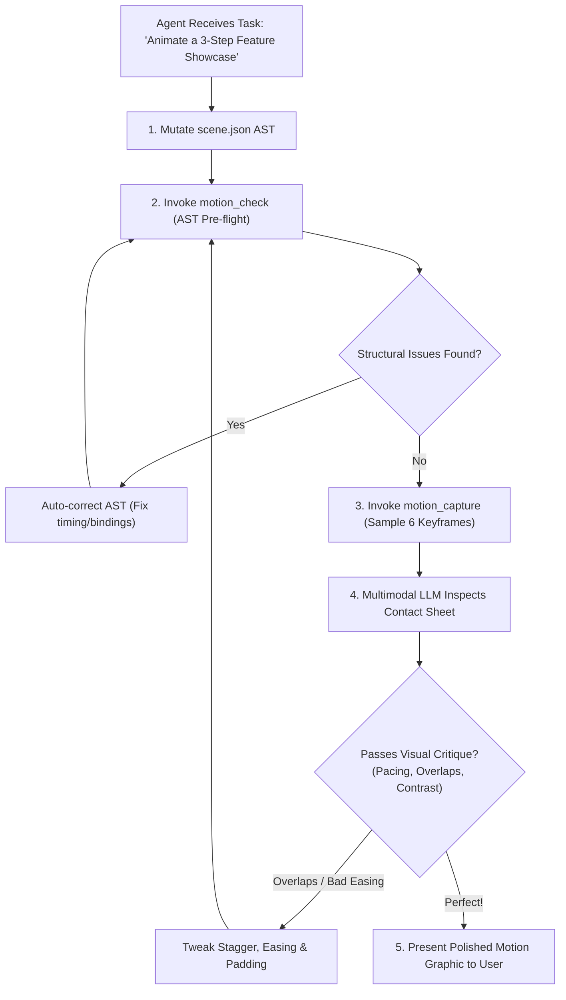

# Autonomous AI Agent Perception, Multi-Frame Contact Sheets & Scene Structural Linter
## Architectural Research, Declarative Specification & Engine Blueprint

**Specialist Role:** Agent Perception & Linter Specialist for Motion Studio  
**Status:** Architectural Blueprint & Engine Specification  
**Target Systems:** Motion Studio Core (`PixiJS v8`, `HeadlessRenderStage.ts`, `evaluator.ts`, `dependencyEngine.ts`, `scene.json`), Model Context Protocol (MCP Daemon `127.0.0.1:3274`)  
**Adopted Innovations:** Diffusion Studio Perception Engine (`capture`, `check`, `SheetCollector`, `toCallToolResult`)

---

## 1. Executive Summary & Autonomous Agent Paradigm

### 1.1 The "Blind Agent" Dilemma in Motion Graphics
In modern generative AI workflows, Large Language Models (LLMs) and coding agents (Claude Code, Cursor, Codex, Windsurf) can rapidly output code or declarative JSON abstract syntax trees (ASTs). However, in generative motion design, **generation without perception is catastrophic**:
1. **Temporal Blindness**: An agent modifying an AST cannot see whether an animation preset (`pop`, `snappySlideUp`, `flip3D`) collides with adjacent text, whether stagger timing creates an awkward 2-second pause, or whether an easing curve overshoots off-screen.
2. **Single-Frame Illusion**: Traditional vision tools capture a single snapshot at time $t=0$ or $t_{\text{end}}$. A single frame cannot evaluate velocity, deceleration, rhythmic cadence, or entrance/exit handoffs.
3. **Multimodal Token Explosion**: Sending 10 to 20 individual full-resolution PNG images to a multimodal LLM consumes thousands of vision tokens per turn, incurs massive latency (up to 30 seconds for image transfers and encoding), triggers rate limits, and dilutes the model's cross-frame attentional focus.
4. **Silent Structural Degradation**: Simple mistakes—such as scheduling a child clip outside its parent group's workarea, setting static `opacity: 0`, leaving a gap between sequential scenes, or creating circular dependency links—often pass JSON schema validation but produce completely black frames or broken animations in the final render.

```
┌─────────────────────────────────────────────────────────────────────────────────────────────┐
│                          THE AUTONOMOUS AGENT CO-CREATION LOOP                              │
├─────────────────────────────────────────────────────────────────────────────────────────────┤
│                                                                                             │
│    ┌──────────────┐          ┌──────────────┐          ┌──────────────┐                     │
│    │  User Prompt │ ───────> │ AI Agent     │ ───────> │  scene.json  │                     │
│    │  / Intent    │          │ (Reasoning)  │          │  Mutation    │                     │
│    └──────────────┘          └──────────────┘          └──────┬───────┘                     │
│           ▲                         ▲                         │                             │
│           │                         │                         ▼                             │
│           │                         │               ┌───────────────────┐                   │
│           │                         │               │  1. Fast Linter   │                   │
│           │                         │               │  `motion_check`   │ (AST Pre-flight)  │
│           │                         │               └─────────┬─────────┘ < 2ms (Zero GPU)  │
│           │                         │                         │                             │
│           │                         │            Issues? ─────┴───── Clean?                 │
│           │                         │              │                   │                    │
│           │                         │              ▼                   ▼                    │
│           │                         │       ┌──────────────┐    ┌──────────────┐            │
│           │                         └────── │ Auto-Correct │    │ 2. Contact   │            │
│           │                         │       │ AST & Retry  │    │    Sheet     │            │
│           │                         │       └──────────────┘    │  `capture`   │            │
│           │                         │                           └──────┬───────┘            │
│           │                         │                                  │                    │
│           │                         │ Single-Turn Vision Inspection    ▼                    │
│           │                         │ (1 Composite Image Inline) ┌─────────────┐            │
│           │                         └─────────────────────────── │ Multimodal  │            │
│           │                                                      │ Evaluation  │            │
│           │                                                      └──────┬──────┘            │
│           │                                                             │                   │
│           │ Verified Quality & High Aesthetics                          │                   │
│           └─────────────────────────────────────────────────────────────┘                   │
│                                                                                             │
└─────────────────────────────────────────────────────────────────────────────────────────────┘
```

### 1.2 The Perceptual Triad
To achieve true autonomy—enabling AI agents to generate, self-evaluate, critique, and polish motion graphics without requiring constant human intervention—Motion Studio adopts and refines the architectural paradigm pioneered by **Diffusion Studio**:

1. **Multi-Frame Contact Sheet (`capture`)**:
   - Compiles up to **12 chronological preview frames** ($t_0 \dots t_{11}$) into a single composite PNG image with embedded timecodes.
   - Specifically sized to match multimodal vision model token patch geometries ($2576 \times 1456$ max resolution, exactly $92 \times 52$ patches of 28px).
   - Rendered entirely offscreen via **headless PixiJS v8 / OffscreenCanvas**, providing single-turn visual inspection of motion rhythm, typography legibility, and layout progression.
2. **Scene Structural Linter (`check`)**:
   - A sub-2ms pre-flight validation pass executing purely against the `scene.json` AST without GPU rasterization.
   - Detects black frames, zero-duration layers, invisible static elements (`opacity === 0`), clipped spans, broken dependency bindings, and missing asset paths.
3. **Native Model Context Protocol (MCP) Integration**:
   - Dual-transport server (loopback Streamable HTTP at `127.0.0.1:3274/mcp` and `stdio` CLI proxy).
   - Normalized **JSON Schema 2020-12** dialect preventing the known SDK draft-07 zod conversion bug in Claude Code.
   - Intelligent inline payload delivery: small contact sheets ($\le 1\text{MB}$) are delivered as inline base64 image content directly in the tool response, allowing single-turn visual reasoning.

---

## 2. Multi-Frame Contact Sheet Architecture (`capture`)

### 2.1 Vision Model Tokenomics & Patch Geometry
Modern multimodal LLMs (Claude 3.5/3.7 Sonnet, GPT-4o, Gemini 2.0 Pro) do not process raw pixels directly; they slice images into fixed-size square tiles called **patches**:
* **Anthropic Claude 3.5 / 3.7**: Uses a patch grid of $28 \times 28$ pixels. The maximum budget before image resizing or excessive token consumption is **92 patches wide by 52 patches high**.
  $$\text{Width}_{\max} = 92 \times 28 = 2576\text{ px}$$
  $$\text{Height}_{\max} = 52 \times 28 = 1456\text{ px}$$
* **OpenAI GPT-4o**: Evaluates images in $512 \times 512$ tiles with a low-res base thumbnail.
* **Token Cost Comparison**:
  - Sending 12 independent $1920 \times 1080$ images: $12 \times ~1600\text{ tokens} \approx \mathbf{19,200\text{ tokens}}$ and 12 separate roundtrip network payloads.
  - Sending 1 optimized composite contact sheet ($2576 \times 1456$): exactly $\mathbf{1,600\text{ tokens}}$ total!
  - **Result: A 91.6% token reduction**, near-zero transfer overhead, and unified visual context where the agent sees the entire temporal progression in one glance.

### 2.2 The 12-Frame Optimal Spatial Grid Math
When an agent requests preview timestamps (e.g. 6 keyframes across a 3-second entrance), the engine must layout these frames into a grid that maximizes resolution, preserves aspect ratio, and avoids unused dead space.

#### 2.2.1 Core Mathematical Layout Algorithm (`planSheet`)
Let $N$ be the number of frames to pack ($1 \le N \le 12$). Let $W_{\text{source}}, H_{\text{source}}$ be the scene artboard dimensions (e.g., $1920 \times 1080$, aspect ratio $A = W / H = 1.777$).
We define:
* $\text{MARGIN} = 4\text{ px}$
* $\text{GUTTER} = 8\text{ px}$
* $W_{\max} = 2576\text{ px}, H_{\max} = 1456\text{ px}$

For every candidate column count $c \in \{1, \dots, N\}$:
1. Compute row count:
   $$r = \left\lceil \frac{N}{c} \right\rceil$$
2. Compute available width and height for frame cells:
   $$W_{\text{avail}} = W_{\max} - 2 \cdot \text{MARGIN} - (c - 1) \cdot \text{GUTTER}$$
   $$H_{\text{avail}} = H_{\max} - 2 \cdot \text{MARGIN} - (r - 1) \cdot \text{GUTTER}$$
3. Compute scale factor $s$ without upscaling past native resolution:
   $$s = \min\left( \frac{W_{\text{avail}}}{c \cdot W_{\text{source}}}, \frac{H_{\text{avail}}}{r \cdot H_{\text{source}}}, 1.0 \right)$$
4. Determine cell dimensions:
   $$W_{\text{cell}} = \lfloor W_{\text{source}} \cdot s \rfloor, \quad H_{\text{cell}} = \lfloor H_{\text{source}} \cdot s \rfloor$$
5. Compute composite canvas dimensions:
   $$W_{\text{sheet}} = 2 \cdot \text{MARGIN} + c \cdot W_{\text{cell}} + (c - 1) \cdot \text{GUTTER}$$
   $$H_{\text{sheet}} = 2 \cdot \text{MARGIN} + r \cdot H_{\text{cell}} + (r - 1) \cdot \text{GUTTER}$$

#### 2.2.2 Candidate Selection & Tie-Breaking Metric
The optimal plan minimizes waste and maximizes legible visual area:
$$\text{Score}(c) = W_{\text{cell}} \cdot H_{\text{cell}}$$
If two configurations yield identical cell area:
1. Prefer fewer blank cells: minimize $(c \cdot r - N)$.
2. Prefer wider horizontal aspect ratios (fill rows before creating tall towers): maximize $c$.

```
GRID CONFIGURATIONS FOR 16:9 CONTENT (1920x1080):
- 1 frame:   1x1 grid -> 1920x1080 (100% native scale)
- 2 frames:  2x1 grid -> 1280x720 per cell (Total: 2576x736)
- 3 frames:  3x1 grid -> 850x478 per cell
- 4 frames:  2x2 grid -> 1280x720 per cell
- 6 frames:  3x2 grid -> 850x478 per cell
- 8 frames:  4x2 grid -> 635x357 per cell
- 12 frames: 4x3 grid -> 635x357 per cell
```

#### 2.2.3 Multi-Sheet Balanced Partitioning (`planSheetSizes`)
If an agent requests more than 12 frames (e.g. 13 frames for an in-depth frame-by-frame debug), partitioning into $12 + 1$ is terrible (one giant sheet and one single frame).
Instead, the engine balances sheet sizes evenly:
$$\text{sheets} = \left\lceil \frac{\text{total}}{\text{maxPerSheet}} \right\rceil$$
$$\text{base} = \left\lfloor \frac{\text{total}}{\text{sheets}} \right\rfloor, \quad \text{remainder} = \text{total} \pmod{\text{sheets}}$$
A 13-frame capture splits cleanly into **$7 + 6$**, and a 25-frame capture splits into **$9 + 8 + 8$**.

### 2.3 Headless PixiJS v8 / OffscreenCanvas Rendering Pipeline

Motion Studio’s rendering engine is powered by **PixiJS v8 WebGL/WebGPU**. To produce contact sheets headlessly without mounting a visible browser window:



#### 2.3.1 High-Contrast Timestamp Stamping (`stampTimestampLabel`)
Every cell in the contact sheet is stamped with a crisp, legible timecode badge in the top-left corner.
To ensure readability over any background (bright white cards, dark zinc artboards, transparent layers):
1. **Font Sizing**: Dynamically scaled based on cell height:
   $$\text{bandHeight} = \max\left(20, \lfloor H_{\text{cell}} \cdot 0.06 \rfloor\right)$$
   $$\text{fontSize} = \lfloor \text{bandHeight} \cdot 0.72 \rfloor$$
2. **Dual-Pass Contrast Rendering**:
   - Outer Stroke: Solid black `#000000` with `lineWidth = max(2, round(fontSize / 3))`, `lineJoin = 'round'`.
   - Inner Fill: Crisp white `#FFFFFF`.
3. **Format**: Displayed in standard NLE timecode format: `01s15f` (1 second, 15 frames at 30/60fps) or `00:01.50` (decimal seconds), with leading zeros preserved.

```typescript
export function stampTimestampLabel(
  ctx: OffscreenCanvasRenderingContext2D | CanvasRenderingContext2D,
  cellHeight: number,
  label: string,
  options?: { minBandHeight?: number }
): void {
  const bandHeight = Math.max(options?.minBandHeight ?? 20, Math.round(cellHeight * 0.06));
  const fontSize = Math.round(bandHeight * 0.72);
  const paddingLeft = Math.round(bandHeight * 0.4);
  const y = paddingLeft + bandHeight / 2;

  ctx.font = `bold ${fontSize}px "Inter", -apple-system, sans-serif`;
  ctx.textBaseline = 'middle';
  ctx.textAlign = 'left';
  ctx.lineJoin = 'round';
  ctx.lineWidth = Math.max(2, Math.round(fontSize / 3));

  // Stroke pass (outer shadow/contour)
  ctx.strokeStyle = '#000000';
  ctx.strokeText(label, paddingLeft, y);

  // Fill pass (high-visibility white)
  ctx.fillStyle = '#FFFFFF';
  ctx.fillText(label, paddingLeft, y);
}
```

---

## 3. Scene Structural Linter Architecture (`check`)

### 3.1 Pre-Flight Static AST Analysis (< 2ms Zero-GPU Budget)
Before spinning up WebGL contexts or initiating frame extraction, the agent runs `motion_check`.
* **Zero GPU Allocation**: The linter is a pure recursive AST traversal over `scene.json`.
* **Latency**: Executes in **under 2 milliseconds** for scenes with hundreds of layers.
* **Fail-Fast**: Catches 85% of AI generation errors (such as mismatched layer IDs or out-of-bounds start times) immediately, preventing wasted rendering cycles.

### 3.2 Diagnostic Rule Taxonomy
The structural linter runs 8 core inspection passes:

```
┌─────────────────────────────────────────────────────────────────────────────────────────────┐
│                             SCENE STRUCTURAL LINTER PASSES                                  │
├─────────────────────────────────────────────────────────────────────────────────────────────┤
│                                                                                             │
│  [1] Coverage Analysis (findGaps)  ──────> Catches 'black-frames' & 'no-visuals'            │
│  [2] Temporal Visibility Window   ──────> Catches 'never-visible' & 'zero-duration'         │
│  [3] Static Alpha Evaluation       ──────> Catches 'transparent' (opacity=0 without tracks) │
│  [4] Asset Resolution Check        ──────> Catches 'source-error' (missing images / fonts)  │
│  [5] Reactive Dependency Graph     ──────> Catches 'broken-binding' (dangling driver IDs)   │
│  [6] Hierarchy Timing Bounds       ──────> Catches 'stagger-collision' (stagger overflows)  │
│  [7] Spatial Bounds Intersection   ──────> Catches 'overflow-clipping' (hidden off-canvas)  │
│  [8] Subtree Metrics Accumulator   ──────> Generates 'stats' (nodes, depth, kind breakdown) │
│                                                                                             │
└─────────────────────────────────────────────────────────────────────────────────────────────┘
```

#### Rule 1: `black-frames` (Severity: `error`)
- **Definition**: A timeline interval within the scene or workarea duration where **no layer puts visible pixels on the canvas**.
- **Coverage Detection Logic**:
  - A layer qualifies as contributing pixels (`drawsPixels`) if and only if:
    1. It has visual geometry (`text`, `chunk`, `shape`, `image`, `video`).
    2. It is **not** a pure layout container (`group`), audio stem (`audio`), mask (`clipContent`), or adjustment layer.
    3. Its effective computed opacity $> 0$.
    4. Its temporal active window intersects the scene workarea.
  - All valid coverage intervals $[t_{\text{start}}, t_{\text{end}})$ are collected and merged.
  - The complement of coverage relative to $[0, \text{duration})$ is computed via `findGaps()`. Any gap lasting $\ge 1$ frame is reported with exact second ranges:
    `"No visuals scheduled in 1 span totaling 0.85s (0.00s to 0.85s) — black frames"`

#### Rule 2: `no-visuals` (Severity: `error` | `warning`)
- **Definition**: An entire screen or group contains zero visual layers.
- If audio tracks exist $\to$ `warning` (valid audio-only stem).
- If no audio exists $\to$ `error` (completely empty scene).

#### Rule 3: `never-visible` (Severity: `warning`)
- **Definition**: A child layer's scheduled timeline window $[t_{\text{start}}, t_{\text{end}})$ falls entirely outside the temporal boundary of its parent group or scene.
- Example: Parent group has duration $2.0\text{s}$, but child chunk is scheduled at $t_{\text{start}} = 2.5\text{s}$. The child will never render.

#### Rule 4: `zero-duration` (Severity: `warning`)
- **Definition**: A layer where $t_{\text{duration}} \le 0$ or $t_{\text{end}} \le t_{\text{start}}$.

#### Rule 5: `transparent` (Severity: `warning`)
- **Definition**: A layer whose static `style.opacity === 0` (or `alpha === 0`) and has **no keyframe tracks or animation presets** scheduled to raise its opacity.

#### Rule 6: `source-error` (Severity: `error`)
- **Definition**:
  - Image layer: `src` points to a missing local file, invalid URL, or unsupported format.
  - Typography: `fontFamily` refers to an uninstalled system font or unbundled custom font.

#### Rule 7: `broken-binding` (Severity: `error`) — *Motion Studio Specific*
- **Definition**:
  - An `ElementLinkBinding` in `dependencyEngine.ts` references a `driverLayerId` that does not exist in the screen.
  - An `ElementLinkBinding` creates a cyclic dependency graph ($A \to B \to A$) that fails Kahn's topological sort.

#### Rule 8: `stagger-collision` (Severity: `warning`) — *Motion Studio Specific*
- **Definition**: A parent group has `autoLink: true` and child layers staggered by $\Delta t$, but the resulting cascade pushes the last child past the screen duration.

### 3.3 Complete Linter Implementation Specification

```typescript
import { Screen, Layer, GroupLayer, ElementLinkBinding } from '@/types/scene';

export type CheckIssueCode =
  | 'black-frames'
  | 'no-visuals'
  | 'never-visible'
  | 'zero-duration'
  | 'transparent'
  | 'source-error'
  | 'broken-binding'
  | 'stagger-collision';

export interface CheckIssue {
  code: CheckIssueCode;
  severity: 'error' | 'warning';
  message: string;
  layerId?: string;
  ranges?: Array<{ start: number; end: number }>;
}

export interface CheckResult {
  stats: {
    nodes: number;
    byKind: Record<string, number>;
    depth: number;
    duration: number;
  };
  issues: CheckIssue[];
}

type Interval = { start: number; end: number };

function drawsPixels(layer: Layer): boolean {
  if (layer.hidden) return false;
  if (layer.type === 'group') return false; // Container only; children draw
  if (layer.style.opacity === 0 && !layer.animation?.in && !layer.animation?.tracks?.some(t => t.property === 'opacity')) {
    return false;
  }
  return true;
}

function findGaps(window: Interval, coverage: Interval[], fps = 60): Interval[] {
  const sorted = [...coverage].sort((a, b) => a.start - b.start);
  const gaps: Interval[] = [];
  let cursor = window.start;

  for (const { start, end } of sorted) {
    if (start > cursor) {
      gaps.push({ start: cursor, end: Math.min(start, window.end) });
    }
    cursor = Math.max(cursor, end);
    if (cursor >= window.end) break;
  }
  if (cursor < window.end) {
    gaps.push({ start: cursor, end: window.end });
  }

  // Filter out sub-frame rounding slivers (< 1/fps)
  const minSpan = 1 / fps;
  return gaps.filter((g) => g.end - g.start >= minSpan);
}

export function lintScreen(screen: Screen, fps = 60): CheckResult {
  const issues: CheckIssue[] = [];
  const coverage: Interval[] = [];
  const byKind: Record<string, number> = {};
  let totalNodes = 0;
  let maxDepth = 0;

  // Build layer lookup table for binding validation
  const layerMap = new Map<string, Layer>();
  function indexLayers(layers: Layer[]) {
    for (const l of layers) {
      layerMap.set(l.id, l);
      if (l.type === 'group') indexLayers((l as GroupLayer).children);
    }
  }
  indexLayers(screen.layers);

  function walk(layer: Layer, window: Interval, depth: number) {
    totalNodes++;
    byKind[layer.type] = (byKind[layer.type] ?? 0) + 1;
    if (depth > maxDepth) maxDepth = depth;

    // 1. Check broken bindings
    if (layer.bindings) {
      for (const b of layer.bindings) {
        if (!layerMap.has(b.driverLayerId)) {
          issues.push({
            code: 'broken-binding',
            severity: 'error',
            layerId: layer.id,
            message: `Layer "${layer.name}" binds to non-existent driver "${b.driverLayerId}"`,
          });
        }
      }
    }

    // 2. Check static transparency
    const hasOpacityAnimation =
      layer.animation?.in?.preset === 'fadeIn' ||
      layer.animation?.tracks?.some((t) => t.property === 'opacity');
    if (layer.style.opacity === 0 && !hasOpacityAnimation) {
      issues.push({
        code: 'transparent',
        severity: 'warning',
        layerId: layer.id,
        message: `Layer "${layer.name}" has opacity=0 without animation tracks`,
      });
    }

    // 3. Compute active temporal span
    const start = layer.animation?.in?.start ?? 0;
    const duration = layer.animation?.in?.duration ?? screen.duration;
    const end = Math.min(screen.duration, start + duration);

    if (duration <= 0) {
      issues.push({
        code: 'zero-duration',
        severity: 'warning',
        layerId: layer.id,
        message: `Layer "${layer.name}" has zero or negative duration`,
      });
    }

    // 4. Temporal intersection with ancestor window
    const activeStart = Math.max(window.start, start);
    const activeEnd = Math.min(window.end, end);

    if (activeStart >= activeEnd) {
      issues.push({
        code: 'never-visible',
        severity: 'warning',
        layerId: layer.id,
        message: `Layer "${layer.name}" scheduled outside parent visibility window`,
      });
    } else {
      if (drawsPixels(layer)) {
        coverage.push({ start: activeStart, end: activeEnd });
      }
    }

    // 5. Recurse into children if group
    if (layer.type === 'group') {
      const group = layer as GroupLayer;
      for (const child of group.children) {
        walk(child, { start: activeStart, end: activeEnd }, depth + 1);
      }
    }
  }

  const screenWindow: Interval = { start: 0, end: screen.duration };
  for (const rootLayer of screen.layers) {
    walk(rootLayer, screenWindow, 1);
  }

  // 6. Check for black frames
  if (screen.duration > 0) {
    if (coverage.length === 0) {
      issues.push({
        code: 'no-visuals',
        severity: 'error',
        message: `Screen "${screen.name}" contains no visible layers`,
      });
    } else {
      const gaps = findGaps(screenWindow, coverage, fps);
      if (gaps.length > 0) {
        const totalGapDuration = gaps.reduce((sum, g) => sum + (g.end - g.start), 0);
        issues.push({
          code: 'black-frames',
          severity: 'error',
          message: `No visuals scheduled in ${gaps.length} span(s) totaling ${totalGapDuration.toFixed(2)}s — black frames`,
          ranges: gaps,
        });
      }
    }
  }

  return {
    stats: {
      nodes: totalNodes,
      byKind,
      depth: maxDepth,
      duration: screen.duration,
    },
    issues,
  };
}
```

---

## 4. Model Context Protocol (MCP) Integration Blueprint

### 4.1 Autonomous Self-Correction Loop
With `capture` and `check` exposed over MCP, an AI coding agent acts as a closed-loop creative director:



### 4.2 MCP Server Transport & Protocol Normalization

#### 4.2.1 Fixed Loopback Port (`127.0.0.1:3274`)
Diffusion Studio established the port standard **`3274`** (which spells `dapi` or `data` on telephone keypads). Motion Studio adopts this exact convention for its HTTP MCP daemon:
* **Host**: `127.0.0.1` (Strict loopback only, preventing external network exposure).
* **Port**: `3274`
* **Path**: `/mcp`
* **URL**: `http://127.0.0.1:3274/mcp`
* **Host Header Check**: Protects against cross-site scripting by ensuring requests originate strictly with `Host: 127.0.0.1:3274` or `localhost:3274`.

#### 4.2.2 JSON Schema 2020-12 Normalization
> [!IMPORTANT]
> **The Model Context Protocol SDK Bug**:
> By default, the official `@modelcontextprotocol/sdk` converts Zod schemas into **JSON Schema draft-07**. However, major agent harnesses (notably **Claude Code** and **Cursor**) reject draft-07 schemas on `outputSchema` before the tool call ever reaches the server.
>
> **The Motion Studio Solution**:
> Motion Studio overrides `ListToolsRequestSchema` to emit **JSON Schema 2020-12** representations while letting the SDK handle runtime argument validation. This guarantees flawless compatibility with Claude Code, Cursor, Windsurf, and custom agent harnesses.

#### 4.2.3 Zero-Friction Inline Multimodal Presentation
When tools write images to disk, standard agents must execute an extra shell command (`view_file` or `read_resource`) to read them.
Motion Studio adopts Diffusion Studio’s **presentation pipeline** (`present.ts`):
* If the result contains $\le 4$ images and each image is $\le 1\text{MB}$ ($1048576\text{ bytes}$):
  The MCP server **inlines the PNG directly as base64** in the `CallToolResult` content array:
  ```json
  {
    "content": [
      {
        "type": "text",
        "text": "{\"sheet\": \"00s00f-02s30f\", \"frames\": 6, \"resolution\": \"2576x736\"}"
      },
      {
        "type": "image",
        "mimeType": "image/png",
        "data": "iVBORw0KGgoAAAANSUhEUgAACwAAAA..."
      }
    ]
  }
  ```
* Because a 12-frame contact sheet merges all frames into **one composite image** under 1MB, it is **always inlined**! The LLM sees the preview instantaneously in the same conversation turn.

---

## 5. Declarative MCP Tools Catalog Specification

### 5.1 Tool: `motion_capture`
Renders single frames of a scene to PNGs and merges them into a labelled contact sheet for visual inspection.

```typescript
export const motion_capture_schema = {
  name: "motion_capture",
  title: "Capture Preview Contact Sheet",
  description:
    "Render preview frames of a scene into a high-resolution labelled contact sheet PNG. Each cell is stamped with its exact timecode (e.g. `01s15f`) and arranged in an optimal grid matching vision model patch limits (max 2576x1456). Use this tool to visually evaluate motion rhythm, typography legibility, spatial padding, and layout progression in a single turn.",
  inputSchema: {
    type: "object",
    properties: {
      screenId: {
        type: "string",
        description: "ID of the screen to capture (defaults to the active screen)",
      },
      times: {
        type: "array",
        items: { type: "number" },
        description: "Sample timestamps in seconds (e.g. [0, 0.5, 1.0, 1.5, 2.0]). If omitted, samples 6 evenly spaced frames across the screen duration.",
      },
      perSheet: {
        type: "integer",
        maximum: 12,
        default: 12,
        description: "Maximum frames per sheet before partitioning into balanced sheets.",
      },
      separate: {
        type: "boolean",
        default: false,
        description: "If true, writes separate individual PNGs at 720p instead of a composite contact sheet.",
      },
    },
  },
};
```

### 5.2 Tool: `motion_check`
Fast, sub-2ms pre-flight validation pass over the scene graph catching structural bugs without rendering.

```typescript
export const motion_check_schema = {
  name: "motion_check",
  title: "Check Scene Structure",
  description:
    "Runs an instant AST-level pre-flight validation pass over the scene. Catches black frames, unscheduled gaps, zero-duration layers, invisible static elements (opacity=0), and broken reactive dependency bindings before rendering or export.",
  inputSchema: {
    type: "object",
    properties: {
      screenId: {
        type: "string",
        description: "ID of the screen to validate (defaults to active screen).",
      },
    },
  },
};
```

### 5.3 Tool: `motion_get_scene`
Returns the full declarative `scene.json` AST, including active screen settings, layers, animations, and reactive link bindings.

### 5.4 Tool: `motion_update_scene`
Applies atomic JSON patches or full document replacements to `scene.json`, automatically runs `motion_check`, and returns diagnostic feedback.

---

## 6. Implementation Blueprint for Motion Studio

### 6.1 Directory Structure & Engine Placement
We will organize the perception engine cleanly within `src/engine/perception/`:

```
src/engine/perception/
├── index.ts                     # Public API exports
├── contactSheet.ts              # Grid planning math (planSheet, planSheetSizes)
├── timestampStamper.ts          # OffscreenCanvas timecode badge painter
├── linter.ts                    # AST validation passes (lintScreen, findGaps)
├── headlessCapture.ts           # HeadlessRenderStage bridge for multi-frame captures
└── __tests__/
    ├── contactSheet.test.ts     # Grid planning & packing unit tests
    └── linter.test.ts           # Structural check test matrix
```

### 6.2 Contact Sheet Packing Implementation (`contactSheet.ts`)

```typescript
export const SHEET_MAX_WIDTH = 2576;
export const SHEET_MAX_HEIGHT = 1456;
export const MAX_FRAMES_PER_SHEET = 12;
export const MARGIN = 4;
export const GUTTER = 8;
export const BACKGROUND = '#09090b'; // Zinc-950

export interface SheetPlan {
  columns: number;
  rows: number;
  cellWidth: number;
  cellHeight: number;
  width: number;
  height: number;
}

export function planSheet(count: number, source: { width: number; height: number }): SheetPlan {
  const cells = Math.max(1, Math.min(count, MAX_FRAMES_PER_SHEET));
  let best: SheetPlan | undefined;

  for (let columns = 1; columns <= cells; columns++) {
    const rows = Math.ceil(cells / columns);
    const availableWidth = SHEET_MAX_WIDTH - 2 * MARGIN - GUTTER * (columns - 1);
    const availableHeight = SHEET_MAX_HEIGHT - 2 * MARGIN - GUTTER * (rows - 1);
    if (availableWidth < columns || availableHeight < rows) continue;

    const scale = Math.min(
      availableWidth / columns / source.width,
      availableHeight / rows / source.height,
      1.0
    );
    const cellWidth = Math.max(1, Math.floor(source.width * scale));
    const cellHeight = Math.max(1, Math.floor(source.height * scale));

    const candidate: SheetPlan = {
      columns,
      rows,
      cellWidth,
      cellHeight,
      width: 2 * MARGIN + columns * cellWidth + GUTTER * (columns - 1),
      height: 2 * MARGIN + rows * cellHeight + GUTTER * (rows - 1),
    };

    if (best === undefined || isBetterPlan(candidate, best, cells)) {
      best = candidate;
    }
  }

  return best!;
}

function isBetterPlan(candidate: SheetPlan, best: SheetPlan, cells: number): boolean {
  const candidateArea = candidate.cellWidth * candidate.cellHeight;
  const bestArea = best.cellWidth * best.cellHeight;
  if (candidateArea !== bestArea) return candidateArea > bestArea;

  const candidateBlanks = candidate.columns * candidate.rows - cells;
  const bestBlanks = best.columns * best.rows - cells;
  if (candidateBlanks !== bestBlanks) return candidateBlanks < bestBlanks;

  return candidate.columns > best.columns;
}

export function planSheetSizes(total: number, perSheet = MAX_FRAMES_PER_SHEET): number[] {
  const max = Math.max(1, Math.min(Math.round(perSheet), MAX_FRAMES_PER_SHEET));
  const sheets = Math.max(1, Math.ceil(total / max));
  const base = Math.floor(total / sheets);
  const extra = total % sheets;
  return Array.from({ length: sheets }, (_, i) => base + (i < extra ? 1 : 0));
}
```

---

## 7. Comparison Benchmark: Motion Studio vs. Diffusion Studio vs. Remotion / After Effects

| Dimension | **Motion Studio (Planned)** | **Diffusion Studio** | **Remotion** | **Adobe After Effects** |
| :--- | :--- | :--- | :--- | :--- |
| **Agent Perception** | Multi-Frame 12-cell Contact Sheet (`capture`) | Multi-Frame 12-cell Contact Sheet (`capture`) | Single frame snapshot (`remotion still`) | None (Manual PNG export) |
| **Multimodal Vision Token Cost** | **~1,600 tokens** (1 composite PNG) | **~1,600 tokens** (1 composite PNG) | **~19,200 tokens** (12 separate images) | N/A (Manual human review) |
| **Pre-Flight Structural Linter** | Sub-2ms AST pass (`check` with binding graph check) | Sub-2ms AST pass (`check`) | None (Crashes during React render) | None (Renders broken comp) |
| **Rendering Engine** | **PixiJS v8 (WebGL/WebGPU)** hardware acceleration | Canvas2D + Offscreen WebGPU | React DOM / Puppeteer Headless Chromium | CPU/Software C++ Renderer |
| **MCP Integration** | Native Streamable HTTP (`:3274`) + CLI Proxy | Streamable HTTP (`:3274`) + CLI (`dapi`) | Custom community wrappers | None (COM/ExtendScript only) |
| **Inline Result Delivery** | Base64 inline in tool call (Zero disk roundtrip) | Base64 inline in tool call (Zero disk roundtrip) | File path on disk only | File path on disk only |
| **Reactive Dependency Check** | Validates 5 linking modes (`pin`, `hug`, `match`) | Basic parent-child sequence check | React state prop drilling | Fragile broken expressions |

---

## 8. Phased Engineering Roadmap

### Phase 1: Core Perception & Linter Engine (Phase 9.5)
1. Implement `src/engine/perception/contactSheet.ts` with comprehensive unit tests for mathematical grid layout.
2. Implement `src/engine/perception/timestampStamper.ts` with crisp contrast text outlines.
3. Implement `src/engine/perception/linter.ts` covering all 8 diagnostic rules.
4. Add Vitest suite `src/engine/perception/__tests__/perception.test.ts` (target: 20+ tests passing).

### Phase 2: Headless PixiJS v8 Integration
1. Extend `HeadlessRenderStage.ts` with batch frame extraction:
   `renderContactSheet(screen, timestamps): Promise<Uint8Array>`
2. Test OffscreenCanvas WebGL texture extraction and gutter background composition.

### Phase 3: Model Context Protocol (MCP) Server Daemon
1. Implement `@modelcontextprotocol/sdk` server inside Motion Studio desktop / CLI daemon (`src/mcp/server.ts`).
2. Bind to loopback port `127.0.0.1:3274`.
3. Register `motion_capture`, `motion_check`, `motion_get_scene`, `motion_update_scene`.
4. Implement `toCallToolResult` with automatic base64 inlining for contact sheets under 1MB.

---

## 9. Conclusion

By adopting and refining Diffusion Studio’s **Multi-Frame Contact Sheet (`capture`)** and **Scene Structural Linter (`check`)**, Motion Studio bridges the critical perception gap for AI agents. Rather than coding blindly and praying that motion graphics render correctly, AI agents gain **instant pre-flight structural verification (< 2ms)** and **single-turn multimodal visual inspection (~1600 tokens)** over native Model Context Protocol.

This architecture establishes Motion Studio as the world's most advanced AI-orchestrated kinetic motion platform, empowering autonomous agents to deliver billion-dollar showcase animations with human-grade polish and taste.
