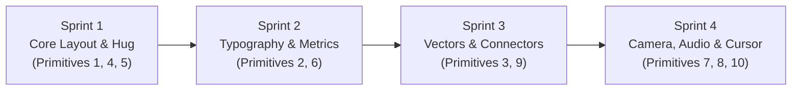

# Smart Motion Primitives & Reactive Video Features
## Architectural Research, Declarative Specification & Engine Blueprint

**Author:** Motion Studio Research & Kinetic Primitives Team  
**Status:** Architectural Blueprint & Proposed Specification  
**Target Engine:** Motion Studio Core (`PixiJS v8`, `Theatre.js`, `dependencyEngine.ts`, `evaluator.ts`, `scene.json`)

---

## Executive Summary

Traditional desktop motion graphics tools (Adobe After Effects, Cinema 4D, Apple Motion) were conceived in an era of manual keyframing and static coordinate systems. High-end motion design—such as speech bubbles that fluidly hug expanding text, pills that glide across spoken words, leader lines that stay glued to moving interface components, or cameras that dynamically frame active elements—requires hundreds of manual keyframes or fragile, multi-line JavaScript/ExtendScript expressions (`sourceRectAtTime()`, `toComp()`, `createPath()`). When copy edits occur or timing shifts by half a second, these fragile rigs break, forcing designers to spend hours on tedious maintenance rather than creative storytelling.

Motion Studio solves this problem through **Smart Motion Primitives**: declarative, reactive video features that turn these labor-intensive techniques into **1-click defaults**. Built on top of:
1. **PixiJS v8 WebGL/WebGPU hardware acceleration** (60–120fps zero-lag execution)
2. **Kahn's DAG Topological Dependency Engine** (`dependencyEngine.ts`: `pin`, `hug`, `match`, `remap`, `lag`)
3. **Deterministic Frame Evaluator** (`evaluator.ts` with sub-pixel Theatre.js and spring physics $f_{\text{spring}}$)
4. **Declarative JSON AST** (`scene.json`)

This document specifies **10 breakthrough Smart Motion Primitives**, detailing their real-world references, After Effects pain points, declarative schemas, mathematical engine implementations, and user experience workflows.

---

## The 10 Smart Motion Primitives Overview

| # | Primitive Name | Real-World Kinetic Reference | Core Mechanism | AE Pain vs. Motion Studio |
|---|---|---|---|---|
| **1** | **Dynamic Text Bubble / Card Auto-Hug** | Apple Dynamic Island, iMessage, Stripe launch cards | Dynamic bounding envelope with padding & spring physics | 40 lines of `sourceRectAtTime()` $\rightarrow$ 1-click `hug` binding |
| **2** | **Word Highlight & Focus Pill Tracker** | Linear feature promos, Apple keynotes, TikTok captions | Bounding-box snapping with snappy quintic interpolation | 60+ manual keyframes per paragraph $\rightarrow$ 1-click `track-word` |
| **3** | **Reactive Leader Lines & Callout Arrows** | Apple hardware reveals, Stripe UI tours, Vox explainers | 2D dynamic vector tangents & cubic bezier auto-routing | Complex `toComp()` & `createPath()` rigs $\rightarrow$ 1-click `leader-line` |
| **4** | **Auto-Pushdown Staggered Lists (FLIP)** | iOS notification stacks, Linear task feeds, Slack logs | Web Animations FLIP + spring pushdown cascades | Manual cascading keyframe offsets $\rightarrow$ `layout: { cascade: true }` |
| **5** | **2.5D Elevation & Dynamic Ground Shadow** | macOS window drag, Linear modals, Google Material 3 | Multi-layer light projection & contact shadow physics | 4 separate shadow slider expressions $\rightarrow$ 1 slider: `elevation: Z` |
| **6** | **Value / Counter & Ticker Interpolators** | Stripe recap metrics, Ramp fintech cards, AppleCard | Deterministic number interpolation & odometer digit roll | Broken slider expressions & regex $\rightarrow$ 1-click `<counter>` layer |
| **7** | **Kinetic Camera Focus Follow** | Screen Studio, Linear demos, Mac App Store promos | Bounding-box auto-framing & spring viewport tracking | Manual 3D Camera & Null rigs $\rightarrow$ `camera: { follow: 'target' }` |
| **8** | **Audio Beat & Syllable Reactivity** | Alex Hormozi captions, Apple "Don't Blink", Spotify | FFT energy impulse driving damped harmonic oscillator | "Convert Audio to Keyframes" sludge $\rightarrow$ 1-click `audio-pulse` |
| **9** | **Dynamic Orbit & Circular Node Array** | Supabase ecosystem, Stripe apps, M-series chip architecture | Parametric ellipse distribution & 2.5D depth scaling | Heavy `Math.cos`/`sin` null hierarchies $\rightarrow$ `layout: { display: 'orbit' }` |
| **10** | **Autonomous UI Cursor & Tap-Ripple Synthesizer** | Stripe checkout demos, Linear app tours, Raycast demos | Minimum-jerk trajectory polynomial + reactive click waves | 45 minutes of manual path keyframing $\rightarrow$ Declarative waypoint array |

---

## 1. Dynamic Text Bubble / Card Auto-Hug (The "Dynamic Island" Primitive)

### 1.1 Kinetic Problem Statement
In modern product promos and social videos, text rarely enters all at once. It pops in word-by-word, sentence-by-sentence, or streams in like an AI chat response. The surrounding card, speech bubble, or pill must expand and contract smoothly around the text without jittering, distorting rounded corners, or drifting from its anchor point.

### 1.2 Real-World Motion Reference
- **Apple Dynamic Island (iOS)**: The black capsule smoothly morphs its width, height, and corner radius as icons, timers, and text labels fade in and out.
- **Apple iMessage / WhatsApp**: Speech bubbles that dynamically size to the message length, anchored firmly at the bottom-left or bottom-right tail.
- **Stripe & Linear Feature Cards**: Launch cards that automatically adjust their dimensions as headlines and badges cascade in.

### 1.3 The After Effects Nightmare
In After Effects, building an auto-resizing box requires creating a Shape Layer with a Rectangle Path, linking its Size to a Text Layer via an expression:
```javascript
// Typical fragile After Effects expression on Rectangle Size:
var textLayer = thisComp.layer("Message Copy");
var r = textLayer.sourceRectAtTime(time, false);
var padX = 32;
var padY = 24;
[r.width + padX * 2, r.height + padY * 2];
```
**Why this breaks in practice:**
1. `sourceRectAtTime(time, false)` reads the raw bounding box of the entire text layer, completely ignoring word-by-word opacity, staggered pop animations, or character masks.
2. The box snaps abruptly rather than expanding with smooth spring physics.
3. If corner radius is applied to the rectangle, AE scales the shape from its center by default, requiring a second 15-line expression on `Rectangle Position` to keep it anchored to the text.
4. Changing font size, letter spacing, or line height breaks the alignment coordinates.

### 1.4 Motion Studio 1-Click Solution
Motion Studio turns this into a single declarative binding mode (`hug`) within `dependencyEngine.ts`. The engine continuously computes the bounding union of all *currently active* child words/chunks at time $t$, adds configured padding, applies an optional minimum/maximum clamp, and smooths the width/height transitions via damped spring physics ($f_{\text{spring}}$).

### 1.5 Declarative Schema Specification
```typescript
export interface HugBindingConfig {
  id: string;
  driverLayerId: string;       // Text layer or Group of staggered chunks
  mode: 'hug';
  padding: [number, number] | [number, number, number, number]; // [X, Y] or [T, R, B, L]
  hugAnchor?: ConstraintAnchor; // e.g. 'bottom-left' (speech tail) or 'center' (island)
  minWidth?: number;
  maxWidth?: number;
  minHeight?: number;
  maxHeight?: number;
  expansionPhysics?: 'instant' | 'spring' | 'smooth';
  stiffness?: number;          // Spring stiffness (default: 240)
  damping?: number;            // Spring damping (default: 22)
  autoCapsule?: boolean;       // Automatically clamp borderRadius to height / 2
}
```

**AST Example in `scene.json`:**
```json
{
  "id": "bubble_bg",
  "name": "Chat Bubble Background",
  "type": "shape",
  "shapeType": "rectangle",
  "style": {
    "backgroundColor": "#2563EB",
    "borderRadius": 24,
    "x": 100,
    "y": 400
  },
  "bindings": [
    {
      "id": "bind_hug_copy",
      "driverLayerId": "chat_text_group",
      "driverProp": "width",
      "drivenProp": "width",
      "mode": "hug",
      "padding": [24, 16],
      "hugAnchor": "bottom-left",
      "expansionPhysics": "spring",
      "stiffness": 220,
      "damping": 20,
      "autoCapsule": false
    }
  ]
}
```

### 1.6 Mathematical Engine Execution
1. **Active Union Calculation:**
   Let driver layer $D$ contain $N$ staggered child tokens. At time $t$, each token $i$ has an in-animation starting at $t_i$.
   $$\text{ActiveTokens}(t) = \{ i \in [0, N-1] \mid t \ge t_i \}$$
   If no tokens are active yet, fallback to minimum dimensions $(W_{\min}, H_{\min})$.
   The raw target bounding box is:
   $$X_{\min}(t) = \min_{i \in \text{Active}} (x_i(t)), \quad X_{\max}(t) = \max_{i \in \text{Active}} (x_i(t) + w_i(t))$$
   $$Y_{\min}(t) = \min_{i \in \text{Active}} (y_i(t)), \quad Y_{\max}(t) = \max_{i \in \text{Active}} (y_i(t) + h_i(t))$$
   $$W_{\text{target}}(t) = \text{clamp}(X_{\max}(t) - X_{\min}(t) + 2 \cdot \text{pad}_X, W_{\min}, W_{\max})$$
   $$H_{\text{target}}(t) = \text{clamp}(Y_{\max}(t) - Y_{\min}(t) + 2 \cdot \text{pad}_Y, H_{\min}, H_{\max})$$

2. **Damped Spring Smoothing:**
   When a new token appears at $t_k$, the target size jumps from $W_{k-1}$ to $W_k$. The rendered width $W(t)$ is evaluated deterministically using the closed-form damped harmonic oscillator:
   $$W(t) = W_{\text{target}} - (W_{\text{target}} - W_0) \cdot e^{-\zeta \omega_n \tau} \left( \cos(\omega_d \tau) + \frac{\zeta}{\sqrt{1-\zeta^2}} \sin(\omega_d \tau) \right)$$
   where $\omega_n = \sqrt{k/m}$, $\zeta = c / (2\sqrt{km})$, and $\tau = t - t_k$.

3. **Anchor Point Alignment:**
   Based on `hugAnchor`:
   - `'bottom-left'`: The bottom-left corner coordinate $(x, y + h)$ remains fixed; expansion grows towards the right and upward.
   - `'center'`: $x = x_{\text{center}} - W(t)/2, \quad y = y_{\text{center}} - H(t)/2$.

### 1.7 Design Mode vs. Motion Mode UX
- **Design Mode**: Select the shape layer and text layer $\rightarrow$ Click **"Hug Selection"** in the alignment toolbar. Padding handles appear directly on the canvas as blue dotted offsets that can be dragged interactively.
- **Motion Mode**: An "Expansion Dynamics" pill in the Inspector reveals spring presets (*Snappy*, *Liquid*, *Instant*). Scrubbing the playhead shows the container breathing organically as words appear.

### 1.8 Traditional Pain vs. Motion Studio Magic
- **After Effects**: 35 lines of fragile expression code per layer; broken corner radii; zero spring damping without third-party expression libraries.
- **Motion Studio**: 1-click binding; deterministic 60fps GPU rendering; automatic squircle corner protection; handles text copy changes instantly.

---

## 2. Word Highlight & Focus Pill Tracker (The "Linear Focus" Primitive)

### 2.1 Kinetic Problem Statement
A common visual trope in high-end explainers and caption videos is a highlight capsule, glow box, or underline that follows along with a headline, focusing on key words as they are spoken or animated.

### 2.2 Real-World Motion Reference
- **Linear Feature Promos & Navigation**: A subtle translucent pill glides seamlessly between active navigation tabs or highlighted changelog items.
- **Apple Keynote Headline Accents**: A yellow or cyan highlighter pill that sweeps across 2–3 words to punctuate an announcement.
- **TikTok / Instagram Kinetic Captions (Alex Hormozi style)**: Captions where the current spoken word is enveloped by an energetic bouncing background pill with inverted text color.

### 2.3 The After Effects Nightmare
In After Effects, achieving this requires:
1. Converting text to individual shape paths or creating a separate rectangle shape layer.
2. Manually creating 4 keyframes per word (Start X, End X, Width at Start, Width at End).
3. Repeating this for all 25 words in a script = **100+ manual keyframes**.
4. If the voiceover timing shifts by 0.3 seconds or copy changes from "Ship faster" to "Deploy instantly", every single position and width keyframe must be manually adjusted on the dope sheet.

### 2.4 Motion Studio 1-Click Solution
Motion Studio introduces the **Word Focus Tracker Binding**. By attaching any shape layer (pill, line, glow box) to a Text Layer with `mode: 'track-word'`, the shape automatically computes the position and width of each word token generated by `textSplitter.ts`. As time advances, the tracker glides from word $k$ to word $k+1$ using snappy quintic easing or spring physics, with optional automatic text color inversion for maximum contrast.

### 2.5 Declarative Schema Specification
```typescript
export interface WordTrackerBindingConfig {
  id: string;
  driverLayerId: string;       // ID of the target TextLayer
  mode: 'track-word';
  style: 'pill' | 'underline' | 'glow-box' | 'bracket';
  padding?: [number, number];  // [horizontal, vertical] padding around word
  transitionDuration?: number; // Duration of slide between words (e.g. 0.22s)
  easing?: EasingType;         // Default: 'snappy' (cubic-bezier(0.16, 1, 0.3, 1))
  invertActiveTextColor?: boolean; // Automatically make active word contrast against pill
  activeTextColor?: string;    // e.g. '#000000' when pill is '#FFFFFF'
  dwellScale?: number;         // Subtle pulse while dwelling on word (e.g. 1.04)
}
```

**AST Example in `scene.json`:**
```json
{
  "id": "focus_pill",
  "name": "Word Focus Pill",
  "type": "shape",
  "shapeType": "rectangle",
  "style": {
    "backgroundColor": "#FFFFFF",
    "borderRadius": 999,
    "opacity": 0.95
  },
  "bindings": [
    {
      "id": "bind_word_tracker",
      "driverLayerId": "headline_text",
      "driverProp": "progress",
      "drivenProp": "x",
      "mode": "track-word",
      "style": "pill",
      "padding": [12, 6],
      "transitionDuration": 0.22,
      "easing": "snappy",
      "invertActiveTextColor": true,
      "activeTextColor": "#000000"
    }
  ]
}
```

### 2.6 Mathematical Engine Execution
1. **Token Spatial Coordinates:**
   `textSplitter.ts` segments the text layer into words with bounding rectangles $R_i = (x_i, y_i, w_i, h_i)$ and time intervals $[t_i^{\text{start}}, t_i^{\text{end}}]$.
2. **Current State Interpolation:**
   At time $t$:
   - If $t \in [t_k^{\text{start}}, t_k^{\text{end}} - \Delta t_{\text{trans}}]$, the pill dwells at $R_k$.
   - During the transition window $[t_k^{\text{end}} - \Delta t_{\text{trans}}, t_{k+1}^{\text{start}}]$:
     $$\tau = \frac{t - (t_k^{\text{end}} - \Delta t_{\text{trans}})}{\Delta t_{\text{trans}}}$$
     $$p = \text{snappy}(\tau) = 1 - (1 - \tau)^5$$
     $$\text{TargetX}(t) = (1 - p) \cdot (x_k - \text{pad}_X) + p \cdot (x_{k+1} - \text{pad}_X)$$
     $$\text{TargetY}(t) = (1 - p) \cdot (y_k - \text{pad}_Y) + p \cdot (y_{k+1} - \text{pad}_Y)$$
     $$\text{TargetWidth}(t) = (1 - p) \cdot (w_k + 2\text{pad}_X) + p \cdot (w_{k+1} + 2\text{pad}_X)$$
     $$\text{TargetHeight}(t) = (1 - p) \cdot (h_k + 2\text{pad}_Y) + p \cdot (h_{k+1} + 2\text{pad}_Y)$$
3. **Contrast Shader / Style Inversion:**
   In PixiJS, the active word's color style is swapped to `activeTextColor` during the dwell interval, or rendered using a destination-out blend mode mask.

### 2.7 Design Mode vs. Motion Mode UX
- **Design Mode**: Right-click any headline $\rightarrow$ select **"Add Word Focus Pill"**. Motion Studio creates a rounded rectangle positioned behind the first word.
- **Motion Mode**: The timeline displays word marker chips directly on the text track. Dragging a word marker's timing on the timeline automatically updates the pill's slide trajectory.

### 2.8 Traditional Pain vs. Motion Studio Magic
- **After Effects**: Hundreds of manual keyframes; hours of re-timing if voiceover changes; zero automatic text color inversion.
- **Motion Studio**: Fully automatic; word positions computed from layout engine; updates instantaneously when text copy or speech timing changes.

---

## 3. Reactive Leader Lines & Callout Arrows (The "Technical Explainer" Primitive)

### 3.1 Kinetic Problem Statement
Technical product explainers, UI tours, and hardware launch videos frequently use leader lines (straight, curved, or stepped orthogonal lines) connecting an interface element or hardware component to an annotation badge. As the UI element animates, zooms, or scrolls, the leader line must stay anchored to both endpoints, flexing organically without breaking its arrowheads or end dots.

### 3.2 Real-World Motion Reference
- **Apple Hardware Reveals**: Callout lines extending from internal chips, camera lenses, or sensors to floating technical specs as the device rotates in 2.5D space.
- **Stripe Dashboard Tours**: Curved lines connecting payment metrics to explanatory tooltips.
- **Vox / Cleo Abram YouTube Explainers**: Diagrams where animated arrows bridge between floating diagrams and data callouts.

### 3.3 The After Effects Nightmare
Connecting two layers with a dynamic line in After Effects requires:
1. Creating a Shape Layer with a Path property.
2. Writing complex layer-space conversion expressions:
```javascript
// Painful AE Path Expression connecting Layer A to Layer B:
var p1 = thisComp.layer("Avatar").toComp([0.5, 0.5]);
var p2 = thisComp.layer("Callout Card").toComp([0, 0.5]);
createPath([fromComp(p1), fromComp(p2)], [], [], false);
```
3. Adding an arrow head requires a second layer with a rotation expression calculating `radiansToDegrees(Math.atan2(dy, dx))`.
4. If either layer is 3D, inside a precomp, or scaled, `toComp()` frequently breaks or introduces 1-frame expression lag.

### 3.4 Motion Studio 1-Click Solution
Motion Studio provides a dedicated `leader-line` layer type. The creator selects a Start Layer + Anchor (`avatar` $\rightarrow$ `'middle-right'`) and an End Layer + Anchor (`badge` $\rightarrow$ `'middle-left'`). The engine computes the vector trajectory every frame at 60fps, supporting straight lines, smooth cubic beziers, and orthogonal circuit-style elbows, complete with hardware-accelerated animated dashes (`dashSpeed`) and reactive arrowheads.

### 3.5 Declarative Schema Specification
```typescript
export interface LeaderLineLayer extends BaseLayer {
  type: 'leader-line';
  source: {
    layerId: string;
    anchor: ConstraintAnchor;
    offset?: [number, number];
  };
  target: {
    layerId: string;
    anchor: ConstraintAnchor;
    offset?: [number, number];
  };
  pathType: 'straight' | 'bezier' | 'orthogonal' | 'arc';
  curvature?: number;          // Curvature factor (-1.0 to 1.0 for bezier bow)
  strokeWidth: number;
  strokeColor: string;
  strokeDashArray?: [number, number]; // e.g. [6, 6] for dotted lines
  dashSpeed?: number;          // Animated marching dashes (pixels per second)
  startCap?: 'none' | 'dot' | 'ring' | 'pulse';
  endCap?: 'none' | 'arrow' | 'dot' | 'chevron';
  capSize?: number;
}
```

**AST Example in `scene.json`:**
```json
{
  "id": "leader_line_1",
  "name": "Feature Connector",
  "type": "leader-line",
  "source": {
    "layerId": "hero_button",
    "anchor": "middle-right",
    "offset": [4, 0]
  },
  "target": {
    "layerId": "tooltip_badge",
    "anchor": "middle-left",
    "offset": [-4, 0]
  },
  "pathType": "bezier",
  "curvature": 0.35,
  "strokeWidth": 2,
  "strokeColor": "#38BDF8",
  "strokeDashArray": [4, 4],
  "dashSpeed": 40,
  "startCap": "dot",
  "endCap": "arrow",
  "capSize": 8,
  "style": { "x": 0, "y": 0, "width": 1920, "height": 1080, "rotation": 0, "opacity": 1 }
}
```

### 3.6 Mathematical Engine Execution
1. **World Coordinate Resolution:**
   Using `dependencyEngine.ts` and `getAnchorPoint`:
   $$P_{\text{start}}(t) = \text{getAnchorPoint}(\text{Box}_{\text{source}}(t), \text{source.anchor}) + \text{offset}_S$$
   $$P_{\text{end}}(t) = \text{getAnchorPoint}(\text{Box}_{\text{target}}(t), \text{target.anchor}) + \text{offset}_T$$

2. **Cubic Bezier Trajectory:**
   $$\vec{D} = P_{\text{end}} - P_{\text{start}}, \quad L = \|\vec{D}\|$$
   $$\vec{N} = \left( -\frac{\vec{D}_y}{L}, \frac{\vec{D}_x}{L} \right) \quad (\text{perpendicular unit normal})$$
   Control points:
   $$C_1 = P_{\text{start}} + \vec{D} \cdot 0.33 + \vec{N} \cdot (L \cdot \text{curvature})$$
   $$C_2 = P_{\text{start}} + \vec{D} \cdot 0.66 + \vec{N} \cdot (L \cdot \text{curvature})$$

3. **Arrowhead Angle Calculation:**
   The tangent vector at $u = 1.0$ is:
   $$\vec{T} = \frac{d B(u)}{du} \Bigg|_{u=1} = 3(P_{\text{end}} - C_2)$$
   $$\theta = \operatorname{atan2}(\vec{T}_y, \vec{T}_x)$$
   The PixiJS graphics engine draws the arrowhead triangle rotated exactly at angle $\theta$, ensuring perfect alignment regardless of curvature.

### 3.7 Design Mode vs. Motion Mode UX
- **Design Mode**: Hovering over any layer displays anchor dots. Drag an arrow connector from Layer A to Layer B. A blue Bezier handle appears on the canvas to visually adjust curve tension.
- **Motion Mode**: Move or animate either layer; the connecting line flexes and follows at 60fps in real time without lag.

### 3.8 Traditional Pain vs. Motion Studio Magic
- **After Effects**: Broken coordinate spaces; custom trigonometric expressions needed for arrow heads; 1-frame expression lag during scrubs.
- **Motion Studio**: True declarative layer; topological dependency resolution; zero expression rigging; hardware-accelerated GPU stroke paths.

---

## 4. Auto-Pushdown Staggered Lists (The "Notification Cascade" Primitive)

### 4.1 Kinetic Problem Statement
In UI demo videos, items entering a list or feed (push notifications, chat messages, activity logs) must smoothly slide into place while **pushing existing items down (or up)**. Animating 5 notifications where each subsequent item displaces earlier items with natural spring physics is notoriously tedious.

### 4.2 Real-World Motion Reference
- **Apple iOS Lock Screen**: Notifications cascading in and stacking, gently pushing prior notifications downward with damped bounce.
- **Linear Task Feed**: Adding a new task pushes the rest of the list down with a crisp spring.
- **Stripe Live Logs**: Real-time event webhooks appearing at the top of a terminal, shifting the history downward.

### 4.3 The After Effects Nightmare
To animate 5 notifications entering a list in After Effects:
- Item 1 enters at $t=0.5$s.
- Item 2 enters at $t=1.0$s: Designer must add keyframes to Item 1's $Y$ position to push it down by $(h_2 + \text{gap})$.
- Item 3 enters at $t=1.5$s: Designer must add keyframes to BOTH Item 1 and Item 2.
- Item 4 enters at $t=2.0$s: Keyframes added to Items 1, 2, and 3.
- Total keyframes: **30+ position keyframes**.
- If the copy in Notification 2 increases from 1 line to 2 lines ($h_2$ changes from 64px to 88px), **every single keyframe on all following items is wrong and must be manually recalculated**.

### 4.4 Motion Studio 1-Click Solution
Motion Studio applies the **FLIP (First, Last, Invert, Play) Layout Morphing** principle natively inside `evaluator.ts`. When a Group Layer has `layout: { cascade: 'push-down' }`, the engine computes each child's resting position dynamically based on how many sibling items have entered at time $t$. When a new item enters, preceding items automatically transition to their new positions using spring dynamics ($f_{\text{spring}}$).

### 4.5 Declarative Schema Specification
```typescript
export interface CascadeLayoutConfig extends LayoutConfig {
  cascadeMode: 'push-down' | 'push-up' | 'smart-reorder';
  spring: {
    stiffness: number; // default: 200
    damping: number;   // default: 20
  };
  maxVisibleItems?: number; // Older items beyond this limit scale down and fade out
}
```

**AST Example in `scene.json`:**
```json
{
  "id": "notifications_feed",
  "name": "Notification Stack",
  "type": "group",
  "layout": {
    "display": "flex",
    "flexDirection": "column",
    "gap": 12,
    "align": "center",
    "justifyContent": "start",
    "cascadeMode": "push-down",
    "spring": { "stiffness": 190, "damping": 18 },
    "maxVisibleItems": 4
  },
  "autoFit": true,
  "children": [
    { "id": "notif_1", "name": "Notif 1", "animation": { "in": { "preset": "pop", "start": 0.4, "duration": 0.5, "easing": "bouncy" } } },
    { "id": "notif_2", "name": "Notif 2", "animation": { "in": { "preset": "pop", "start": 1.2, "duration": 0.5, "easing": "bouncy" } } },
    { "id": "notif_3", "name": "Notif 3", "animation": { "in": { "preset": "pop", "start": 2.0, "duration": 0.5, "easing": "bouncy" } } }
  ]
}
```

### 4.6 Mathematical Engine Execution
1. **Dynamic Target Index Determination:**
   Let children be sorted by arrival time $[C_0, C_1, \dots, C_{M-1}]$.
   At time $t$, define the active set $A(t) = \{ j \mid t \ge t_j^{\text{start}} \}$.
   In `'push-down'` mode, the newest active item occupies slot 0; earlier items shift to index $k = \operatorname{rank}(j, t)$.
2. **Cumulative Height Offset:**
   The target $Y$ position for item $j$ at time $t$ is:
   $$Y_j^{\text{target}}(t) = \sum_{k < \text{slot}(j, t)} (H_k + \text{gap})$$
3. **Continuous Spring Evaluation:**
   When item $j$ is displaced by a new arrival at $t_{\text{new}}$, its instantaneous displacement $\Delta y = Y_j^{\text{target}}(t) - Y_j^{\text{target}}(t^-)$ is smoothed via `evaluateSpring()`:
   $$y_j(t) = Y_j^{\text{target}}(t) - \Delta y \cdot \text{SpringDecay}(t - t_{\text{new}})$$

### 4.7 Design Mode vs. Motion Mode UX
- **Design Mode**: Create a group with cards. In the layout panel, switch layout to **"Cascading Feed"**. Set spacing and alignment.
- **Motion Mode**: Drag each child layer's in-point along the timeline. Notice that the preview automatically plays the physical pushdown cascade without creating a single position keyframe.

### 4.8 Traditional Pain vs. Motion Studio Magic
- **After Effects**: 30+ manual keyframes; breaking layout cascades whenever card height changes; zero dynamic re-flow.
- **Motion Studio**: 0 position keyframes; automatic FLIP layout; dynamic height awareness; natural spring physics.

---

## 5. 2.5D Elevation & Dynamic Ground Shadow (The "Layer Lift" Primitive)

### 5.1 Kinetic Problem Statement
When cards, modals, or device mockups lift off a canvas (e.g. during a hover, pop-up, or drag animation), their drop shadows must dynamically adapt: as elevation $Z$ increases, the shadow expands, blurs, drifts further from the virtual light source, and becomes more diffuse. When the element lands, the shadow contracts into a sharp, dark contact shadow.

### 5.2 Real-World Motion Reference
- **Apple macOS Window Dragging**: Lifting an active Finder window casts a deep, soft ambient shadow while maintaining a crisp contact edge.
- **Linear Modal Popups**: Modals lifting off the background canvas with realistic two-tier diffuse lighting.
- **Google Material 3**: Systematic elevation states ($0\text{dp} \to 16\text{dp}$) with physics-based ambient and key light shadows.

### 5.3 The After Effects Nightmare
Creating realistic dynamic elevation in AE requires animating 4 separate properties across 2 separate drop shadow effects per layer:
1. Shadow 1 (Contact): Distance, Softness, Opacity.
2. Shadow 2 (Ambient): Distance, Softness, Opacity.
- Animating a card lifting up requires keyframing **8 shadow parameters** alongside layer Scale and Position.
- If a directional light source is moved, all distance and direction keyframes must be manually updated.

### 5.4 Motion Studio 1-Click Solution
Motion Studio treats **Elevation ($Z$)** as a first-class numeric transform property on `LayerStyle`. When $Z$ is animated (via preset or keyframe), `evaluator.ts` deterministically computes a dual-tier shadow (tight contact occlusion + soft atmospheric dispersion) projected from a virtual light source.

### 5.5 Declarative Schema Specification
```typescript
export interface LayerStyle {
  // Existing spatial properties...
  elevation?: number; // Virtual Z height in pixels (0 = flat on canvas, 100 = floating high)
  lightSource?: {
    x: number;        // Canvas X coordinate of virtual light (default: canvas.width / 2)
    y: number;        // Canvas Y coordinate of virtual light (default: -400px above top)
    intensity?: number; // 0.0 to 2.0 (default: 1.0)
  };
  shadowPreset?: 'natural' | 'crisp' | 'soft-glow' | 'isometric';
}
```

**AST Example in `scene.json`:**
```json
{
  "id": "feature_card",
  "name": "Feature Card",
  "type": "shape",
  "shapeType": "rectangle",
  "style": {
    "x": 600,
    "y": 350,
    "width": 720,
    "height": 420,
    "backgroundColor": "#18181B",
    "borderRadius": 20,
    "elevation": 48
  },
  "animation": {
    "in": {
      "preset": "pop",
      "start": 0.5,
      "duration": 0.8,
      "easing": "snappy"
    }
  }
}
```

### 5.6 Mathematical Engine Execution
Given layer center $(x_c, y_c)$ and elevation $Z(t)$:
1. **Light Vector Projection:**
   $$\vec{L} = (x_c - \text{light.x}, y_c - \text{light.y})$$
   $$\text{Dist} = \|\vec{L}\|, \quad \vec{u}_L = \frac{\vec{L}}{\text{Dist}}$$
2. **Dual-Tier Shadow Calculation:**
   - **Contact Shadow (High Occlusion, Low Blur):**
     $$\text{offset}_{Y1} = Z \cdot 0.25$$
     $$\text{blur}_1 = Z \cdot 0.2 + 2$$
     $$\alpha_1 = 0.45 \cdot e^{-Z / 80}$$
   - **Ambient Dispersion Shadow (Soft, Expansive):**
     $$\text{offset}_{X2} = \vec{u}_{Lx} \cdot (Z \cdot 0.4)$$
     $$\text{offset}_{Y2} = \vec{u}_{Ly} \cdot (Z \cdot 0.4) + Z \cdot 0.7$$
     $$\text{blur}_2 = Z \cdot 1.4 + 8$$
     $$\alpha_2 = 0.25 \cdot \left( \frac{1}{1 + Z \cdot 0.015} \right)$$
3. **CSS / PixiJS Compilation:**
   `evaluator.ts` outputs compiled CSS filter shadows or updates dual PixiJS drop-shadow filter uniforms with zero manual artist rigging.

### 5.7 Design Mode vs. Motion Mode UX
- **Design Mode**: An **Elevation Slider** ($0\text{px} \to 120\text{px}$) in the Inspector. A virtual light handle on the canvas allows rotating the light angle visually.
- **Motion Mode**: Apply the preset `"lift"` or keyframe `elevation: 0 -> 48`. The shadow organically detaches, diffuses, and lands.

### 5.8 Traditional Pain vs. Motion Studio Magic
- **After Effects**: 8 keyframes per lift animation across 2 separate effects; tedious light angle sync.
- **Motion Studio**: 1 slider (`elevation`); physically accurate dual-tier ambient + contact optics calculated automatically.

---

## 6. Value / Counter & Ticker Interpolators (The "Fintech Count-Up" Primitive)

### 6.1 Kinetic Problem Statement
Financial technology promos (Stripe, Ramp, Mercury), SaaS recaps, and metric dashboards require animated number counters (e.g. `$0` to `$1,250,490`, `0.0%` to `99.9%`, `0` to `50k+`). Numbers must count up along natural deceleration curves, format commas and decimals properly, and support rolling vertical odometer drum animations.

### 6.2 Real-World Motion Reference
- **Stripe Annual Recap**: Large metrics counting up with rolling vertical digit reels.
- **Ramp Fintech Cards**: Spend limits counting up dynamically from `$0` to `$250,000`.
- **Apple Watch Activity Rings**: Calorie and step counters ticking up with spring easing.

### 6.3 The After Effects Nightmare
1. Native Text layers cannot interpolate numbers; artists must apply a "Slider Control" effect.
2. Writing expressions to format thousands separators requires a 12-line regex hack:
```javascript
// Painful AE Number Formatting Expression:
var val = effect("Slider Control")("Slider").value;
var rounded = Math.round(val);
"$" + rounded.toString().replace(/\B(?=(\d{3})+(?!\d))/g, ",");
```
3. AE Slider Controls clamp at $1,000,000$ by default, breaking on enterprise values.
4. Building a rolling odometer ticker requires creating 10 precomps with masked vertical number columns $[0, 1, 2, \dots, 9]$ and manually staggering their roll speeds.

### 6.4 Motion Studio 1-Click Solution
Motion Studio provides a first-class `counter` layer type. Creators declare `startValue`, `endValue`, `duration`, `easing`, and formatting rules (`prefix`, `suffix`, `decimals`, `notation: 'compact'`). The layer renders either as smooth continuous typography or as a hardware-accelerated **3D Rolling Odometer**.

### 6.5 Declarative Schema Specification
```typescript
export interface CounterLayer extends BaseLayer {
  type: 'counter';
  startValue: number;
  endValue: number;
  displayMode: 'continuous' | 'odometer';
  format: {
    prefix?: string;             // e.g. "$" or "€"
    suffix?: string;             // e.g. "/mo" or "%" or "+"
    decimals?: number;           // Number of decimal places (default: 0)
    thousandsSeparator?: ',' | '.' | ' ';
    decimalSeparator?: '.' | ',';
    compactNotation?: boolean;   // e.g. 1.5M instead of 1,500,000
    padLeadingZeroes?: number;   // e.g. 3 -> "007"
  };
}
```

**AST Example in `scene.json`:**
```json
{
  "id": "arr_metric",
  "name": "ARR Metric Counter",
  "type": "counter",
  "startValue": 0,
  "endValue": 1250490,
  "displayMode": "odometer",
  "format": {
    "prefix": "$",
    "suffix": "",
    "decimals": 0,
    "thousandsSeparator": ","
  },
  "style": {
    "fontSize": 72,
    "fontFamily": "Geist Mono",
    "fontWeight": 700,
    "color": "#FFFFFF",
    "x": 400,
    "y": 300,
    "width": 600,
    "height": 90
  },
  "animation": {
    "in": {
      "preset": "snappy",
      "start": 0.4,
      "duration": 2.2,
      "easing": "snappy"
    }
  }
}
```

### 6.6 Mathematical Engine Execution
1. **Normalized Progress Curve:**
   At time $t$, with start time $t_s$ and duration $T$:
   $$p = \text{snappy}\left( \operatorname{clamp}\left( \frac{t - t_s}{T}, 0, 1 \right) \right)$$
   $$V(t) = V_{\text{start}} + p \cdot (V_{\text{end}} - V_{\text{start}})$$

2. **Odometer Column Phase Calculation:**
   For each digit column at power $10^m$ (where $m=0$ is units, $m=1$ is tens):
   $$\text{DigitVal}_m(t) = \frac{V(t)}{10^m} \pmod{10}$$
   The vertical pixel scroll offset for column $m$ with line height $H_{\text{line}}$ is:
   $$Y_m(t) = -(\text{DigitVal}_m(t)) \cdot H_{\text{line}}$$
   Higher-order digits only spin when lower-order digits roll past 9, exactly mimicking mechanical odometers.

### 6.7 Design Mode vs. Motion Mode UX
- **Design Mode**: Insert **Text $\rightarrow$ Counter**. Type the start and end values into the Inspector. Choose currency or percentage from dropdown presets.
- **Motion Mode**: Adjust duration handle on the timeline. Toggle between "Smooth Count" and "Rolling Odometer" with one click.

### 6.8 Traditional Pain vs. Motion Studio Magic
- **After Effects**: 15-line regex expressions; precomp nesting nightmares for rolling digits; slider clamp bugs.
- **Motion Studio**: Declarative 1-click counter; built-in odometer physics; international formatting via standard `Intl.NumberFormat`.

---

## 7. Kinetic Camera Focus Follow & Auto-Framing (The "Director's Camera" Primitive)

### 7.1 Kinetic Problem Statement
In software walkthroughs and multi-element explainer videos, the viewer's eye must be guided across different focal points (e.g. from an overview $\to$ search input $\to$ dropdown $\to$ confirmation modal). Creating smooth pan-and-zoom camera sweeps that keep targets perfectly centered with generous padding is painful to rig manually.

### 7.2 Real-World Motion Reference
- **Screen Studio**: Automatically detects mouse activity and zooms into active windows with buttery easing.
- **Apple Keynote Screen Recordings**: Camera gliding and zooming seamlessly to highlight UI controls during feature walk-throughs.
- **Linear Product Tours**: The viewport panning diagonally across a high-res canvas to follow a workflow.

### 7.3 The After Effects Nightmare
1. Creating a 3D Camera layer, plus a 3D Null object ("Camera Controller").
2. Parenting the camera to the null.
3. For every focal point, the artist must keyframe both **Null Position** and **Camera Zoom**.
4. If the target UI button moves or resizes, the camera misses the target, requiring manual recalibration of both position and zoom keyframes.

### 7.4 Motion Studio 1-Click Solution
Motion Studio incorporates camera control directly into the scene document model via `ViewportMatrix.ts`. Creators define **Camera Focus Targets** by referencing layer IDs. The engine automatically calculates the target element's bounding box center and the optimal zoom level to fit it with specified screen padding, executing the transition using spring dynamics.

### 7.5 Declarative Schema Specification
```typescript
export interface CameraFocusWaypoint {
  time: number;                // Timestamp when camera begins moving to this target
  targetLayerId: string | 'overview'; // Target element, or 'overview' to reset
  transitionDuration?: number; // e.g. 1.2s
  easing?: EasingType;         // Default: 'snappy'
  paddingFactor?: number;      // Viewport margin around target (e.g. 0.35 = 35% margin)
  minZoom?: number;            // Default: 1.0
  maxZoom?: number;            // Default: 3.5
}

export interface CameraTrackConfig {
  enabled: boolean;
  waypoints: CameraFocusWaypoint[];
  smoothing: {
    stiffness: number;         // default: 160
    damping: number;           // default: 18
  };
}
```

**AST Example in `scene.json`:**
```json
{
  "camera": {
    "enabled": true,
    "waypoints": [
      { "time": 0.0, "targetLayerId": "overview", "transitionDuration": 0.8 },
      { "time": 1.5, "targetLayerId": "search_modal", "transitionDuration": 1.1, "paddingFactor": 0.25 },
      { "time": 4.0, "targetLayerId": "submit_button", "transitionDuration": 0.9, "paddingFactor": 0.4 }
    ],
    "smoothing": { "stiffness": 170, "damping": 19 }
  }
}
```

### 7.6 Mathematical Engine Execution
1. **Target Framing Calculation:**
   For target layer with bounding box $B_{\text{target}} = (x, y, w, h)$ at artboard resolution $(W_{\text{art}}, H_{\text{art}})$:
   $$\text{Center}_{\text{world}} = \left( x + \frac{w}{2}, y + \frac{h}{2} \right)$$
   $$\text{Scale}_{\text{fit}} = \min\left( \frac{W_{\text{art}}}{w \cdot (1 + 2 \cdot \text{pad})}, \frac{H_{\text{art}}}{h \cdot (1 + 2 \cdot \text{pad})} \right)$$
   $$\text{TargetZoom} = \operatorname{clamp}(\text{Scale}_{\text{fit}}, \text{minZoom}, \text{maxZoom})$$

2. **Spring Viewport Integration (`ViewportMatrix.ts`):**
   The camera pan and zoom are smoothly interpolated at time $t$ via `evaluateSpring()`:
   $$\vec{\text{Pan}}(t) = \vec{\text{Pan}}_{\text{target}} - \Delta \vec{\text{Pan}} \cdot \text{SpringDecay}(t)$$
   $$\text{Zoom}(t) = \text{Zoom}_{\text{target}} - \Delta \text{Zoom} \cdot \text{SpringDecay}(t)$$
   The resulting transformation matrix $M_{\text{cam}}$ is applied to the root PixiJS `artboardContainer`.

### 7.7 Design Mode vs. Motion Mode UX
- **Design Mode**: Select an element $\rightarrow$ click **"Focus Camera Here"** in the top bar. A camera waypoint icon is inserted onto the timeline.
- **Motion Mode**: The timeline features a dedicated **Camera Track**. Waypoint markers can be dragged, trimmed, or retargeted to different layers effortlessly.

### 7.8 Traditional Pain vs. Motion Studio Magic
- **After Effects**: Complex 3D camera rigs; manual Point-of-Interest keyframing; drifting targets.
- **Motion Studio**: 1-click layer targeting; automated bounding-box framing; physics-smoothed pan-and-zoom.

---

## 8. Audio Beat & Syllable Reactivity (The "Speech Pop" Primitive)

### 8.1 Kinetic Problem Statement
In viral social media videos, short-form reels, and energetic brand promos, visual elements (words, stickers, emojis, icons) must punch, pulse, or bounce in sync with speech syllables or musical bass kicks.

### 8.2 Real-World Motion Reference
- **Alex Hormozi Viral Reels**: Spoken words punch out with an energetic scale pop ($1.0 \to 1.25 \to 1.0$) on accented voice syllables.
- **Apple "Don't Blink" Promos**: Words and graphics synchronizing with rhythmic drum transients.
- **Spotify Wrapped Motion**: Visual cards pulsing to musical downbeats.

### 8.3 The After Effects Nightmare
1. In AE, users must right-click an audio layer $\to$ **"Keyframe Assistant $\to$ Convert Audio to Keyframes"**.
2. This creates an unwieldy slider layer with thousands of raw keyframes (1 per frame).
3. The artist then writes expressions with thresholds:
```javascript
// Painful AE Audio Reactive Expression:
var s = thisComp.layer("Audio Amplitude").effect("Both Channels")("Slider");
var thresh = 25;
if (s > thresh) {
  var diff = s - thresh;
  [100 + diff * 2, 100 + diff * 2];
} else {
  [100, 100];
}
```
4. This results in robotic, jittery scaling without organic spring overshoot or natural physics recovery.

### 8.4 Motion Studio 1-Click Solution
Motion Studio integrates audio understanding natively into the engine. Spoken syllable onsets (from Whisper transcription) and musical beat transients (from Tauri/Rust FFmpeg audio analysis) are extracted into compact timestamp arrays. Creators simply check **"Pulse to Speech"** or **"Bounce to Beat"**; each transient injects an impulse into a damped spring oscillator.

### 8.5 Declarative Schema Specification
```typescript
export interface AudioReactiveBindingConfig {
  id: string;
  driverTrackId: string;       // Audio track ID
  mode: 'audio-pulse';
  trigger: 'speech-syllable' | 'music-beat' | 'bass-transient';
  drivenProperty: 'scale' | 'rotation' | 'y' | 'glow';
  impulseMagnitude: number;    // e.g. 0.25 (scale up to 1.25)
  springRecovery: {
    stiffness: number;         // default: 280
    damping: number;           // default: 14
  };
}
```

**AST Example in `scene.json`:**
```json
{
  "id": "emphasis_badge",
  "name": "Speech Synced Badge",
  "type": "shape",
  "shapeType": "circle",
  "style": { "x": 960, "y": 540, "width": 120, "height": 120, "backgroundColor": "#EC4899" },
  "bindings": [
    {
      "id": "bind_speech_pop",
      "driverTrackId": "voiceover_audio",
      "driverProp": "progress",
      "drivenProp": "scale",
      "mode": "audio-pulse",
      "trigger": "speech-syllable",
      "impulseMagnitude": 0.28,
      "springRecovery": { "stiffness": 300, "damping": 15 }
    }
  ]
}
```

### 8.6 Mathematical Engine Execution
1. **Transient Extraction:**
   The audio pipeline yields a list of impulse timestamps $T_{\text{hits}} = [t_0, t_1, \dots, t_M]$ and normalized intensities $I_k \in [0, 1]$.
2. **Harmonic Impulse Superposition:**
   For any current time $t$, consider all hits within decay window $[t - \Delta t_{\text{max}}, t]$:
   $$\text{Scale}(t) = 1.0 + \sum_{k: t_k \le t} I_k \cdot A \cdot e^{-\zeta \omega_n (t - t_k)} \cos(\omega_d (t - t_k))$$
   where $\omega_d = \omega_n \sqrt{1 - \zeta^2}$.
   This guarantees physical, punchy bounce without jitter or keyframe bloat.

### 8.7 Design Mode vs. Motion Mode UX
- **Design Mode**: Select element $\rightarrow$ click **"Pulse on Audio"** in the properties inspector. Select the target audio layer.
- **Motion Mode**: Waveform peaks on the audio timeline display glowing markers where beats/syllables hit, allowing visual tuning of threshold sensitivity.

### 8.8 Traditional Pain vs. Motion Studio Magic
- **After Effects**: Massive slider layers with 2,000+ keyframes; harsh, jittery motion; no spring bounce.
- **Motion Studio**: Zero keyframes; native transient detection; organic damped spring impulses.

---

## 9. Dynamic Orbit & Circular Node Array (The "Ecosystem Orbit" Primitive)

### 9.1 Kinetic Problem Statement
In technology stack reveals, architecture diagrams, and brand ecosystem explainers, a hero product logo is surrounded by orbiting satellite badges (partner logos, features, integrations). Adding or removing a badge should automatically redistribute all nodes evenly along an elliptical orbit without manual angle recalculations.

### 9.2 Real-World Motion Reference
- **Supabase Launch Week**: The central green Postgres logo surrounded by orbiting icons (Auth, Storage, Edge Functions, Realtime).
- **Stripe Ecosystem Videos**: Partner app cards revolving smoothly around a central credit card terminal.
- **Apple Silicon Architecture**: Core CPU/GPU clusters distributed symmetrically in circular layouts.

### 9.3 The After Effects Nightmare
1. Setting up circular distribution in AE requires creating a center Null, parenting each satellite layer, and manually calculating angle increments ($\frac{360^\circ}{N}$).
2. To keep icons upright as they orbit, the artist must add counter-rotation expressions to every child: `transform.rotation = -parent.transform.rotation`.
3. Changing the number of icons from 5 to 6 requires manually adjusting all 6 parent null rotation values.
4. Simulating 2.5D depth (icons in back scaling down to 0.7 and lowering opacity) requires writing complex trigonometry expressions.

### 9.4 Motion Studio 1-Click Solution
Motion Studio introduces `layout: { display: 'orbit' }` on `GroupLayer`. The engine automatically positions all child layers along an elliptical ring with radii $(R_x, R_y)$, rotates them at a declared velocity, counter-rotates child contents so they stay upright, and modulates scale and z-index to deliver instant 2.5D depth.

### 9.5 Declarative Schema Specification
```typescript
export interface OrbitLayoutConfig {
  display: 'orbit';
  radiusX: number;             // Horizontal radius in pixels
  radiusY: number;             // Vertical radius (set < radiusX for 2.5D perspective)
  tiltAngle?: number;          // Tilt angle of the orbital ring (in degrees)
  rotationSpeed?: number;      // Angular velocity (revolutions per second)
  faceForward?: boolean;       // Automatically counter-rotate so badges remain upright
  depthModulation?: boolean;   // Modulate scale (0.75 in back -> 1.15 in front) and z-index
  depthScaleRange?: [number, number];
}
```

**AST Example in `scene.json`:**
```json
{
  "id": "tech_stack_orbit",
  "name": "Integration Orbit",
  "type": "group",
  "layout": {
    "display": "orbit",
    "radiusX": 340,
    "radiusY": 140,
    "tiltAngle": -15,
    "rotationSpeed": 0.08,
    "faceForward": true,
    "depthModulation": true,
    "depthScaleRange": [0.75, 1.2]
  },
  "children": [
    { "id": "icon_react", "name": "React" },
    { "id": "icon_node", "name": "Node" },
    { "id": "icon_postgres", "name": "Postgres" },
    { "id": "icon_graphql", "name": "GraphQL" },
    { "id": "icon_tailwind", "name": "Tailwind" }
  ]
}
```

### 9.6 Mathematical Engine Execution
1. **Angular Distribution:**
   For $N$ children, child $i \in [0, N-1]$ has base angular offset $\phi_i = \frac{2\pi \cdot i}{N}$.
   At time $t$, total angle is $\theta_i(t) = \phi_i + 2\pi \cdot \text{speed} \cdot t$.
2. **Parametric Elliptical Coordinates:**
   $$x_i'(t) = R_x \cdot \cos(\theta_i(t))$$
   $$y_i'(t) = R_y \cdot \sin(\theta_i(t))$$
3. **Tilt Rotation Matrix:**
   $$\begin{pmatrix} x_i(t) \\ y_i(t) \end{pmatrix} = \begin{pmatrix} \cos\psi & -\sin\psi \\ \sin\psi & \cos\psi \end{pmatrix} \begin{pmatrix} x_i'(t) \\ y_i'(t) \end{pmatrix}$$
4. **2.5D Depth Modulation:**
   $$\text{DepthNorm} = \frac{\sin(\theta_i(t)) + 1}{2} \in [0, 1]$$
   $$\text{Scale}_i(t) = S_{\min} + \text{DepthNorm} \cdot (S_{\max} - S_{\min})$$
   $$\text{ZIndex}_i(t) = \operatorname{round}(\text{DepthNorm} \cdot 100)$$
   If `faceForward: true`, child rotation is set to $-\psi$ to maintain perfect visual alignment.

### 9.7 Design Mode vs. Motion Mode UX
- **Design Mode**: Select multiple layers $\rightarrow$ click **"Arrange in Orbit"**. Visual ellipse rings appear on canvas with drag handles for $R_x, R_y$, and tilt angle.
- **Motion Mode**: Adjust the "Orbit Speed" slider to control rotation velocity. Adding a new child layer immediately redistributes the orbit dynamically.

### 9.8 Traditional Pain vs. Motion Studio Magic
- **After Effects**: Heavy null parenting hierarchies; manual angle math; manual counter-rotation expressions; tedious pseudo-3D layering.
- **Motion Studio**: Declarative 1-click orbit layout; automatic equidistant distribution; built-in 2.5D depth and upright counter-rotation.

---

## 10. Autonomous UI Cursor & Tap-Ripple Synthesizer (The "Product Demo" Primitive)

### 10.1 Kinetic Problem Statement
Producing software walkthroughs requires simulating a realistic human mouse cursor moving between buttons, clicking cards, and triggering interactive feedback. In traditional video editing, animating cursor motion paths, timing clicks, and creating expanding ripple circles takes 30–45 minutes per screen.

### 10.2 Real-World Motion Reference
- **Stripe / Linear Product Demos**: A clean macOS pointer smoothly navigating UI menus and triggering crisp ripple pulses on click.
- **Raycast Feature Promos**: Rapid keyboard/mouse commands highlighted by tactile cursor clicks.
- **Screen Studio**: Automatic smooth cursor path generation and automated click zoom.

### 10.3 The After Effects Nightmare
1. Drawing a spatial Bezier motion path for the cursor across 5 button targets.
2. Manually tweaking spatial tangents so the mouse moves naturally without robotic straight lines or unnatural loops.
3. For each click: manually keyframing cursor scale down to 0.85 and back up to 1.0.
4. For each click: creating a separate shape layer with an expanding circle, animating Scale $0 \to 100\%$ and Opacity $100\% \to 0\%$.
5. If a button moves 20px, the cursor path, click keyframes, and ripple shape must all be manually re-positioned.

### 10.4 Motion Studio 1-Click Solution
Motion Studio provides a dedicated `cursor` primitive. Creators declare an array of waypoints specifying target layer IDs (`btn_signup`, `menu_item_3`) and actions (`click`, `double-click`, `hover`). The engine computes an organic humanized **minimum-jerk trajectory** between targets, executes click squashing, and automatically emits hardware-accelerated radial ripple waves at the target contact point.

### 10.5 Declarative Schema Specification
```typescript
export interface CursorWaypoint {
  time: number;
  targetLayerId: string;
  targetAnchor?: ConstraintAnchor; // default: 'center'
  offset?: [number, number];
  action?: 'move-only' | 'click' | 'double-click' | 'hover-dwell';
  dwellDuration?: number;          // Pause duration on target in seconds (default: 0.25)
}

export interface CursorLayer extends BaseLayer {
  type: 'cursor';
  cursorStyle: 'mac-pointer' | 'mac-hand' | 'windows' | 'circle-touch';
  rippleColor?: string;            // default: 'rgba(59, 130, 246, 0.4)'
  maxRippleRadius?: number;        // default: 48px
  waypoints: CursorWaypoint[];
}
```

**AST Example in `scene.json`:**
```json
{
  "id": "demo_cursor",
  "name": "Demo Cursor",
  "type": "cursor",
  "cursorStyle": "mac-pointer",
  "rippleColor": "rgba(99, 102, 241, 0.5)",
  "maxRippleRadius": 54,
  "style": { "x": 0, "y": 0, "width": 24, "height": 24, "rotation": 0, "opacity": 1 },
  "waypoints": [
    { "time": 0.5, "targetLayerId": "nav_pricing", "action": "click", "dwellDuration": 0.2 },
    { "time": 2.0, "targetLayerId": "tier_pro_card", "action": "click", "dwellDuration": 0.3 }
  ]
}
```

### 10.6 Mathematical Engine Execution
1. **Minimum-Jerk Human Trajectory:**
   Studies in human motor control (Flash & Hogan) prove that human hand and mouse movements minimize the integral of squared jerk $\int (\dddot{x})^2 dt$.
   For movement between point $P_0$ and $P_1$ over time window $[t_0, t_1]$ with normalized duration $\tau = \frac{t - t_0}{t_1 - t_0} \in [0, 1]$:
   $$\vec{P}(\tau) = P_0 + (P_1 - P_0) \cdot (10\tau^3 - 15\tau^4 + 6\tau^5)$$
   This single 5th-order polynomial generates authentic human acceleration and deceleration curves without robotic linear artifacts.

2. **Click Physics & Expanding Wave:**
   At click timestamp $t_c$:
   - Cursor squashes: $\text{Scale}(t) = 1.0 - 0.16 \cdot \text{pulse}(t - t_c)$.
   - Radial ripple expanding on GPU:
     $$R(t) = R_{\max} \cdot \left( 1 - e^{-10(t - t_c)} \right)$$
     $$\text{Opacity}(t) = \alpha_0 \cdot e^{-6(t - t_c)}$$
   The ripple renders as an instanced PixiJS graphics circle pinned directly to the target layer's world coordinates.

### 10.7 Design Mode vs. Motion Mode UX
- **Design Mode**: Click **"Add Cursor Tour"**. Click on the 3 buttons you want the cursor to visit in sequence. Motion Studio automatically generates the waypoints.
- **Motion Mode**: The timeline shows waypoint diamonds. Dragging a button on canvas updates the cursor's trajectory automatically.

### 10.8 Traditional Pain vs. Motion Studio Magic
- **After Effects**: 45 minutes of manual bezier tweaking per demo; tedious ripple shape precomposing.
- **Motion Studio**: Declarative target list; human minimum-jerk trajectory physics; automatic click squash and ripple synthesis.

---

## Architectural Implementation Blueprint

### 1. Schema Extensions (`src/types/scene.ts`)
The declarative JSON AST requires extending `Layer`, `LayerStyle`, `LayoutConfig`, and `ElementLinkBinding`:

```typescript
// 1. Extend LinkMode to support advanced kinetic tracking
export type LinkMode =
  | 'pin'
  | 'hug'
  | 'match'
  | 'remap'
  | 'lag'
  | 'track-word'    // Primitive #2: Word focus pill tracking
  | 'audio-pulse';  // Primitive #8: Audio impulse reactivity

// 2. Extend Layer union to include specialized reactive primitives
export interface LeaderLineLayer extends BaseLayer {
  type: 'leader-line';
  source: { layerId: string; anchor: ConstraintAnchor; offset?: [number, number] };
  target: { layerId: string; anchor: ConstraintAnchor; offset?: [number, number] };
  pathType: 'straight' | 'bezier' | 'orthogonal' | 'arc';
  curvature?: number;
  strokeWidth: number;
  strokeColor: string;
  strokeDashArray?: [number, number];
  dashSpeed?: number;
  startCap?: 'none' | 'dot' | 'ring' | 'pulse';
  endCap?: 'none' | 'arrow' | 'dot' | 'chevron';
  capSize?: number;
}

export interface CounterLayer extends BaseLayer {
  type: 'counter';
  startValue: number;
  endValue: number;
  displayMode: 'continuous' | 'odometer';
  format: {
    prefix?: string;
    suffix?: string;
    decimals?: number;
    thousandsSeparator?: ',' | '.' | ' ';
    decimalSeparator?: '.' | ',';
    compactNotation?: boolean;
  };
}

export interface CursorLayer extends BaseLayer {
  type: 'cursor';
  cursorStyle: 'mac-pointer' | 'mac-hand' | 'windows' | 'circle-touch';
  rippleColor?: string;
  maxRippleRadius?: number;
  waypoints: CursorWaypoint[];
}

export type Layer =
  | GroupLayer
  | TextLayer
  | ChunkLayer
  | ShapeLayer
  | ImageLayer
  | LeaderLineLayer
  | CounterLayer
  | CursorLayer;
```

### 2. Dependency Engine Extensions (`src/engine/bindings/dependencyEngine.ts`)
1. **Dynamic Temporal Bounding Box Calculation**:
   Update `getDriverPropertyValue` to accept `currentTime`. For groups with animated children, filter children by active visibility ($t \ge t_{\text{start}}$) and factor in instantaneous spring scales.
2. **`track-word` Evaluator**:
   Implement word token bounding box resolution and snappy handoff interpolation inside `evaluateBinding()`.
3. **Topological Order Preservation**:
   Leader lines and cursor layers declare dependencies on both source and target layers; Kahn's algorithm in `sortLayersByDependency()` automatically ensures they evaluate after both targets have resolved their transforms.

### 3. Evaluator Pipeline Extensions (`src/engine/evaluator.ts`)
1. **FLIP Cascade Layout Solver**:
   Inside `evaluateSceneAtTime()`, when `group.layout.cascadeMode` is enabled, compute each child's dynamic resting slot based on the active set at time $t$ and apply spring smoothing.
2. **Elevation Shader / Shadow Emitter**:
   When `layer.style.elevation` is present, automatically synthesize dual-tier ambient and contact shadows into `css.filter` and PixiJS filter pipelines.
3. **Camera Projection Pass**:
   At the end of `evaluateSceneAtTime()`, evaluate `scene.camera` waypoints, compute spring-smoothed pan and zoom, and inject the camera matrix into the root viewport.

### 4. PixiJS Stage Rendering (`src/engine/pixi/PixiStage.ts`)
1. **Hardware-Accelerated Stroke Meshes**:
   Implement `drawLeaderLine()` in `PixiStage.ts` using PixiJS `Graphics` cubic beziers and arrowheads.
2. **Odometer Number Strips**:
   Implement `drawCounter()` utilizing pre-rasterized bitmap fonts or texture atlases for 120fps vertical odometer rolling.
3. **GPU Ripple Sprites**:
   Instantiate pooled circular mesh rings for cursor tap ripples that update in the frame render pass without garbage collection overhead.

---

## Phased Implementation Roadmap



### Sprint 1: Dynamic Envelope & Layout Physics (Primitives 1, 4, 5)
- [ ] Upgrade `hug` mode in `dependencyEngine.ts` to support active child temporal envelopes and spring expansion.
- [ ] Implement FLIP cascading list layout (`cascadeMode: 'push-down'`) in `evaluator.ts`.
- [ ] Add `elevation: number` to `LayerStyle` and implement dual-tier dynamic shadow mathematics.

### Sprint 2: Kinetic Typography & Metric Counters (Primitives 2, 6)
- [ ] Implement `track-word` binding mode in `dependencyEngine.ts` utilizing `textSplitter.ts` token metrics.
- [ ] Build `<counter>` primitive with continuous easing and rolling vertical odometer drum strips.
- [ ] Integrate contrast shader / text color inversion for active highlight pills.

### Sprint 3: Reactive Connectors & Ecosystem Arrays (Primitives 3, 9)
- [ ] Build `<leader-line>` primitive with straight, cubic bezier, and orthogonal paths with auto-aligning arrowheads.
- [ ] Add `layout: { display: 'orbit' }` to `GroupLayer` with automatic 2.5D depth sorting and upright counter-rotation.
- [ ] Expose visual canvas handles for bezier tension and orbital ring tilt.

### Sprint 4: Cinematic Director & Autonomous Interactions (Primitives 7, 8, 10)
- [ ] Implement `scene.camera` waypoint tracking with spring-smoothed pan/zoom in `ViewportMatrix.ts`.
- [ ] Implement `audio-pulse` binding connected to audio transient detection in the Tauri backend.
- [ ] Implement autonomous `<cursor>` primitive with minimum-jerk trajectory mathematics and instant click ripples.

---

## Conclusion

By elevating these 10 motion patterns from manual keyframe grunt work into **first-class declarative primitives**, Motion Studio creates an insurmountable competitive moat against traditional desktop NLEs. Creators can assemble cinematic, Apple- and Linear-grade motion graphics in minutes rather than days—while maintaining 100% deterministic, 60–120fps hardware-accelerated fidelity.
