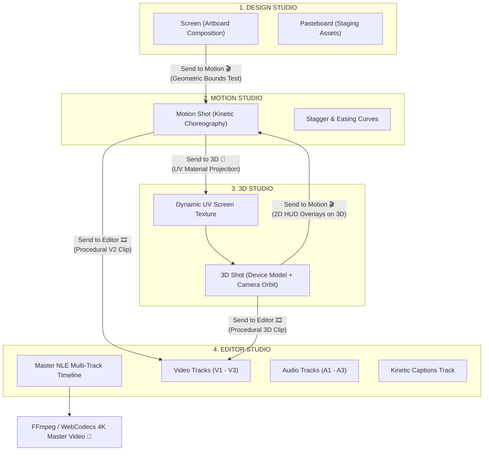
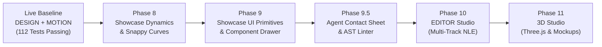

# Motion Studio: 4-Suite Architecture & Multi-Stage Handoff Pipeline

> **Architectural Blueprint & Specification Document**  
> **Status:** Production Blueprint & Engineering Reference  
> **Version:** 2.0 (Full 4-Suite Integration)  
> **Scope:** DESIGN • MOTION • 3D • EDITOR

---

## 1. Executive Overview & Architectural Philosophy

### 1.1 The Fragmented Motion Design Problem
Traditional motion design pipelines are notoriously fractured across disconnected applications:
- **Figma**: Vector layout, typography, components, and artboards (purely static).
- **Jitter / After Effects**: Layer keyframing, motion presets, and easing curves (disconnects from design layouts).
- **Spline / Blender / Cinema 4D**: 3D device mockups, isometric stages, and camera orbits (heavy, non-reactive to UI updates).
- **Premiere Pro / CapCut / DaVinci Resolve**: Audio synchronization, multi-track cutting, B-roll assembly, and captions.

When a designer or creative engineer needs to update a single headline or brand accent color, this fragmented stack requires manual re-exports, file transfers, texture re-baking, and timeline re-alignments across 3 to 4 distinct tools.

### 1.2 The Motion Studio Solution: "One Document, Four Specialized Lenses"
**Motion Studio** unifies the entire modern motion graphics lifecycle into a single desktop-native application packaged with Tauri v2. Rather than forcing a compromise between design, kinetic animation, 3D staging, and video editing, Motion Studio introduces **4 Specialized Operational Studios**:

```
┌────────────────────────────────────────────────────────────────────────────────────────┐
│                                 THE 4-SUITE PIPELINE                                   │
├───────────────────┬───────────────────┬────────────────────────┬───────────────────────┤
│    1. DESIGN      │    2. MOTION      │         3. 3D          │       4. EDITOR       │
│  "Vector Layout   │  "Kinetic Motion  │   "Spatial Mockups     │  "Master Sequencer    │
│   & Artboards"    │   Choreographer"  │    & Device Staging"   │   & Multi-Track NLE"  │
│  (Figma-grade)    │   (Jitter-grade)  │     (Spline-grade)     │   (Premiere-grade)    │
└───────────────────┴───────────────────┴────────────────────────┴───────────────────────┘
```

### 1.3 The Core Architectural Invariant: Single Source of Truth (`scene.json`)
All four studios do **not** maintain private or divergent document formats. Instead, they provide specialized viewports, contextual inspectors, and optimized toolbars over a single declarative JSON Abstract Syntax Tree: **`scene.json`**.
- Modifying a color or padding in **DESIGN** instantaneously updates the rendered texture in **3D** and the composite preview in **EDITOR**.
- Adjusting a kinetic stagger in **MOTION** updates the playback timing in **EDITOR** without rasterization or intermediate proxy files.
- The entire project is deterministic: evaluating any time $t$ or master frame index $F$ yields the exact same pixel buffer across WebGL, WebGPU, and headless FFmpeg renderers.

---

## 2. Workspace Transformation Matrix

The application chrome dynamically morphs across the 4 operational modes. Below is the comprehensive breakdown of how the **Header Bar**, **Left Sidebar**, **Canvas / Viewport**, and **Right Inspector** transform in each studio.

```
┌──────────────────────────────────────────────────────────────────────────────────────────────────┐
│ HEADER: [Logo] Untitled  [ DESIGN | MOTION | 3D | EDITOR ]  [Action Button] [Zoom] [AI] [Export]│
├────────────────────┬────────────────────────────────────────────────────────┬────────────────────┤
│ LEFT SIDEBAR       │ CENTER CANVAS / VIEWPORT                               │ RIGHT INSPECTOR    │
│                    │                                                        │                    │
│ [Mode-Specific     │ [Mode-Specific Rendering Engine]                       │ [Contextual        │
│  Tree & Assets]    │  - DESIGN: Infinite Vector Pasteboard + Artboard       │  Property Controls │
│                    │  - MOTION: Camera Frustum Matte + Transform Path       │  & Presets]        │
│                    │  - 3D: WebGL Three.js Spatial Viewport + Orbit Gizmo   │                    │
│                    │  - EDITOR: Master Program Monitor + Safe Guides        │                    │
├────────────────────┴────────────────────────────────────────────────────────┴────────────────────┤
│ BOTTOM SEQUENCER / TIMELINE                                                                      │
│ (DESIGN: Hidden | MOTION: Shot Dope Sheet | 3D: Camera Track | EDITOR: Multi-Track NLE Timeline) │
└──────────────────────────────────────────────────────────────────────────────────────────────────┘
```

### 2.1 Detailed Comparison Matrix

| Studio Mode | Primary Focus | Header Primary Action | Left Sidebar Content | Viewport Engine & Interaction | Right Inspector Panels | Bottom Dock Panel |
| :--- | :--- | :--- | :--- | :--- | :--- | :--- |
| **1. DESIGN** | Static composition, layout, typography, vector shapes, reactive constraints | `Send to Motion 🎬` | **Screens List** + **Layers Tree** (Artboard vs. Pasteboard isolation) | **PixiJS 2D Canvas**: Infinite pasteboard, smart distance HUD (`Alt`), 4-corner radius handles, vector draw tools | Alignment, Auto-Layout Flex, Typography, Fills/Gradients, Borders, Shadows/Shaders, Linked Bindings (`pin`, `hug`, etc.) | **Hidden** (Clean, unobstructed workspace) |
| **2. MOTION** | Kinetic choreography, timing staggers, easing curves, FLIP layout morphs | `Send to 3D 🧊`<br>`Send to Editor 🎞️` | **Shots List** + **Layer Motion Tree** (Preset badges, stagger indicators) | **PixiJS 2D Camera**: 75% dark camera matte, live time evaluation $t$, motion path handles, reactive cyan binding curves | In/Out/Emphasis Presets, Kinetic Easing Curves (`Snappy 0.16, 1, 0.3, 1`, `Spring`), Stagger Delays, Theatre.js Curve Dock | **Shot Dope Sheet**: Time ruler, playhead, clip blocks, work area brackets (`B`/`N`), ripple drag |
| **3. 3D** | Device mockups (iPhone, Mac), screen texture projection, camera orbits, PBR lighting | `Send to Editor 🎞️`<br>`Send to Motion 🎬` (2D HUD) | **3D Scene Graph**: Cameras, Lights, 3D Device Meshes, Materials + GLTF Bin | **Three.js WebGL/WebGPU**: Spatial orbit/pan/dolly, 3D transform gizmo, real-time 2D shot canvas texture mapping | 3D Transform $(X, Y, Z, \text{Euler})$, Screen Texture Source, PBR Materials (Roughness, Metalness, Glass), HDRI & Lights, Camera Focal Length/DoF | **3D Camera Sequencer**: Camera orbit paths, focal target tracks, tilt keyframes |
| **4. EDITOR** | Multi-track video assembly, B-roll cutting, audio sync, kinetic captions | `Export Video 🚀`<br>(Master 4K/60fps render) | **Master Media Pool (Bin)**: Motion Shots, 3D Passes, Raw Video, Audio SFX/BGM, Captions | **Master Program Monitor**: Multi-track composite preview, safe title guides (90%/80%), A/B split, PiP transform overlays | Clip Trim (`sourceIn`, `sourceOut`, speed), Audio Bus (Volume, Pan, EQ, Ducking), Transitions (Wipe, Dissolve, Glitch), Kinetic Captions Editor | **Multi-Track NLE Timeline**: Video tracks ($V_1\text{--}V_n$), Audio tracks ($A_1\text{--}A_n$), Razor tool (`C`), Snapping, Audio Waveforms |

---

### 2.2 Studio 1: DESIGN ("Figma-Grade Vector & Layout Engine")

```
┌────────────────────────────────────────────────────────────────────────────────────────┐
│  [Logo] Project: Untitled   [ DESIGN | Motion | 3d | Editor ]    [Send to Motion 🎬]   │
├─────────────────┬──────────────────────────────────────────────────────┬───────────────┤
│ SCREENS &       │                   INFINITE PASTEBOARD                │ DESIGN        │
│ LAYERS          │                                                      │ INSPECTOR     │
│                 │      [Pasteboard Staging: Component Scratchpad]      │               │
│ ▾ Screens       │                                                      │ ⊞ Alignment   │
│   ▸ #1 Hero     │                 ┌────────────────────┐               │ ↔ Auto-Layout │
│   ▸ #2 Features │                 │ ARTBOARD (1920x1080│               │ T Typography  │
│                 │                 │                    │               │ 🎨 Fill/Stroke│
│ ▾ Layers        │                 │  [Hero Card]       │               │ ◐ Shadows/Glow│
│   ▾ Artboard    │                 │  "Ship Faster"     │               │ 🔗 Bindings   │
│     ▾ CardGroup │                 │  [Get Started]     │               │   (Pin, Hug)  │
│       Title     │                 │                    │               │               │
│       Button    │                 └────────────────────┘               │               │
│   ▾ Pasteboard  │                                                      │               │
│       Avatar_v1 │                                                      │               │
├─────────────────┴──────────────────────────────────────────────────────┴───────────────┤
│ [ Floating Canvas Toolbar: Select (V) | Pan (H) | Text (T) | Rect (R) | Components (C) ]│
└────────────────────────────────────────────────────────────────────────────────────────┘
```

#### Header Bar Configuration
- **Suite Switcher**: `DESIGN` button highlighted in high-contrast active state.
- **Screen Format Switcher**: Quick dropdown on the artboard header (`16:9 Landscape`, `9:16 Portrait`, `1:1 Square`, `4:5 Social`).
- **Primary Action**: `Send to Motion 🎬` — analyzes artboard geometry, isolates active layers, and transitions project state into MOTION studio.
- **Secondary Tools**: Canvas Zoom Selector (50%, 75%, 100% Fit, 200%), Undo/Redo, AI Prompt (`Ctrl+K`).

#### Left Sidebar Configuration
- **Section 1: Screens List**: Visual card stack of project artboards (`#1 Hero Scene`, `#2 Feature Grid`, `#3 Pricing Card`). Users can add, duplicate, reorder, and rename screens.
- **Section 2: Two-Tier Hierarchical Layers Tree**:
  - **Artboard Group**: Layers located geometrically within the active artboard boundaries $[0 \le x \le W, 0 \le y \le H]$. These layers form the actual broadcast frame.
  - **Pasteboard Group**: Unrestricted scratch elements, imported reference images, and experimental component variations parked outside the frame.
- **Context Actions**: Right-click layer context menu (Group `Ctrl+G`, Ungroup, Precision Split `Ctrl+Shift+S`, Lock, Hide).

#### Center Canvas / Viewport Configuration
- **Rendering Engine**: Hardware-accelerated PixiJS v8 2D canvas with WebGL/WebGPU batching.
- **Infinite Pasteboard**: Smooth panning via Spacebar+drag or Middle-click, cursor-centered zoom via mouse wheel or pinch gesture.
- **Transform & Vector Controls**:
  - `TransformBox`: Live affine transformation matrix ($R(-\theta)$, uniform scale, non-uniform stretch).
  - Corner Radius Handles: 4 inner circular handles with live radius HUD and `Alt` single-corner override.
  - Smart Distance Measurement: Pressing `Alt` displays live magenta pixel distance lines between hovered and selected layers.
  - Magnetic Snapping: Dynamic red alignment rays indicating center, edge, and equal spacing alignment against sibling layers.
  - Inline Double-Click Text Editing: Creates an in-place content-editable overlay with identical font shaping and styling.
- **Floating Bottom Toolbar**: Select (`V`), Hand (`H`), Text (`T`), Rectangle (`R`), Ellipse (`O`), Star/Polygon, Components Drawer (`C`).

#### Right Inspector Configuration (`DesignInspector`)
- **Alignment & Distribution Matrix**: 9-point spatial alignment (Left, Center, Right, Top, Middle, Bottom) and equal spacing distribution.
- **Layout & Container Panel**: Flexbox configuration (`flex-row`, `flex-col`, `gap`, `padding`), `clipContent` (overflow masking), and `autoFit` FLIP layout morphing toggle.
- **Typography Engine**: Integrated Google Fonts and local `.woff2` font loader, font size, weight (`100` to `900`), letter spacing, line height, text transform, and auto-width/auto-height sizing.
- **Fills, Strokes & Gradients**: Solid Hex/RGBA color picker, linear/radial gradient builder, curated swatch palette, inside/center/outside stroke alignment.
- **Effects & Shaders**: Multi-layered drop shadows (spread, blur, offset), GPU layer blur, background blur, bloom, and glow.
- **Linked Dependencies (`BindingsSection`)**: Dedicated UI to wire driver-driven reactive relationships across layers (5 modes: `pin`, `hug`, `match`, `remap`, `lag`).

---

### 2.3 Studio 2: MOTION ("Jitter-Grade Kinetic Motion Choreographer")

```
┌────────────────────────────────────────────────────────────────────────────────────────┐
│  [Logo] Project: Untitled   [ Design | MOTION | 3d | Editor ]  [Send to 3D 🧊] [Send to Ed]│
├─────────────────┬──────────────────────────────────────────────────────┬───────────────┤
│ SHOTS & MOTION  │                  CAMERA ARTBOARD (1:1)               │ MOTION        │
│ TREE            │                                                      │ INSPECTOR     │
│                 │     ░░░░░░░░░░░░░░░░░░░░░░░░░░░░░░░░░░░░░░░░░░░░░░   │               │
│ ▾ Active Shot   │     ░░░░░░░┌──────────────────────────┐░░░░░░░░░░░   │ ⚡ Presets     │
│   #1 Hero (5.0s)│     ░░░░░░░│ CAMERA BOUNDARY (100%)   │░░░░░░░░░░░   │   - In: Pop   │
│                 │     ░░░░░░░│                          │░░░░░░░░░░░   │   - Out: None │
│ ▾ Motion Layers │     ░░░░░░░│      "Ship Faster"       │░░░░░░░░░░░   │               │
│   Card [Pop]    │     ░░░░░░░│    (Snappy Slide Up)     │░░░░░░░░░░░   │ 📈 Curves      │
│   Title [Slide] │     ░░░░░░░│                          │░░░░░░░░░░░   │   [ Snappy ▾ ]│
│   Btn [FadeIn]  │     ░░░░░░░└──────────────────────────┘░░░░░░░░░░░   │ ⏱ Stagger     │
│                 │     ░░░░░░░░░░░░░░░░░░░░░░░░░░░░░░░░░░░░░░░░░░░░░░   │   0.08s / word│
├─────────────────┴──────────────────────────────────────────────────────┴───────────────┤
│ TIMELINE: 00:01:15  [◀◀] [Play ▶] [Loop 🔁]  Work Area: [ 0.0s ─────── 3.5s ]         │
│ ────────────────────────────────────────────────────────────────────────────────────── │
│ ▾ CardGroup 🔗 [=====================================================================] │
│     Title            [=======] Snappy Slide Up                                         │
│     Button                  [=======] Pop In                                           │
└────────────────────────────────────────────────────────────────────────────────────────┘
```

#### Header Bar Configuration
- **Suite Switcher**: `MOTION` button highlighted in Stamp Gold / Primary accent.
- **Primary Actions**:
  - `Send to 3D 🧊`: Mounts current shot as a real-time screen material on a 3D model.
  - `Send to Editor 🎞️`: Appends/inserts current shot as a clip into the master NLE timeline.
- **Playback & Transport Bar**: Play/Pause (`Space`), Frame Stepper (`←`/`→`), Loop toggle, Timecode readout (`00:01:12` / Frame index `F45`).

#### Left Sidebar Configuration
- **Section 1: Shots Sequencer**: List of active motion shots. Each shot represents an isolated temporal scene with independent duration and animation tracks.
- **Section 2: Animated Layer Tree**: Displays visual badges indicating active presets for each layer (e.g., `[Pop In]`, `[Snappy Slide]`, `[Auto-Link 🔗]`). Pasteboard layers are dimmed to signify they will not render during video playback.

#### Center Canvas / Viewport Configuration
- **Camera Frustum Focus**: A 75% dark camera matte overlay (`boxShadow: 0 0 0 9999px rgba(9, 9, 11, 0.75)`) isolates the artboard. Staging clutter on the pasteboard fades into deep shadow.
- **Live Frame Evaluator**: PixiJS continuously evaluates layer transforms at timestamp $t$ (`evaluateSceneAtTime`).
- **Kinetic Path Overlays**: Selecting an animated layer displays its motion trajectory vector with start, keyframe, and overshoot anchor points.
- **Live Reactive Connection Lines**: `BindingConnectionOverlay` renders glowing cyan dashed Bézier curves connecting driver layers to driven followers.

#### Right Inspector Configuration (`AnimateInspector`)
- **3-Phase Lifecycle Architecture**:
  - **IN (Entrance)**: How the layer enters the screen (Pop, Slide Up/Down/Left/Right, Blur Reveal, Scale Iris, Drop In, 3D Flip).
  - **EMPHASIS (Idle Attention Loop)**: Continuous resting loop (Pulse, Floating Wave, Glow Shimmer, Heartbeat, Wiggle).
  - **OUT (Exit)**: Clean dismissal (Slide Out, Fade Shrink, Blur Out, Disintegrate).
- **Showcase Kinetic Easing Suite**:
  - **Snappy Quintic Out** (`cubic-bezier(0.16, 1, 0.3, 1)`): The Apple/Linear standard curve (covers 75% distance in first 40–50% time).
  - **Damped Harmonic Spring** ($f_{\text{spring}}(t)$ with damping $\zeta=0.72$, natural frequency $\omega=14$).
  - **Anticipation Whip** (`cubic-bezier(0.34, 1.56, 0.64, 1)`).
  - **Cinematic S-Curve** (`cubic-bezier(0.65, 0, 0.35, 1)`).
- **Stagger & Splitting Controls**: Automatic cascade stagger timing (e.g. 0.08s per chunk/word) with directional cascade (Left-to-Right, Right-to-Left, Center-Out).
- **Theatre.js Studio Dock Button**: Expands the professional sub-pixel graph curve editor for advanced bezier curve manipulation.

#### Bottom Sequencer (Timeline Panel)
- **Timeline Ruler**: Pixel-accurate time scale with 1s and 0.1s increments.
- **Playhead Scrubber**: Draggable red playhead driven by `AnimationClock` pub/sub transient updates without VDOM thrashing.
- **Work Area Brackets**: Configurable loop start (`B`) and loop end (`N`) markers for isolated timing polish.
- **Clip Track Blocks**: Interactive blocks supporting ripple trimming, drag-to-shift, and multi-selection marquee.

---

### 2.4 Studio 3: 3D ("Spline / Three.js Spatial Stage & Device Mockup Engine")

```
┌────────────────────────────────────────────────────────────────────────────────────────┐
│  [Logo] Project: Untitled   [ Design | Motion | 3D | Editor ]   [Send to Editor 🎞️]    │
├─────────────────┬──────────────────────────────────────────────────────┬───────────────┤
│ 3D SCENE GRAPH  │                 THREE.JS 3D VIEWPORT                 │ 3D            │
│ & ASSETS        │                                                      │ INSPECTOR     │
│                 │                        ┌───┐                         │               │
│ ▾ Scene         │                        │ ☼ │ Key Light               │ 🧭 Transform  │
│   🎥 Orbit Cam  │                        └───┘                         │   X, Y, Z     │
│   ☼ Key Light   │                         /                            │   Pitch, Yaw  │
│   ☼ Rim Light   │                        /                             │               │
│   📱 iPhone 16  │                  ┌───────────┐                       │ 📱 Screen UV  │
│     GlassFrame  │                  │  [Shot 1] │                       │   Source:     │
│     ScreenPlane │                  │  Mapped   │ (3D Device Mesh)      │   "Shot 1" ▾  │
│                 │                  │  Texture  │                       │               │
│ ▾ 3D Library    │                  └───────────┘                       │ 🎨 Materials  │
│   MacBook Pro   │                                                      │   Glass PBR   │
│   Credit Card   │                                                      │ 🎥 Camera     │
│   App Icon 3D   │                                                      │   Focal: 50mm │
├─────────────────┴──────────────────────────────────────────────────────┴───────────────┤
│ 3D CAMERA TRACKS: [ Orbit 360° ] [ Isometric Tilt ] [ Dolly In ] [ Floating Wobble ]   │
└────────────────────────────────────────────────────────────────────────────────────────┘
```

#### Header Bar Configuration
- **Suite Switcher**: `3D` button highlighted in Electric Blue / Cyan accent.
- **Primary Actions**:
  - `Send to Editor 🎞️`: Mounts the 3D animated camera pass as a clip in the master NLE sequence.
  - `Send to Motion 🎬` (2D HUD Over 3D): Routes the 3D render as a live background layer for 2D kinetic callout annotations.
- **3D Orbit Presets**: One-click quick camera staging buttons:
  - `[ Orbit 360° ]` • `[ Isometric 45° ]` • `[ Frontal Hero ]` • `[ Dolly In ]` • `[ Floating Wobble ]`
- **Shading Modes**: Switch between `Rendered PBR`, `Clay / Wireframe`, and `Texture UV Debug`.

#### Left Sidebar Configuration
- **Section 1: 3D Scene Graph**: Hierarchical outline of the 3D environment:
  - 🎥 Cameras (`Main Orbit Camera`, `Wide Angle Dolly`).
  - 💡 Lighting Rig (`Key Light`, `Fill Light`, `Rim Light`, `HDRI Skybox`).
  - 📱 3D Meshes & Groups (`iPhone 16 Pro`, `MacBook Pro M3`, `Shadow Catcher Floor`).
- **Section 2: Curated 3D Hardware Library**: Drag-and-drop `.glb` assets optimized for low GPU overhead (iPhone 16 Pro, MacBook Pro, iPad Pro, Apple Watch Ultra, Minimalist SaaS Isometric Cards, Floating Credit Card, 3D App Tiles).

#### Center Canvas / Viewport Configuration
- **Rendering Engine**: Hardware-accelerated Three.js WebGL / WebGPU canvas embedded seamlessly into the studio workspace.
- **Spatial Controls**:
  - OrbitControls: `Alt + LMB` to Orbit, `MMB` to Pan, `Wheel` to Dolly.
  - 3D Transform Gizmo: Interactive axis arrows ($X = \text{Red}$, $Y = \text{Green}$, $Z = \text{Blue}$) for translation, rotation rings for Euler angles, and scale boxes.
- **Real-Time Dynamic Screen Texture Projection**:
  - The 2D Motion Shot canvas is assigned directly as a Three.js `CanvasTexture` mapped to the screen UV coordinates of the 3D model.
  - As the playhead moves, the 2D shot evaluates in real time and automatically updates the 3D model's screen with zero latency!

#### Right Inspector Configuration (`ThreeDInspector`)
- **3D Spatial Transform**: Position $(X, Y, Z)$, Rotation $(\text{Pitch}, \text{Yaw}, \text{Roll})$, and Scale $(X, Y, Z)$.
- **Screen Texture Channel**:
  - Source Shot Dropdown: Select any 2D Screen or Motion Shot (`Shot 1: Hero UI`, `Shot 2: Feature Walkthrough`).
  - UV Mapping Controls: Horizontal/Vertical flip, screen scale fit (`cover`, `contain`), emissive intensity multiplier (simulating OLED screen brightness).
- **Physical PBR Material System**: Metallic, Roughness, Transmission (glass opacity), Clearcoat, and specular tint.
- **Studio Environment & Lighting**: HDRI environment selection (`Studio Softbox`, `Cyberpunk Neon`, `Clean Minimal Daylight`), shadow softness, contact shadows.
- **Cinematic Camera Controls**: Sensor focal length (35mm, 50mm, 85mm), Depth of Field (DoF aperture, automatic autofocus on screen center).

#### Bottom Dock Panel (3D Camera Sequencer)
- Dedicated camera motion track controlling position and rotation keyframes over time.
- Interpolation curves for smooth camera fly-throughs and cinematic dolly moves.

---

### 2.5 Studio 4: EDITOR ("Multi-Track Video NLE & Master Sequencer")

```
┌────────────────────────────────────────────────────────────────────────────────────────┐
│  [Logo] Project: Untitled   [ Design | Motion | 3d | EDITOR ]      [ Export Video 🚀 ] │
├─────────────────┬──────────────────────────────────────────────────────┬───────────────┤
│ MEDIA POOL      │                MASTER PROGRAM MONITOR                │ EDITOR        │
│ (PROJECT BIN)   │                                                      │ INSPECTOR     │
│                 │             ┌──────────────────────────┐             │               │
│ ▾ Motion Shots  │             │ MASTER COMPOSITE (4K)    │             │ ✂ Clip Trim   │
│   🎬 Shot 1:Hero│             │                          │             │   In: 00:01.0 │
│   🎬 Shot 2:Grid│             │   [3D Phone Rotating]    │             │   Out:00:05.5 │
│                 │             │   + 2D Kinetic Callout   │             │   Speed: 1.0x │
│ ▾ 3D Shots      │             │   + Lower Thirds Caption │             │               │
│   🧊 3D Orbit   │             │                          │             │ 🔊 Audio Bus  │
│                 │             └──────────────────────────┘             │   Vol: -3.5 dB│
│ ▾ Audio Tracks  │               [Safe Guides: 90% | 80%]               │   Ducking: ON │
│   🎵 Synthwave  │                                                      │ 🎞 Transition │
│   🗣 Voiceover  │                                                      │   Crossfade   │
├─────────────────┴──────────────────────────────────────────────────────┴───────────────┤
│ MASTER TIMELINE: 00:00:14:02  [◀◀] [Play ▶] [Razor Tool (C)] [Snapping (S)]            │
│ ────────────────────────────────────────────────────────────────────────────────────── │
│ V3 (Captions)   │     [=== Caption: "Introducing Choreo" ===]                          │
│ V2 (Motion/3D)  │ [ Shot 1: Hero 2D ] [ 3D Orbit Pass ] [ Shot 2: Grid ]               │
│ V1 (B-Roll)     │ [================== Background Gradient Video =====================] │
│ A1 (Voiceover)  │ [======== Voiceover Audio Track (Waveform) ========]                 │
│ A2 (Music BGM)  │ [~~~~~~~~~~~~~~~~ Ambient Synthwave BGM (Waveform) ~~~~~~~~~~~~~~~~] │
└────────────────────────────────────────────────────────────────────────────────────────┘
```

#### Header Bar Configuration
- **Suite Switcher**: `EDITOR` button highlighted in Emerald Green accent.
- **Primary Action**: `Export Video 🚀` — triggers the bundled Tauri Rust/FFmpeg sidecar (or WebCodecs hardware encoder) to compile the master multi-track timeline into a broadcast-ready MP4/ProRes file.
- **Timeline Editing Tools**: Razor tool (`C`), Selection pointer (`V`), Snap toggle (`S`), Ripple edit toggle, Master timecode clock (`00:00:14:02 / 00:01:00:00`).

#### Left Sidebar Configuration
- **Master Media Pool (Project Bin)**:
  - **Motion Shots**: Procedural 2D scenes generated in MOTION studio.
  - **3D Shots**: Procedural 3D camera passes generated in 3D studio.
  - **External Video Assets**: Imported B-roll footage, screen recordings (MP4, WebM, ProRes).
  - **Audio Assets**: Imported voiceover tracks, sound effects (SFX), background music (BGM).
  - **Captions Track**: Auto-generated or imported SRT / Whisper word-level transcripts.
- **Media Asset Inspector**: Displays thumbnail, codec, sample rate, resolution, and clip duration.

#### Center Canvas / Viewport Configuration
- **Master Program Monitor**: Displays the real-time composite output of all active video, graphic, and overlay tracks at the master playhead position.
- **Broadcast Safe Guides**: Overlay guidelines showing Action Safe (90%), Title Safe (80%), and mobile vertical safe zones (TikTok/Reels overlay boundaries).
- **A/B Split View & Picture-in-Picture (PiP)**: Side-by-side comparison slider and interactive canvas overlay to reposition and scale overlay clips directly in the monitor.

#### Right Inspector Configuration (`EditorInspector`)
- **Clip Transform & Timing**: Source in-point (`sourceIn`), out-point (`sourceOut`), timeline placement (`start`, `duration`), playback speed multiplier ($0.25\times$ to $4\times$, reverse), opacity, and blend modes.
- **Audio Channel Strip**: Master and track-level volume sliders (dB), stereo pan $(-100\text{ to }+100)$, fade-in/fade-out curves, 3-band parametric EQ, and automated audio ducking (automatically lowers background music by $-12\text{dB}$ whenever voiceover is speaking).
- **Transitions Panel**: Clip-to-clip transitions (Cross Dissolve, Wipe, Whip Pan, Zoom Blur, Push, Directional Slide, Glitch Disintegrate).
- **Kinetic Captions Styler**: MrBeast-style word-by-word active highlight, Apple Keynote minimalist subtitles, font, size, outline, and drop shadow controls.

#### Bottom Sequencer (Multi-Track NLE Timeline)
- **Hierarchical Track Architecture**:
  - Video Tracks ($V_3$ Captions/Overlays $\to$ $V_2$ 2D/3D Motion Shots $\to$ $V_1$ Base Video/B-Roll).
  - Audio Tracks ($A_1$ Voiceover $\to$ $A_2$ Sound Effects $\to$ $A_3$ Background Music).
- **Visual Waveforms**: Audio waveforms rendered in real time across audio clips.
- **Precision Trimming & Slicing**: Trimming handles at clip edges, razor cutting (`C` or `S` at playhead), ripple delete (`Shift+Delete`).

---

## 3. The Multi-Stage Handoff Pipeline

The power of Motion Studio lies in its fluid, bidirectional handoff pipeline between studios. A project does not flow strictly linear; creative ideas can flow forward and backward across design, motion, 3D, and the editor.

### 3.1 Pipeline Flow Architecture



---

### 3.2 Handoff 1: DESIGN $\to$ MOTION ("Send to Motion 🎬")

#### User Workflow
1. The designer builds a UI layout on the canvas (e.g. an iPhone app screen with status bar, greeting card, balance counter, and transactions list).
2. The user clicks **"Send to Motion 🎬"** on the Artboard Header or Top Nav Bar.

#### Technical Execution
1. **Geometric Bounds Isolation**:
   The engine executes `isLayerOnArtboard(layer, settings.width, settings.height)` against all layers. Elements parked on the infinite pasteboard outside the frame are excluded from the motion sequence:
   $$\text{onArtboard} = (x + w > 0) \land (x < W) \land (y + h > 0) \land (y < H)$$
2. **Shot Instantiation & Reference**:
   The engine creates or updates a `MotionShot` entry in `scene.json` linked to `screenId: screen.id`.
3. **Smart Kinetic Default Choreography**:
   Rather than leaving layers static at time $t=0$, the system automatically assigns intelligent, taste-driven motion defaults:
   - **Parent Containers**: Pop In or Snappy Slide Up ($+20\text{px} \to 0\text{px}$, duration $0.6\text{s}$, curve `cubic-bezier(0.16, 1, 0.3, 1)`).
   - **Child Elements & Chunks**: Cascading Snappy reveals ($+10\text{px} \to 0\text{px}$, duration $0.45\text{s}$, stagger interval $\Delta t = 0.08\text{s}$).
4. **Workspace Transition**:
   - `uiMode` changes to `"motion"`.
   - The bottom Timeline Panel animates open.
   - The 75% dark camera matte overlay covers the pasteboard, framing the artboard 1:1.

---

### 3.3 Handoff 2: MOTION $\to$ 3D ("Send to 3D 🧊")

#### User Workflow
1. In MOTION studio, the user has choreographed a sleek mobile UI animation (`Shot: Mobile Banking`).
2. The user wants to showcase this UI running inside an iPhone 16 Pro floating in an isometric studio setting.
3. The user clicks **"Send to 3D 🧊"**.

#### Technical Execution
1. **Dynamic Canvas Texture Registration**:
   The 2D PixiJS rendering pipeline registers the output buffer of `Shot: Mobile Banking` as a shared dynamic texture resource:
   ```typescript
   threeDMaterial.screenMap = new THREE.CanvasTexture(pixiOffscreenCanvas);
   threeDMaterial.screenMap.colorSpace = THREE.SRGBColorSpace;
   ```
2. **3D Mesh Binding**:
   A 3D device model (e.g. `iphone_16_pro.glb`) is instantiated in the 3D scene. The screen mesh entity's emissive and diffuse material slots are bound to this texture source:
   ```json
   {
     "meshId": "screen_glass",
     "material": {
       "textureSourceType": "motion_shot",
       "sourceId": "shot_mobile_banking",
       "emissiveIntensity": 1.2
     }
   }
   ```
3. **Synchronous Frame Scrubbing**:
   When the 3D timeline playhead scrubs to timestamp $T$, the engine first invokes `evaluateSceneAtTime(shot, T)` on the 2D PixiJS engine, renders the 2D frame, and flags `texture.needsUpdate = true` on the Three.js material before rasterizing the 3D viewport.
4. **Workspace Transition**:
   - Workspace transitions to `3D` mode.
   - Three.js WebGL viewport activates with orbital controls and lighting gizmos.

---

### 3.4 Handoff 3: MOTION $\to$ EDITOR ("Send to Editor 🎞️")

#### User Workflow
1. The user has finished polishing a 5-second 2D motion scene.
2. The user clicks **"Send to Editor 🎞️"**.

#### Technical Execution
1. **Virtual Clip Creation**:
   The engine appends a new `TimelineClip` on video track `V2` at the current playhead position $T_{\text{master}}$:
   ```json
   {
     "id": "clip_shot_01",
     "trackId": "track_v2",
     "type": "motion_shot",
     "sourceId": "shot_mobile_banking",
     "start": 12.0,
     "duration": 5.0,
     "sourceIn": 0.0,
     "sourceOut": 5.0,
     "playbackRate": 1.0
   }
   ```
2. **Zero Proxy Overhead (Procedural Evaluation)**:
   The editor does **not** render or export an intermediate MP4. The clip remains a live, non-destructive reference to the procedural 2D shot. Editing a text string in DESIGN or an easing curve in MOTION instantly updates the Editor's playback monitor.
3. **Workspace Transition**:
   - Workspace transitions to `EDITOR` mode.
   - Master NLE timeline focuses on the newly inserted clip.

---

### 3.5 Handoff 4: 3D $\to$ EDITOR ("Send to Editor 🎞️")

#### User Workflow
1. In 3D studio, the user sets up an orbiting camera shot sweeping across the floating iPhone.
2. The user clicks **"Send to Editor 🎞️"**.

#### Technical Execution
1. **3D Clip Instantiation**:
   A clip of type `"three_d_shot"` is created on the master timeline pointing to `sourceId: "shot_3d_phone_orbit"`.
2. **Multi-Track Composite Execution**:
   In the editor, when the master playhead lands within this clip's time range $[t_{\text{start}}, t_{\text{start}} + \text{duration}]$, the engine advances the 3D virtual clock to $t_{\text{local}} = t_{\text{master}} - t_{\text{start}}$, renders the Three.js scene offscreen, and composites it onto the master canvas.
3. **Transition Integration**:
   The 3D shot can smoothly transition into adjacent 2D motion shots or live B-roll footage using native NLE transitions (e.g. cross dissolve, whip pan).

---

### 3.6 Handoff 5: 3D $\to$ MOTION (2D HUD Overlays on 3D)

#### User Workflow
1. The user has an animated 3D phone rotating on screen.
2. The user wants 2D kinetic callout annotations (e.g., glowing pointers, spec callouts: "A18 Pro Bionic", "Grade 5 Titanium") that float in 2D screen space over the 3D render.

#### Technical Execution
1. **Composite Layering**:
   In MOTION studio, a background layer is bound to the 3D Shot (`background3DShotId: "shot_3d_phone_orbit"`).
2. **3D-to-2D Screen Space Projection**:
   Designated 3D vertices or dummy empties on the 3D mesh (e.g. the phone's camera bump or action button) are projected into normalized 2D screen coordinates:
   $$\begin{bmatrix} x_{2d} \\ y_{2d} \end{bmatrix} = \text{project3DTo2D}(P_{\text{world}}, \text{Camera}_{\text{three}}, W, H)$$
3. **Reactive Binding Engine Integration**:
   Using the **Universal Reactive Dependency Engine (`dependencyEngine.ts`)**, a 2D callout badge layer uses `mode: "pin"` to lock its anchor $[x, y]$ to the projected 3D screen coordinates. As the 3D model rotates, the 2D callout box tracks along seamlessly!

---

## 4. Deterministic Data Structures (`scene.json`)

The single source of truth across all 4 studios is the declarative JSON AST. Below is the production TypeScript specification and an exemplary serialized document.

### 4.1 TypeScript Schema Definitions

```typescript
// ============================================================================
// 1. PROJECT ROOT & SETTINGS
// ============================================================================

export type UiMode = 'design' | 'motion' | '3d' | 'editor';

export interface ProjectSettings {
  width: number;             // e.g. 1920 or 3840 (4K)
  height: number;            // e.g. 1080 or 2160
  fps: number;               // 30 or 60 fps
  masterDuration: number;    // Total project master length in seconds
  backgroundColor: string;   // Hex color, e.g. "#09090b"
  palette: string[];         // Curated brand color swatches
}

export interface SceneDocument {
  version: '2.0';
  name: string;
  settings: ProjectSettings;
  variables?: Record<string, ProjectVariable>;
  screens: Screen[];          // DESIGN Studio: 2D Vector Artboards & Staging
  shots: MotionShot[];        // MOTION Studio: 2D Temporal Choreography
  threeDShots: ThreeDShot[];  // 3D Studio: Spatial Scenes & Camera Passes
  editor: EditorSequence;     // EDITOR Studio: Multi-Track Master NLE
}

export interface ProjectVariable {
  id: string;
  label: string;
  type: 'string' | 'color' | 'number' | 'image';
  value: any;
}

// ============================================================================
// 2. DESIGN STUDIO ENTITIES (SCREENS & LAYERS)
// ============================================================================

export interface Screen {
  id: string;                 // e.g. "screen_hero"
  name: string;               // e.g. "Hero Showcase"
  duration: number;           // Default preview duration in seconds
  layers: Layer[];            // Nested tree of vector/text/group layers
}

export type LayerType = 'group' | 'text' | 'chunk' | 'shape' | 'image';

export interface BaseLayer {
  id: string;
  name: string;
  locked?: boolean;
  hidden?: boolean;
  style: LayerStyle;
  animation?: LayerAnimation;
  bindings?: ElementLinkBinding[];
}

// ============================================================================
// 3. MOTION STUDIO ENTITIES (SHOTS & KEYFRAMES)
// ============================================================================

export interface MotionShot {
  id: string;                 // e.g. "shot_hero_motion"
  name: string;
  screenId: string;           // References parent Screen in DESIGN
  duration: number;           // Discrete shot duration in seconds
  motionLayerIds: string[];   // Layers explicitly included on the artboard
  workArea?: { start: number; end: number };
  theatreSheetId?: string;    // Bound Theatre.js animation sheet
}

// ============================================================================
// 4. 3D STUDIO ENTITIES (3D SHOTS, MODELS & CAMERAS)
// ============================================================================

export interface ThreeDShot {
  id: string;                 // e.g. "shot_3d_phone_orbit"
  name: string;
  duration: number;
  environment: {
    hdri: string;             // e.g. "studio_softbox_2k.hdr"
    ambientIntensity: number;
    shadowSoftness: number;
    backgroundColor?: string;
  };
  camera: ThreeDCamera;
  models: ThreeDModel[];
}

export interface ThreeDCamera {
  id: string;
  fov: number;                // Field of view in degrees (e.g. 45)
  near: number;
  far: number;
  position: [number, number, number];
  target: [number, number, number];
  animationTrack?: {
    orbitAngle?: { start: number; end: number; easing: string };
    dollyDistance?: { start: number; end: number; easing: string };
  };
}

export interface ThreeDModel {
  id: string;
  name: string;
  assetUrl: string;           // Path to .glb file, e.g. "assets/models/iphone_16_pro.glb"
  position: [number, number, number];
  rotation: [number, number, number]; // Euler angles [pitch, yaw, roll] in radians
  scale: [number, number, number];
  screenSlot?: {
    meshName: string;         // Name of screen child mesh inside GLTF
    sourceType: 'motion_shot' | 'screen' | 'video';
    sourceId: string;         // e.g. "shot_hero_motion"
    emissiveIntensity: number;
  };
}

// ============================================================================
// 5. EDITOR STUDIO ENTITIES (NLE TRACKS & CLIPS)
// ============================================================================

export interface EditorSequence {
  fps: number;
  masterDuration: number;
  tracks: TimelineTrack[];
  transitions: TimelineTransition[];
  audioMaster: {
    masterVolume: number;     // dB, e.g. 0.0
    limiterEnabled: boolean;
  };
}

export type TrackKind = 'video' | 'audio';

export interface TimelineTrack {
  id: string;                 // e.g. "track_v2", "track_a1"
  name: string;               // e.g. "V2: Motion Shots", "A1: Voiceover"
  kind: TrackKind;
  index: number;              // Stacking order (higher = on top)
  muted?: boolean;
  solo?: boolean;
  locked?: boolean;
  volume?: number;            // dB fader
  clips: TimelineClip[];
}

export type ClipSourceType =
  | 'motion_shot'             // Rendered procedural 2D shot
  | 'three_d_shot'            // Rendered procedural 3D shot
  | 'video'                   // Imported MP4/ProRes file
  | 'audio'                   // Imported WAV/MP3 file
  | 'caption';                // Word-level kinetic caption block

export interface TimelineClip {
  id: string;                 // e.g. "clip_01"
  trackId: string;
  type: ClipSourceType;
  sourceId: string;           // Points to MotionShot, ThreeDShot, or Asset ID
  name: string;

  // Timeline Placement (Master Clock)
  start: number;              // In-point on master timeline in seconds
  duration: number;           // Duration on master timeline in seconds

  // Source Trimming (Virtual Asset Clock)
  sourceIn: number;           // In-point within source media
  sourceOut: number;          // Out-point within source media
  playbackRate: number;       // 1.0 = normal, 0.5 = 50% slow-mo, 2.0 = 2x

  // Layer & Audio Properties
  volume?: number;            // dB
  opacity?: number;           // 0 to 1
  blendMode?: string;
  fadeIn?: number;            // seconds
  fadeOut?: number;           // seconds
}

export interface TimelineTransition {
  id: string;
  type: 'crossfade' | 'wipe' | 'slide' | 'zoom' | 'glitch';
  duration: number;           // seconds
  outgoingClipId: string;
  incomingClipId: string;
}
```

---

### 4.2 Production `scene.json` Instance

```json
{
  "version": "2.0",
  "name": "Choreo Showcase Reel",
  "settings": {
    "width": 1920,
    "height": 1080,
    "fps": 60,
    "masterDuration": 30.0,
    "backgroundColor": "#09090b",
    "palette": ["#000000", "#ffffff", "#e8c547", "#f5f0e8", "#34d399", "#60a5fa"]
  },
  "variables": {
    "headline": {
      "id": "var_headline",
      "label": "Hero Headline",
      "type": "string",
      "value": "Motion Studio v2.0"
    },
    "brandColor": {
      "id": "var_brand_color",
      "label": "Accent Color",
      "type": "color",
      "value": "#60A5FA"
    }
  },
  "screens": [
    {
      "id": "screen_hero",
      "name": "Hero App Artboard",
      "duration": 5.0,
      "layers": [
        {
          "id": "group_hero_card",
          "name": "Hero Card Container",
          "type": "group",
          "autoFit": true,
          "layout": {
            "display": "flex",
            "flexDirection": "column",
            "gap": 16,
            "align": "center"
          },
          "style": {
            "x": 480,
            "y": 240,
            "width": 960,
            "height": 600,
            "backgroundColor": "#18181b",
            "borderRadius": 24,
            "padding": 40,
            "rotation": 0,
            "opacity": 1
          },
          "animation": {
            "in": {
              "preset": "pop",
              "start": 0.0,
              "duration": 0.6,
              "easing": "snappy"
            }
          },
          "children": [
            {
              "id": "text_headline",
              "name": "Headline",
              "type": "text",
              "content": "Ship Faster with AI",
              "style": {
                "x": 0,
                "y": 0,
                "width": "auto",
                "height": "auto",
                "fontSize": 64,
                "fontWeight": "800",
                "color": "#FFFFFF",
                "rotation": 0,
                "opacity": 1
              },
              "animation": {
                "in": {
                  "preset": "slideUp",
                  "start": 0.3,
                  "duration": 0.5,
                  "easing": "snappy"
                }
              }
            }
          ]
        }
      ]
    }
  ],
  "shots": [
    {
      "id": "shot_hero_motion",
      "name": "Hero 2D Sequence",
      "screenId": "screen_hero",
      "duration": 5.0,
      "motionLayerIds": ["group_hero_card", "text_headline"],
      "workArea": { "start": 0.0, "end": 4.5 }
    }
  ],
  "threeDShots": [
    {
      "id": "shot_3d_phone_orbit",
      "name": "iPhone 16 Orbit Pass",
      "duration": 6.0,
      "environment": {
        "hdri": "studio_softbox_2k.hdr",
        "ambientIntensity": 1.0,
        "shadowSoftness": 0.8
      },
      "camera": {
        "id": "cam_orbit",
        "fov": 45,
        "near": 0.1,
        "far": 100,
        "position": [0, 1.2, 3.5],
        "target": [0, 0, 0],
        "animationTrack": {
          "orbitAngle": { "start": -25, "end": 25, "easing": "smooth" }
        }
      },
      "models": [
        {
          "id": "model_iphone",
          "name": "iPhone 16 Pro",
          "assetUrl": "assets/models/iphone_16_pro.glb",
          "position": [0, 0, 0],
          "rotation": [0.1, -0.3, 0],
          "scale": [1, 1, 1],
          "screenSlot": {
            "meshName": "Glass_Screen_Geometry",
            "sourceType": "motion_shot",
            "sourceId": "shot_hero_motion",
            "emissiveIntensity": 1.2
          }
        }
      ]
    }
  ],
  "editor": {
    "fps": 60,
    "masterDuration": 15.0,
    "tracks": [
      {
        "id": "track_v2",
        "name": "V2: Motion & 3D Passes",
        "kind": "video",
        "index": 2,
        "clips": [
          {
            "id": "clip_2d_hero",
            "trackId": "track_v2",
            "type": "motion_shot",
            "sourceId": "shot_hero_motion",
            "name": "Hero 2D Intro",
            "start": 0.0,
            "duration": 4.0,
            "sourceIn": 0.0,
            "sourceOut": 4.0,
            "playbackRate": 1.0
          },
          {
            "id": "clip_3d_device",
            "trackId": "track_v2",
            "type": "three_d_shot",
            "sourceId": "shot_3d_phone_orbit",
            "name": "iPhone 3D Orbit",
            "start": 4.0,
            "duration": 6.0,
            "sourceIn": 0.0,
            "sourceOut": 6.0,
            "playbackRate": 1.0
          }
        ]
      },
      {
        "id": "track_a1",
        "name": "A1: Music Soundtrack",
        "kind": "audio",
        "index": 0,
        "volume": -4.0,
        "clips": [
          {
            "id": "clip_bgm",
            "trackId": "track_a1",
            "type": "audio",
            "sourceId": "asset_music_future_bass",
            "name": "Future Bass Promo",
            "start": 0.0,
            "duration": 10.0,
            "sourceIn": 2.5,
            "sourceOut": 12.5,
            "playbackRate": 1.0,
            "fadeIn": 0.5,
            "fadeOut": 1.0
          }
        ]
      }
    ],
    "transitions": [
      {
        "id": "trans_01",
        "type": "crossfade",
        "duration": 0.5,
        "outgoingClipId": "clip_2d_hero",
        "incomingClipId": "clip_3d_device"
      }
    ],
    "audioMaster": {
      "masterVolume": 0.0,
      "limiterEnabled": true
    }
  }
}
```

---

## 5. Entity Naming Conventions & Ontology

To prevent confusion among users, developers, and AI agents, Motion Studio enforces unambiguous terminology for every entity in the system.

### 5.1 Disambiguation Guide

| Entity Term | Studio Owner | Primary Concept | What it Contains | File / AST Key | Example ID |
| :--- | :--- | :--- | :--- | :--- | :--- |
| **Screen** | **DESIGN** | A static 2D vector artboard representing the 100% resting composition. | Hierarchical 2D layers (`groups`, `shapes`, `text`, `chunks`, `images`), flexbox rules, palette styles. | `screens: Screen[]` | `screen_hero`<br>`screen_pricing` |
| **Shot** | **MOTION** | A temporal 2D animation scene bound to an authored Screen. | Lifecycle presets (`in`, `out`, `emphasis`), stagger delays, keyframe tracks, work area brackets. | `shots: MotionShot[]` | `shot_hero_motion`<br>`shot_pricing_reveal` |
| **3D Shot** | **3D** | A 3D spatial scene with cameras, lights, and device mockups. | 3D models (`.glb`), PBR materials, HDRI environment, camera orbit curves, UV screen texture bindings. | `threeDShots: ThreeDShot[]` | `shot_3d_iphone_orbit`<br>`shot_3d_macbook_open` |
| **Clip** | **EDITOR** | A temporal instance segment placed on a multi-track NLE timeline. | References to a 2D Shot, 3D Shot, video file, or audio track with timeline $[t_{\text{start}}, t_{\text{end}}]$ and source trimming $[s_{\text{in}}, s_{\text{out}}]$. | `tracks[].clips: TimelineClip[]` | `clip_v2_hero_01`<br>`clip_a1_voiceover` |
| **Track** | **EDITOR** | A horizontal channel lane on the master NLE timeline. | Stacking order index, track type (`video` or `audio`), mute/solo flags, volume fader, and child clips. | `editor.tracks: TimelineTrack[]` | `track_v1_broll`<br>`track_a2_sfx` |

### 5.2 Deterministic ID Generation Syntax
Entities in `scene.json` adhere to standard prefix conventions:
- `screen_<slug>`: e.g. `screen_hero`, `screen_cta_banner`
- `shot_<slug>`: e.g. `shot_hero_kinetic`, `shot_features_stagger`
- `threed_<slug>`: e.g. `threed_macbook_isometric`, `threed_phone_drop`
- `track_<kind><index>`: e.g. `track_v1`, `track_v2`, `track_a1`
- `clip_<trackId>_<slug>`: e.g. `clip_v2_hero_cut1`, `clip_a1_voiceover_intro`

---

## 6. AI Agent Perception & MCP Integration

Because Motion Studio is designed for an **"AI Scaffolding + Human Taste"** workflow, external AI agents (via the Model Context Protocol - MCP) can read, modify, and verify all four studios autonomously.

### 6.1 Multi-Studio MCP Tools Architecture

```
┌────────────────────────────────────────────────────────────────────────┐
│                     MODEL CONTEXT PROTOCOL (MCP)                       │
├───────────────────┬───────────────────┬────────────────────────────────┤
│ 1. DESIGN TOOLS   │ 2. MOTION TOOLS   │ 3. 3D & EDITOR TOOLS           │
│ - create_screen   │ - apply_preset    │ - threed_mount_screen_texture  │
│ - add_group       │ - set_stagger     │ - threed_set_camera_orbit      │
│ - split_selection │ - auto_link_group │ - editor_add_clip_to_track     │
│ - set_layer_style │ - set_curve       │ - editor_split_clip_at_time    │
├───────────────────┴───────────────────┴────────────────────────────────┤
│ 4. AGENT PERCEPTION & STRUCTURAL LINTER TOOLS                          │
│ - capture_contact_sheet: Multi-frame 12-cell timecode stamped image    │
│ - lint_scene: AST validator (black frames, zero duration, broken links)│
└────────────────────────────────────────────────────────────────────────┘
```

### 6.2 Key Perception Tools for Agents

#### 1. Multi-Frame Contact Sheet (`capture_contact_sheet`)
Rather than forcing multimodal LLMs to make 10 separate tool calls to inspect an animation, `capture_contact_sheet` renders single frames at equal intervals (e.g. $t = 0.0\text{s}, 0.5\text{s}, 1.0\text{s}, \dots, 5.0\text{s}$) and stitches them into a **single 12-cell contact sheet image with stamped timecodes**.
- In one turn, the AI agent visually perceives animation rhythm, typography readability, and layout FLIP expansions.

#### 2. AST Structural Linter (`lint_scene`)
An ultra-fast static validator that runs before presenting output to the user:
- Detects `black-frames` (intervals where no layer is active on the artboard).
- Detects `zero-duration` (clips or presets where $t_{\text{start}} \ge t_{\text{end}}$).
- Detects `missing-texture-source` (3D models referencing non-existent motion shots).
- Detects `dangling-bindings` (reactive link drivers pointing to deleted layers).

---

## 7. Implementation Roadmap & Milestones

The multi-suite rollout is structured into distinct engineering phases:



### Phase Breakdown
1. **Current Baseline (Live & Certified)**:
   - DESIGN + MOTION studios operational.
   - Universal Reactive Dependency Engine (`dependencyEngine.ts`) with 5 linking modes.
   - Precision 2-Element Split paradigm.
   - Artboard vs. Infinite Pasteboard separation with "Send to Motion 🎬".
   - 112 / 112 Vitest unit tests passing.
2. **Phase 8: Kinetic Easing Engine & Apple/Linear Snappy Curve**:
   - Codify `snappy` (`cubic-bezier(0.16, 1, 0.3, 1)`) and damped spring defaults across all presets.
3. **Phase 9: Showcase UI Components Library**:
   - Asymmetric Chat Bubbles with animated typing indicators.
   - Dynamic Island / Toast Notification pills.
   - macOS / Browser app windows with 3D perspective entrances.
   - Animated KPI metric counters.
4. **Phase 9.5: Agent Perception & Linter Tools**:
   - Multi-frame 12-cell contact sheet PNG generator.
   - AST scene linter for autonomous AI validation.
5. **Phase 10: EDITOR Studio (Scoped Video NLE)**:
   - WebCodecs video frame decoder and playhead frame tile cache.
   - Multi-track timeline ($V_1\text{--}V_3$, $A_1\text{--}A_3$).
   - Clip trimming, razor split (`C`), audio waveforms, and kinetic captions.
6. **Phase 11: 3D Studio (Three.js Mockups & Spatial Stage)**:
   - Embedded Three.js offscreen renderer.
   - `.glb` device model library (iPhone 16 Pro, MacBook Pro).
   - Dynamic 2D-to-3D screen UV texture mapping.
   - Camera orbit presets and 3D-to-2D reactive screen pins.

---

## 8. Summary & Verification Standards

By adhering to this blueprint:
1. **Zero Divergence**: State mutations are 100% deterministic and persisted exclusively to `scene.json`.
2. **Instant Cross-Suite Feedback**: Modifying a layout in DESIGN immediately updates the texture in 3D and the program monitor in EDITOR.
3. **High-Performance Architecture**: 60fps canvas rendering, GPU batching, non-VDOM clock subscribers, and bundled native FFmpeg rendering deliver a responsive, studio-grade creative application.
