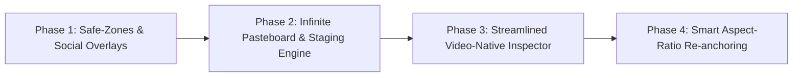

# Video-Native Design Blueprint: Transitioning from General-Purpose UI (Figma) to Video-First Design

**Author**: Video-Native Design Specialist, Motion Studio  
**Target Repository**: `MOTION-STUDIO`  
**Date**: September 2026  
**Document Status**: Definitive Engineering Blueprint & Specification  

---

## 1. Executive Summary & Mission Statement

Motion Studio's mission is to empower creators and AI agents to effortlessly build world-class, billion-dollar product motion graphics (rivaling Apple keynotes, Linear release promos, Stripe Sessions showcases, and CashApp kinetic typography).

To achieve this, Motion Studio must decisively break away from general-purpose UI design tools like Figma. Figma was engineered for **stateful, interactive, responsive web and mobile software interfaces**. When applied to motion graphics, web-design conventions introduce crippling baggage: fluid column wrapping that causes bounding boxes to glitch during animations, responsive container queries that fight fixed compositions, and interactive hover/click prototype states that have no meaning in a time-based medium.

Video design is not web design. Video design is **cinematography on a digital canvas**:
1. **Fixed-Aperture Composition**: Every frame renders to a deterministic pixel grid ($1920\times 1080$, $1080\times 1920$, etc.) at fixed frame rates ($30\text{ fps}$, $60\text{ fps}$).
2. **Temporal Dimension ($t$) over User Interaction**: Static interactive states (`:hover`, `:active`) are replaced by an immutable continuous timeline $t \in [0, T]$ driving kinetic transitions (In, Emphasis, Out).
3. **Safe-Zone & Platform UI Awareness**: Broadcast safe zones (Action Safe $90\%$, Title Safe $80\%$) and asymmetric mobile social UI overlays (TikTok, Instagram Reels, YouTube Shorts) dictate the visible focus areas. Over $44\%$ of a vertical mobile screen is obscured by native player chrome.
4. **Infinite Pasteboard Staging Ground**: The area outside the camera frame ($x < 0, y < 0, x > W, y > H$) is not empty void; it is the physical "green room" and launchpad where off-screen assets live and from which kinetic actors launch their trajectories onto the screen.

This blueprint establishes the mathematical foundations, spatial mechanics, pruned UI models, and technical architecture required to make Motion Studio the definitive video-native design environment.

---

## 2. The Paradigm Shift: Pruning Web/UI Auto-Layout Clutter

### 2.1 The Fundamental Divergence

| Architectural Dimension | General-Purpose UI (Figma / Web) | Video-Native Design (Motion Studio) |
| :--- | :--- | :--- |
| **Viewport Model** | Fluid, responsive, unbounded ($320\text{px} \to 2560\text{px}$) | Fixed-aperture camera sensor ($1920\times 1080$, $1080\times 1920$, etc.) |
| **Primary Independent Variable** | User input events (pointer clicks, hover, scroll) | Continuous deterministic time $t \in [0, T]$ |
| **State Paradigm** | Discrete interactive states (`default`, `hover`, `active`, `disabled`) | Temporal kinetic phases (`In` $\to$ `Emphasis Loop` $\to$ `Out`) |
| **Layout Dynamics** | CSS multi-column reflow, line wrapping, fluid clamp | FLIP layout morphing (`autoFit: true`), fixed bounding envelopes |
| **Spatial Isolation** | Canvas filled with dozens of independent artboards | Single physical Camera Artboard framed by an Infinite Staging Ground |
| **Boundary Discipline** | Elements clipped to frame or hidden with scrollbars | Elements purposefully staged off-screen to animate into frame |

```
┌─────────────────────────────────────────────────────────────────────────────────────────────┐
│                             THE PARADIGM RESTRUCTURING                                      │
├──────────────────────────────────────────────────────────────┬──────────────────────────────┤
│  FIGMA / WEB UI (STATEFUL & RESPONSIVE)                      │  MOTION STUDIO (VIDEO-NATIVE)│
├──────────────────────────────────────────────────────────────┼──────────────────────────────┤
│  • flex-wrap: wrap (unpredictable multi-line break jumps)    │  • 1D Fixed Arrays: Row / Col│
│  • min-width, max-width, clamp() fluid scaling               │  • Explicit Fixed Dimensions │
│  • @container & media queries (destructive layout shifts)    │  • Reactive FLIP Hugging     │
│  • :hover, :active, :focus micro-interaction noodles         │  • In / Emphasis / Out Modes │
│  • Arbitrary external margin push conflicts                  │  • Spatial Anchor Locking    │
│  • Fluid responsive layout reflow during canvas drag         │  • Deterministic Kinematics  │
└──────────────────────────────────────────────────────────────┴──────────────────────────────┘
```

---

### 2.2 The CSS / Web Layout Bloat Audit: What to Eliminate

To achieve pure, glitch-free kinetic motion, Motion Studio explicitly prunes the following web layout conventions from its Design suite:

#### 1. Elimination of Responsive Wrap (`flexWrap: 'wrap' | 'wrap-reverse'`)
* **Why Figma / Web has it**: Responsive web pages must wrap tags, cards, or pills onto subsequent lines when viewed on narrower mobile screens.
* **Why it is toxic in video**: Video resolutions never dynamically shrink while playing. If a layout container wraps during an animation (e.g. as text chunks type in or a card expands), the container jumps from 1 line to 2 lines in a single frame. This produces an ugly layout glitch, disrupts velocity curves, breaks sub-pixel GPU text hinting, and invalidates motion blur calculation vectors.
* **Video-Native Decision**: **Strict 1D Flex Arrays**. Containers are strictly `flexDirection: 'row'` or `flexDirection: 'column'` with `flexWrap: 'nowrap'`. Horizontal wrapping is strictly handled at the typography level via explicit `wordWrapWidth` or clean semantic text chunks.

#### 2. Elimination of Min / Max Container Queries (`min-width`, `max-width`, `min-height`, `max-height`, `@container`)
* **Why Figma / Web has it**: Protects layouts from collapsing or blowing out when dynamic user database content is injected.
* **Why it is toxic in video**: In motion graphics, content is static or explicitly authored. If an element's scale or dimension transition hits an arbitrary `max-width: 600px` ceiling mid-flight, the velocity profile $v(t)$ drops to 0 instantly, ruining the organic ease-out deceleration curve.
* **Video-Native Decision**: Elements have either:
  1. An explicit numeric dimension ($W, H \in \mathbb{R}^+$).
  2. Intrinsic dynamic auto-fit (`autoFit: true`) governed by FLIP bounding box envelope calculation.

#### 3. Elimination of Interactive States (`:hover`, `:active`, `:focus`, Prototyping Spaghetti)
* **Why Figma / Web has it**: Simulating human-computer interaction (button clicks, dropdown menus, focus rings).
* **Why it is toxic in video**: A video viewer cannot hover or click on a video frame. In modern tech showcase videos (Apple, Stripe, Linear), what looks like an "interaction" (a cursor clicking a button, causing a ripple or card expansion) is actually a **choreographed temporal sequence**.
* **Video-Native Decision**: Eliminate interactive pseudo-classes, variant noodles, and prototype click triggers. Instead, introduce:
  - **Emphasis Loops**: Continuous ambient oscillations (`pulse`, `heartbeat`, `float`, `shimmer`).
  - **State Transitions**: Triggered deterministically at specific timeline offsets ($t_{\text{event}}$) via keyframe tracks or preset cascades.
  - **Animated Cursor Primitives**: Dedicated mock cursors that animate along cubic-bezier paths and trigger visual changes via reactive `match` or `remap` bindings!

#### 4. Elimination of Complex 2D CSS Grid Matrices (`grid-template-areas`, `repeat(auto-fit, minmax(...))`)
* **Why Figma / Web has it**: Two-dimensional macro page layout (holy grail layouts, responsive galleries).
* **Why it is toxic in video**: CSS Grid interpolation across keyframes is notoriously poorly specified across browser engines, causes dropped frames in WebGL extraction, and prevents fine-grained stagger orchestration.
* **Video-Native Decision**: Video layouts are composed through:
  - **Freeform Canvas Absolute Positioning** ($x, y$ coordinates).
  - **1D Flexbox Containers** (Row or Column with `gap` and 9-point alignment).
  - **Reactive Constraints Engine** (`dependencyEngine.ts`): Spatial `pin` (9-point anchor), size `hug` (dynamic padding), `match` (proportional tracking), and `lag` (spring inertia).

#### 5. Elimination of Margin Bleed in Favor of Container Padding & Inset Boxes
* **Why Figma / Web has it**: CSS margins push neighboring siblings.
* **Why it is toxic in video**: Margins cause compounding spatial offsets that make off-screen entrance math unpredictable (e.g. animating $x$ from $-200\text{px}$ requires calculating all sibling margins).
* **Video-Native Decision**: Elements use strict $x, y$ offsets within parent coordinates. Container breathing room is defined strictly by internal container padding $[pad_T, pad_R, pad_B, pad_L]$.

---

## 3. Video Safe-Zones: Rigorous Mathematics & Overlays

In video production, content must be protected against physical display cropping (broadcast overscan) and interactive software overlays (social media UI rails). A title positioned in the bottom-right corner of a 9:16 frame looks perfect in Figma, but on TikTok or Instagram Reels it is completely hidden behind the Like, Comment, and Share buttons.

```
┌─────────────────────────────────────────────────────────────────────────────┐
│                       THE 9:16 MOBILE SOCIAL GAUNTLET                       │
│                                                                             │
│ ┌─────────────────────────────────────────────────────────────────────────┐ │
│ │ ⚠️ TOP STATUS & SEARCH BAR (0 - 160px)                                  │ │
│ │ [Following | For You]                           [Search 🔍]             │ │
│ ├───────────────────────────────────────────────────┬─────────────────────┤ │
│ │                                                   │ 🚫 SOCIAL RAIL      │ │
│ │                                                   │ (820px - 1680px)    │ │
│ │                                                   │ [Avatar + Follow]   │ │
│ │            ✅ ACTIVE SOCIAL FOCUS SAFE ZONE       │                     │ │
│ │                                                   │ [Heart: 142.5K]     │ │
│ │            • Bounding Box: [54, 160, 920, 1480]   │                     │ │
│ │            • Dimensions: 866px × 1320px           │ [Comments: 1,820]   │ │
│ │            • Usable Area: 55.1% of Total Frame    │                     │ │
│ │                                                   │ [Bookmark Ribbon]   │ │
│ │                                                   │                     │ │
│ │                                                   │ [Share Arrow]       │ │
│ │                                                   │                     │ │
│ │                                                   │ [Spinning Vinyl 💿] │ │
│ ├───────────────────────────────────────────────────┴─────────────────────┤ │
│ │ ⚠️ BOTTOM CAPTION, METADATA & AUDIO BAR (1480px - 1920px)               │ │
│ │ @motionstudio • Announcing Motion Studio 2.0! #motion #design           │ │
│ │ ♫ Original Audio - Motion Studio Official Sound                         │ │
│ │ [=============================================] [Home Bar Indicator]   │ │
│ └─────────────────────────────────────────────────────────────────────────┘ │
└─────────────────────────────────────────────────────────────────────────────┘
```

---

### 3.1 SMPTE & EBU Broadcast Standards

The Society of Motion Picture and Television Engineers (SMPTE ST 2046-1) and European Broadcasting Union (EBU R95) define two fundamental framing boundaries:

1. **Action Safe ($90\%$)**:
   - The area in which all essential visual action, character movement, and scene environment must take place.
   - Mathematics: Uniform $5\%$ inset from all four outer boundaries.
     $$\Delta x_{\text{action}} = 0.05 \cdot W, \quad \Delta y_{\text{action}} = 0.05 \cdot H$$
     $$X_{\text{action}} = [\Delta x_{\text{action}}, W - \Delta x_{\text{action}}], \quad Y_{\text{action}} = [\Delta y_{\text{action}}, H - \Delta y_{\text{action}}]$$
     $$W_{\text{action}} = 0.90 \cdot W, \quad H_{\text{action}} = 0.90 \cdot H$$

2. **Title Safe ($80\%$)**:
   - The critical zone in which all typography, lower-thirds, brand marks, and informational graphics must be contained to ensure zero edge clipping across all monitors.
   - Mathematics: Uniform $10\%$ inset from all four outer boundaries.
     $$\Delta x_{\text{title}} = 0.10 \cdot W, \quad \Delta y_{\text{title}} = 0.10 \cdot H$$
     $$X_{\text{title}} = [\Delta x_{\text{title}}, W - \Delta x_{\text{title}}], \quad Y_{\text{title}} = [\Delta y_{\text{title}}, H - \Delta y_{\text{title}}]$$
     $$W_{\text{title}} = 0.80 \cdot W, \quad H_{\text{title}} = 0.80 \cdot H$$

---

### 3.2 Mobile Social Media UI Exclusion Zones (9:16 Portrait $1080\times 1920$)

Mobile vertical video platforms (TikTok, Instagram Reels, YouTube Shorts) superimpose dense, non-negotiable native interface elements onto the video canvas.

#### 1. TikTok UI Geometry Breakdown ($1080\times 1920\text{ canvas}$)
* **Top Header & Notch Zone**:
  - Span: $y \in [0, 160\text{px}]$. Full width ($1080\text{px}$).
  - Contains: Device status bar (time, battery, cellular signal), front camera punch-hole/Dynamic Island, tab switcher ("LIVE", "Following", "For You", "Friends"), search icon.
  - Severity: **High**. Any title placed here is illegible.
* **Right-Hand Social Interaction Rail**:
  - Span: $x \in [920\text{px}, 1080\text{px}]$ ($\Delta x = 160\text{px}$), $y \in [820\text{px}, 1680\text{px}]$ ($\Delta y = 860\text{px}$).
  - Contains: Creator Profile Avatar ($48\times 48\text{px}$) with follow button, Like heart icon + numerical counter, Comments icon + counter, Bookmark/Favorites ribbon + counter, Share arrow + counter, Rotating music vinyl disc ($44\times 44\text{px}$) with musical notes animation.
  - Severity: **Critical**. Completely blocks buttons, text, and focal points.
* **Bottom Caption & Audio Metadata Zone**:
  - Span: $y \in [1480\text{px}, 1920\text{px}]$ ($\Delta y = 440\text{px}$), $x \in [0, 920\text{px}]$.
  - Contains: Creator handle (`@username`), multi-line description text (up to 4 lines with "See more" trigger), tagged products/prompts banner, audio track title with animated ticker, bottom navigation bar (Home, Shop, Create `+`, Inbox, Profile), iOS home indicator bar.
  - Severity: **Critical**. Text captions, subtitles, or lower-thirds placed below $y = 1480\text{px}$ will suffer $100\%$ visual collision.
* **Left Margin Buffer**:
  - Span: $x \in [0, 54\text{px}]$ along the entire vertical edge.
  - Required to avoid clipping on modern curved-corner OLED displays.
* **The TikTok Active Safe Focus Box**:
  $$x_{\min} = 54\text{px}, \quad x_{\max} = 920\text{px} \implies W_{\text{safe}} = 866\text{px}$$
  $$y_{\min} = 160\text{px}, \quad y_{\max} = 1480\text{px} \implies H_{\text{safe}} = 1320\text{px}$$
  $$\text{Effective Safe Area} = \frac{866 \times 1320}{1080 \times 1920} = \frac{1,143,120}{2,073,600} \approx 55.13\%$$

#### 2. Instagram Reels Geometry Breakdown ($1080\times 1920\text{ canvas}$)
* **Top Header**: $y \in [0, 140\text{px}]$. Contains "Reels" header, camera trigger, audio track banner.
* **Right Social Rail**: $x \in [930\text{px}, 1080\text{px}]$, $y \in [900\text{px}, 1700\text{px}]$. Contains Like, Comment, Send/Share, Remix/3-dot menu, audio thumbnail.
* **Bottom Profile & Caption**: $y \in [1520\text{px}, 1920\text{px}]$. Contains Avatar + username + "Follow", caption copy, audio pill, seek scrubber bar.
* **The Reels Active Safe Focus Box**:
  $$[x_{\min}, y_{\min}, x_{\max}, y_{\max}] = [54, 140, 930, 1520] \implies 876\text{px} \times 1380\text{px} \quad (58.3\%)$$

#### 3. YouTube Shorts Geometry Breakdown ($1080\times 1920\text{ canvas}$)
* **Top Header**: $y \in [0, 150\text{px}]$. Contains Search, Camera icon, 3-dot overflow menu.
* **Right Social Rail**: $x \in [920\text{px}, 1080\text{px}]$, $y \in [880\text{px}, 1720\text{px}]$. Contains Thumbs Up, Thumbs Down, Comments, Share, Remix.
* **Bottom Metadata**: $y \in [1500\text{px}, 1920\text{px}]$. Contains Channel name, red "Subscribe" pill button, title, audio remix link, sound waveform icon.
* **The Shorts Active Safe Focus Box**:
  $$[x_{\min}, y_{\min}, x_{\max}, y_{\max}] = [54, 150, 920, 1500] \implies 866\text{px} \times 1350\text{px} \quad (56.4\%)$$

---

### 3.3 Comprehensive Mathematical Coordinate Matrix

The table below provides exact pixel values for all framing guides across Motion Studio's 4 core aspect ratios:

| Parameter | 16:9 Landscape | 9:16 Portrait | 1:1 Square | 4:5 Social Portrait |
| :--- | :--- | :--- | :--- | :--- |
| **Canvas Dimensions ($W \times H$)** | **$1920 \times 1080$** | **$1080 \times 1920$** | **$1080 \times 1080$** | **$1080 \times 1350$** |
| **Aspect Ratio Decimal** | $1.778$ | $0.5625$ | $1.000$ | $0.800$ |
| **Target Platforms** | YouTube, Web, TV, Desktop | TikTok, Reels, Shorts | Instagram Grid, X, LinkedIn | Instagram Feed Vertical |
| **Action Safe ($90\%$) Insets** | $x \pm 96\text{px},\; y \pm 54\text{px}$ | $x \pm 54\text{px},\; y \pm 96\text{px}$ | $x \pm 54\text{px},\; y \pm 54\text{px}$ | $x \pm 54\text{px},\; y \pm 68\text{px}$ |
| **Action Safe Bounds** | $[96, 54, 1824, 1026]$ | $[54, 96, 1026, 1824]$ | $[54, 54, 1026, 1026]$ | $[54, 68, 1026, 1282]$ |
| **Action Safe Size** | $1728 \times 972\text{px}$ | $972 \times 1728\text{px}$ | $972 \times 972\text{px}$ | $972 \times 1214\text{px}$ |
| **Title Safe ($80\%$) Insets** | $x \pm 192\text{px},\; y \pm 108\text{px}$| $x \pm 108\text{px},\; y \pm 192\text{px}$| $x \pm 108\text{px},\; y \pm 108\text{px}$| $x \pm 108\text{px},\; y \pm 135\text{px}$|
| **Title Safe Bounds** | $[192, 108, 1728, 972]$ | $[108, 192, 972, 1728]$ | $[108, 108, 972, 972]$ | $[108, 135, 972, 1215]$ |
| **Title Safe Size** | $1536 \times 864\text{px}$ | $864 \times 1536\text{px}$ | $864 \times 864\text{px}$ | $864 \times 1080\text{px}$ |
| **Rule of Thirds: $X_1, X_2$** | $640\text{px},\; 1280\text{px}$ | $360\text{px},\; 720\text{px}$ | $360\text{px},\; 720\text{px}$ | $360\text{px},\; 720\text{px}$ |
| **Rule of Thirds: $Y_1, Y_2$** | $360\text{px},\; 720\text{px}$ | $640\text{px},\; 1280\text{px}$ | $360\text{px},\; 720\text{px}$ | $450\text{px},\; 900\text{px}$ |
| **Geometric Center ($X_c, Y_c$)** | $(960, 540)$ | $(540, 960)$ | $(540, 540)$ | $(540, 675)$ |
| **Optical Center ($X_c, 0.46H$)** | $(960, 497)$ | $(540, 883)$ | $(540, 497)$ | $(540, 621)$ |
| **Platform Overlay Exclusion** | Bottom progress bar ($y > 990$) | Social Focus Box: $[54, 160, 920, 1480]$ | Audio button at top-right ($48\text{px}$) | **1:1 Profile Crop**: $y \in [135, 1215]$ |

> [!IMPORTANT]
> **The 4:5 Instagram Profile Grid Crop Warning**:
> In Instagram's feed, a 4:5 video displays at full $1080\times 1350$. However, on the creator's profile grid, it is cropped to a centered 1:1 square ($1080\times 1080$). The top $135\text{px}$ ($y \in [0, 135]$) and bottom $135\text{px}$ ($y \in [1215, 1350]$) are sliced off! 
> Notice that the uncropped profile area ($y \in [135, 1215]$) matches Motion Studio's **Title Safe** boundary for 4:5 exactly. Following Title Safe guarantees your cover thumbnail looks immaculate on Instagram profile grids.

---

### 3.4 Composition Grids & Center Reticles

#### 1. Rule of Thirds & Crash Points
The composition is divided into 9 equal rectangles by two horizontal and two vertical lines at $1/3$ and $2/3$ intervals.
* The 4 intersections are **Crash Points** (visual power centers).
* In kinetic design, hero focal points (e.g. avatar badge, metric stat counter, primary logo) should rest on or animate between these crash points to maintain cinematic tension.

#### 2. Dual-Contrast Center Reticle
* Physical Center $(W/2, H/2)$ is marked with a precision optical crosshair:
  - Central dead-ring diameter: $12\text{px}$ (prevents obscuring central text).
  - Four orthogonal arms: length $24\text{px}$, stroke width $1.5\text{px}$.
  - Color styling: High-contrast dual stroke—inner hairline white (`#FFFFFF`) encased in a $1\text{px}$ black drop-shadow outline (`#000000`). This ensures $100\%$ visibility whether over pitch-black OLED backgrounds (`#09090b`) or bright linen canvases (`#f5f0e8`).

---

## 4. Fixed Aspect-Ratio Compositions & Artboard Architecture

### 4.1 The Artboard as the Physical Camera Sensor

In web UI design, an "artboard" or "frame" is a lightweight container. Designers routinely draw 50 frames of arbitrary sizes on a single canvas.

In Motion Studio, the **Artboard is the Physical Camera Sensor / Virtual Lens**:
* The Artboard represents the exact spatial raster that the WebGL/WebGPU pipeline extracts and feeds to FFmpeg during video rendering.
* There is **one primary active Artboard per Screen**.
* All visual layers inside the Artboard are camera actors.
* The Artboard frame has immutable physical boundaries ($0 \le x \le W, 0 \le y \le H$).

```
                      THE INFINITE STAGING GROUND
 ┌────────────────────────────────────────────────────────────────────────────┐
 │  PARKED SCRATCHPAD ASSETS                 OFF-SCREEN ENTRANCE LAUNCHPAD    │
 │  ┌──────────────┐                         ┌───────────────────┐            │
 │  │ Alternate    │                         │ Hero Chat Bubble  │ ────────┐  │
 │  │ Color Palette│                         │ (Slides in at 0.5s│         │  │
 │  └──────────────┘                         └───────────────────┘         │  │
 │                                                                         │  │
 │                ┌──────────────────────────────────────────┐             │  │
 │                │  CAMERA ARTBOARD (1920 × 1080)           │             │  │
 │                │                                          │             ▼  │
 │                │   ┌──────────────────────────────────┐   │         [Screen]
 │                │   │ Title Safe (80%)                 │   │            │   │
 │                │   │                                  │   │            │   │
 │                │   │         Resting State ◄──────────┼───┼────────────┘   │
 │                │   │                                  │   │                │
 │                │   └──────────────────────────────────┘   │                │
 │                │                                          │                │
 │                └──────────────────────────────────────────┘                │
 │                                                                            │
 │  UNRENDERED STORYBOARD VARIATIONS         OFF-SCREEN EXIT STAGE            │
 └────────────────────────────────────────────────────────────────────────────┘
```

---

### 4.2 Behavior During Aspect Ratio Switching

When a creator or AI agent switches aspect ratios (e.g. converting a 16:9 desktop showcase to a 9:16 mobile reel), the Artboard undergoes a deterministic reframing transformation:

#### 1. Invariant Center Anchor Reframing
* Let old dimensions be $(W_0, H_0)$ with center $C_0 = (W_0/2, H_0/2)$.
* Let new dimensions be $(W_1, H_1)$ with center $C_1 = (W_1/2, H_1/2)$.
* Spatial offset applied to centered layers:
  $$\Delta x = \frac{W_1 - W_0}{2}, \quad \Delta y = \frac{H_1 - H_0}{2}$$
* Layers with center bindings or center alignment automatically preserve their focal position relative to the camera lens.

#### 2. Constraint Engine Recalculation
* Layers linked via **Spatial Pin (`pin`)** to screen anchors (e.g. pinned to `top-left` with $[24, 24]$ offset, or `bottom-center` with $[0, -48]$ offset) automatically compute their new world coordinates instantaneously:
  $$x_{\text{pin}} = \text{Anchor}_X(W_1) + dx, \quad y_{\text{pin}} = \text{Anchor}_Y(H_1) + dy$$
* Layers linked via **Size Hug (`hug`)** adjust their envelopes dynamically.

#### 3. Spatial Pasteboard Classification Sweep
* The store immediately executes `isLayerOnArtboard(layer, W_1, H_1)`.
* Layers that were previously inside the 1920 width but fall outside the new 1080 portrait width are automatically categorized into the **Staging Pasteboard** list in the left sidebar, preventing accidental out-of-frame ghost renders.

---

### 4.3 Visual Framing: The 75% Dark Camera Matte

To deliver pristine focus, Motion Studio implements a dual-mode visual framing treatment:

1. **DESIGN Mode**:
   - The camera artboard is bounded by a crisp $1\text{px}$ high-contrast border (`rgba(255, 255, 255, 0.15)`) and deep drop shadow (`0 25px 60px -15px rgba(0, 0, 0, 0.9)`).
   - The infinite pasteboard is fully visible at normal opacity, allowing effortless drag-and-drop asset management and scratchpad composition.
   - Safe-zone guides are displayed based on user toggles.

2. **MOTION Mode**:
   - The infinite pasteboard is blanketed by a **75% dark camera matte overlay**:
     $$\text{box-shadow: } 0\; 0\; 0\; 9999\text{px } \text{rgba}(9, 9, 11, 0.75)$$
   - The active camera artboard enforces `overflow: hidden`.
   - The viewport isolates the physical camera frame 1:1, showing exactly what will be written to disk during MP4 export.

---

## 5. Infinite Pasteboard Staging vs. Artboard Camera Frame

### 5.1 The Staging Ground ("Green Room") Concept

In traditional web design tools, placing an element off the artboard is considered an accident or sloppy workspace hygiene. In motion graphics, **the off-screen pasteboard is an essential production stage**.

Consider an Apple-style kinetic title card:
1. At $t = 0.0\text{s}$, the title is physically located at $x = -600\text{px}$ (completely outside the left camera edge).
2. At $t = 0.4\text{s}$, the title launches across the boundary with high velocity ($v_0$).
3. At $t = 1.0\text{s}$, the title decelerates smoothly into its resting position at $x = 240\text{px}$ inside Title Safe.

If the authoring tool forces everything into artboard bounds or auto-deletes off-screen layers, authoring entrance and exit choreography becomes impossible!

---

### 5.2 Asset Classification: Scratchpad vs. Staged Actor

Motion Studio establishes a clear architectural distinction between the two types of off-screen elements:

```
┌─────────────────────────────────────────────────────────────────────────────────────────────┐
│                            OFF-SCREEN ASSET TAXONOMY                                        │
├─────────────────────────────────────────────┬───────────────────────────────────────────────┤
│  1. PARKED SCRATCHPAD ASSETS                │  2. STAGED ACTOR LAYERS (KINETIC ENTRANTS)    │
├─────────────────────────────────────────────┼───────────────────────────────────────────────┤
│  • Intention: Reference materials, draft    │  • Intention: Elements that physically enter  │
│    copy, alternate color variants, icons.   │    or cross the camera frame during video.    │
│  • Timeline Status: EXCLUDED from timeline. │  • Timeline Status: INCLUDED on timeline.     │
│  • Does NOT trigger render pipeline passes. │  • Evaluated frame-by-frame by Theatre.js.    │
│  • Marked with muted icon in Left Sidebar.  │  • Displays ghosted trajectory vector arrow   │
│  • Action: "Stage as Actor 🎬" to activate. │    pointing to resting destination.           │
└─────────────────────────────────────────────┴───────────────────────────────────────────────┘
```

#### The Geometric & Temporal Sweep:
An element is automatically classified as a **Staged Actor** if:
1. Its bounding box intersects the Artboard at its resting coordinates: `isLayerOnArtboard(layer, W, H) === true`. **OR**
2. It possesses an active animation preset (`layer.animation.in` or `layer.animation.out`) whose trajectory enters the artboard boundaries. **OR**
3. The user explicitly clicked **"Stage as Actor (Send to Timeline)"**.

All other off-screen elements remain **Parked Scratchpad Assets**, preserving a clean, clutter-free timeline sequencer.

---

### 5.3 Visual Feedback: Ghosted Launch Vectors in MOTION Mode

When working in MOTION mode, an animator or AI agent scrubbing the timeline needs to understand where an incoming actor is launching from.

* When a staged actor layer is selected in MOTION mode, even if its current position at playhead time $t$ is outside the camera frame in the dark matte:
  1. A high-contrast cyan dashed wireframe ($1\text{px}$ `#06b6d4`) outlines its off-screen location.
  2. A glowing Bézier trajectory vector arrow draws across the canvas from its off-screen origin $(x_{\text{start}}, y_{\text{start}})$ to its on-screen resting destination $(x_{\text{rest}}, y_{\text{rest}})$.
  3. The animator can directly drag the off-screen handle to adjust the launch angle and entrance distance interactively!

---

## 6. Concrete UI Mockups & Inspector Layout for the DESIGN Suite

### 6.1 Studio Chrome & Workspace Architecture

```
┌──────────────────────────────────────────────────────────────────────────────────────────────────────────────────┐
│ [Logo] Untitled-1  [ DESIGN | MOTION | 3D Soon | EDITOR Soon ]   [16:9 Landscape ▾]  [⊞ Guides ▾] [Send to Motion 🎬] [Export]│
├──────────────────────┬─────────────────────────────────────────────────────────────────────┬─────────────────────┤
│ LAYERS & STAGING     │ CANVAS VIEWPORT                                                     │ DESIGN INSPECTOR    │
├──────────────────────┤                                                                     ├─────────────────────┤
│ ▾ 🎬 Artboard (4)    │      [ Artboard Header: 16:9 Landscape (1920 × 1080) ]              │ ⊞ CANVAS & FRAME    │
│   ▸ Group Hero Card  │ ┌─────────────────────────────────────────────────────────────────┐ │ Preset: [16:9 Land ▾]│
│     Chunk 1 "Hey"    │ │  Action Safe (90%) -----------------------------------------┐   │ │ W: [1920] H: [1080] │
│     Chunk 2 "Team"   │ │  │ Title Safe (80%) -------------------------------------┐  │   │ │ FPS: [60]  Dur: 5.0s│
│     Pill Badge       │ │  │ │                                                     │  │   │ ├─────────────────────┤
│                      │ │  │ │       Rule of Thirds Crash Point                    │  │   │ 📐 SAFE-ZONE GUIDES │
│ ▾ 🗄️ Pasteboard (2)   │ │  │ │           ●                      ●                 │  │   │ [x] Title Safe (80%)│
│   • Scratch Logo     │ │  │ │                                                     │  │   │ [x] Action Safe(90%)│
│   • Staged Actor 🎬  │ │  │ │                     + Center Reticle                │  │   │ [x] Rule of Thirds  │
│                      │ │  │ │                                                     │  │   │ [ ] Social Overlay ▾│
│                      │ │  │ │           ●                      ●                 │  │   │     (TikTok / Reels)│
│                      │ │  │ └─────────────────────────────────────────────────────┘  │   │ ├─────────────────────┤
│                      │ │  └──────────────────────────────────────────────────────────┘   │ │ 🎨 BACKGROUND     │
│                      │ └─────────────────────────────────────────────────────────────────┘ │ Color: [#09090b    ]│
├──────────────────────┴─────────────────────────────────────────────────────────────────────┴─────────────────────┤
│ 💡 DESIGN MODE: Layout, typography, & staging active. Switch to MOTION mode to animate timings.                   │
└──────────────────────────────────────────────────────────────────────────────────────────────────────────────────┘
```

---

### 6.2 The Top Navigation Bar

The Top Navigation Bar serves as the mission control for the 4-stage pipeline and framing parameters:

1. **Brand & Document Identity**: Logo + editable project name with live auto-save cloud sync indicator (`Saved`).
2. **The 4-Suite Segmented Switcher**:
   - `[ DESIGN | MOTION | 3D (Soon) | EDITOR (Soon) ]`
   - Instant 1-click toggle between static staging layout (`DESIGN`) and temporal sequencing (`MOTION`).
3. **Screen Format Switcher Dropdown**:
   - Displays current aspect ratio with platform badges:
     - `16:9 Landscape` (1920×1080) — YouTube & Presentation
     - `9:16 Portrait` (1080×1920) — TikTok, Reels & Shorts
     - `1:1 Square` (1080×1080) — Instagram Grid & Social Feed
     - `4:5 Social` (1080×1350) — Instagram Feed Vertical
4. **Guides & Overlays Dropdown (`[ ⊞ Guides ▾ ]`)**:
   - Multi-select toggle menu:
     - `✓ Action Safe (90%)` (Green dashed outline)
     - `✓ Title Safe (80%)` (Stamp Gold dashed outline)
     - `✓ Rule of Thirds` (Cyan 1px grid with crash point dots)
     - `✓ Center Crosshair` (Precision optical reticle)
     - `✓ Social UI Overlay` $\to$ Submenu: `TikTok` | `Instagram Reels` | `YouTube Shorts`
     - `Letterbox Matte` $\to$ Submenu: `2.39:1 Anamorphic` | `1.85:1 DCI`
5. **Zoom & View HUD**:
   - Zoom level dropdown (`50%`, `65%`, `100%`, `200%`, `Zoom to Fit [Shift+1]`, `Zoom to Selection [Shift+2]`).
6. **Actions**:
   - `[ Send to Motion 🎬 ]` (Promotes active artboard layers to the timeline sequencer).
   - `[ Export ▾ ]` (Triggers MP4 / WebM / `.motion` bundle modal).

---

### 6.3 The Left Sidebar: Artboard vs. Pasteboard Segregation

The layer tree automatically groups layers based on their spatial relationship to the camera:

```
┌────────────────────────────────────────────────────────┐
│ LAYERS & STAGING                                       │
├────────────────────────────────────────────────────────┤
│ ▾ 🎬 Camera Artboard (4)                [+ Add Layer]  │
│   ▾ 📦 Hero Card [Auto-Fit Row]          👁️  🔒       │
│       T "Hey Team"                       👁️  🔒       │
│       T "Something big is coming"        👁️  🔒       │
│       🔘 Pill Badge [📍 Pinned]          👁️  🔒       │
│                                                        │
│ ▾ 🗄️ Staging Pasteboard (3)                            │
│   ▸ 🎬 Floating Sparkle [Actor: Enters t=1.2s] 👁️  🔒 │
│   • 📄 Scratchpad Notes                  👁️  🔒       │
│   • 🖼️ Alternate Logo Dark.svg           👁️  🔒       │
├────────────────────────────────────────────────────────┤
│ 🔗 Active Scene Bindings (2)                           │
│   • Hero Card 📐 Hugs Text                             │
│   • Pill Badge 📍 Pinned to Hero Card TR               │
└────────────────────────────────────────────────────────┘
```

* **Interactive Drag-and-Drop**: Dragging an asset from `Staging Pasteboard` into `Camera Artboard` repositions its spatial coordinates onto the screen and registers it for animation.
* **Badges**:
  - `🎬 Actor`: Indicates an off-screen layer scheduled to enter the frame.
  - `📍 Pinned`: Indicates a layer bound to another via reactive constraints.
  - `📐 Hug`: Indicates a container with FLIP auto-fit enabled.

---

### 6.4 The Redesigned Video-Native DESIGN Inspector

When a layer is selected in DESIGN mode, the Right Inspector provides **6 clean, focused panels**, stripped of web layout bloat and optimized for motion graphics:

```
┌────────────────────────────────────────────────────────┐
│ DESIGN INSPECTOR                                       │
├────────────────────────────────────────────────────────┤
│ 1. LAYER IDENTITY & ACTIONS                            │
│ [Group: Hero Card]                   👁️  🔒  📋  🗑️     │
├────────────────────────────────────────────────────────┤
│ 2. SPATIAL TRANSFORM & PIVOT ANCHOR                    │
│   Position:                                            │
│   X [ 240px ]             Y [ 480px ]                  │
│   Dimensions:                                          │
│   W [ 600px ]    [🔗]     H [ auto  ]                  │
│   Rotation:                                            │
│   ∠ [ 0°    ]             [ ↷ 90° ] [ ⇋ Flip ]         │
│   Pivot / Origin Point:                                │
│   ┌───┬───┬───┐  Selected: Center (0.5, 0.5)           │
│   │ ◸ │ ⊼ │ ◹ │  • Defines scale & rotation center    │
│   ├───┼───┼───┤  • Invariant anchor for motion presets │
│   │ ⊲ │ ● │ ⊳ │                                        │
│   ├───┼───┼───┤                                        │
│   │ ⿕ │ ⊻ │ ⿖ │                                        │
│   └───┴───┴───┘                                        │
├────────────────────────────────────────────────────────┤
│ 3. KINETIC LAYOUT & FLIP MORPHING                      │
│   Layout Type:   [ None (Freeform) | Flex Container ]  │
│   Direction:     [ ➔ Row ]   [ ⬇ Column ]              │
│   Alignment:     9-Point Matrix [Center-Center]        │
│   Gap: [ 16px ]  Padding: [ 32px ] [⛶ 4-Side Expand]   │
│   [✓] Auto-Fit Background (FLIP Morph)      [ HUG ]    │
│   [✓] Clip Content (Mask Child Overflow)   [CLIPPED]   │
├────────────────────────────────────────────────────────┤
│ 4. TYPOGRAPHY (When Text Selected)                     │
│   Font: [ Inter ▾ ]       Weight: [ Bold 700 ▾ ]       │
│   Size: [ 64px ]          Line H: [ 1.1x ]             │
│   Tracking: [ -0.02em ]   Align:  [ ≡ Center ]         │
│   Split Text: [ Right-Click ➔ Split (Ctrl+Shift+S) ]  │
├────────────────────────────────────────────────────────┤
│ 5. APPEARANCE & SHADERS                                │
│   Fill: [ ⬛ #18181b ]    Opacity: [ 100% ]            │
│   Corner Radius: [ 24px ] [⛶ 4-Corner: 24,24,24,24]    │
│   Border: [ 1px ] [ Solid ▾ ] Color: [ rgba(255..0.1) ]│
│   Drop Shadow: [ + Add Shadow ]                        │
│     [ Y: 12px, Blur: 32px, Color: rgba(0,0,0,0.5) ]   │
│   GPU Shaders:                                         │
│     [ ] Bloom Filter      [ ] Layer Glow               │
├────────────────────────────────────────────────────────┤
│ 6. LINKED DEPENDENCIES (🔗)                            │
│   [ + Link to Element ▾ ]                              │
│   • 📍 Pin: Target [TL] ➔ Driver [TR] + [12, 0]        │
│   • 📐 Hug: Target resizes to wrap Driver + [24, 16]   │
└────────────────────────────────────────────────────────┘
```

#### Detailed Breakdown of Video-Native Inspector Panels:

1. **Pivot / Origin Point Matrix (9-Point Grid)**:
   - In web design, `transform-origin` is rarely exposed. In motion graphics, **the pivot anchor is everything**.
   - An element popping in with scale $0 \to 1$ from its `bottom-center` appears to grow out of the ground; popping in from `center` expands from its heart; rotating from `top-left` swings like a pendulum.
   - The interactive 9-point grid allows instant selection of $(\text{pivotX}, \text{pivotY}) \in \{0, 0.5, 1\}^2$.
2. **Kinetic Layout with FLIP Auto-Fit**:
   - Clean Row vs. Column toggles with pixel gap.
   - `Auto-Fit Background (FLIP)` toggle: When active, the background container hugs child bounds smoothly as text chunks or badges reveal sequentially during animation.
   - `Clip Content (Mask)`: Enables hardware-accelerated clipping to mask incoming text slide-ups (the signature Apple keynote text mask wipe).
3. **4-Corner Independent Border Radius**:
   - Uniform scrubber plus 4-value expansion (`TL`, `TR`, `BR`, `BL`).
   - Essential for asymmetric chat bubbles (`[18, 18, 4, 18]`), browser mockups, and pill tabs.
4. **Driver-Driven Constraints (`BindingsSection.tsx`)**:
   - Exposes Motion Studio's 5 linking modes (`pin`, `hug`, `match`, `remap`, `lag`).

---

## 7. Technical Architecture & Data Model Blueprints

### 7.1 Schema Extensions (`src/types/scene.ts`)

To support safe-zones, guides, and pivot anchors natively in `scene.json`, the following declarative extensions are defined:

```typescript
// --- SAFE-ZONE & GUIDE TYPES ---

export type SafeZonePreset = 'broadcast' | 'tiktok' | 'reels' | 'shorts' | 'none';

export interface SafeZoneConfig {
  actionSafe: boolean;      // 90% broadcast action safe
  titleSafe: boolean;       // 80% broadcast title safe
  ruleOfThirds: boolean;    // 3x3 grid with crash points
  centerCrosshair: boolean; // Optical dual-contrast reticle
  socialOverlay: 'none' | 'tiktok' | 'reels' | 'shorts';
  socialOverlayOpacity: number; // 0.0 to 1.0 (default 0.7)
  anamorphicMatte?: '2.39:1' | '1.85:1' | 'none';
}

// --- EXTENDED PROJECT SETTINGS ---

export interface ProjectSettings {
  width: number;
  height: number;
  fps: number;
  duration: number;
  backgroundColor: string;
  palette?: string[];
  safeZones?: SafeZoneConfig; // Active viewport guide settings
}

// --- PIVOT ANCHOR IN LAYER STYLE ---

export interface LayerStyle {
  // Spatial Coordinates
  x: number;
  y: number;
  width: number | 'auto';
  height: number | 'auto';
  
  // Transform & Kinematics
  rotation: number;         // in degrees
  scaleX?: number;          // default 1.0
  scaleY?: number;          // default 1.0
  pivotX?: number;          // 0.0 (left), 0.5 (center), 1.0 (right)
  pivotY?: number;          // 0.0 (top), 0.5 (center), 1.0 (bottom)
  
  // Appearance, Shaders, Typography (existing)
  // ...
}
```

---

### 7.2 SafeZoneOverlay Component Blueprint (`SafeZoneOverlay.tsx`)

An ultra-performant, zero-cost SVG overlay rendered directly inside the Artboard frame in `ScreenRenderer.tsx`:

```tsx
import React from 'react';
import { SafeZoneConfig } from '@/types/scene';

interface SafeZoneOverlayProps {
  width: number;
  height: number;
  config: SafeZoneConfig;
}

export const SafeZoneOverlay: React.FC<SafeZoneOverlayProps> = ({
  width,
  height,
  config,
}) => {
  // 1. SMPTE Calculations
  const actionX = width * 0.05;
  const actionY = height * 0.05;
  const actionW = width * 0.90;
  const actionH = height * 0.90;

  const titleX = width * 0.10;
  const titleY = height * 0.10;
  const titleW = width * 0.80;
  const titleH = height * 0.80;

  // 2. Rule of Thirds
  const x1 = width / 3;
  const x2 = (width * 2) / 3;
  const y1 = height / 3;
  const y2 = (height * 2) / 3;

  // 3. Center
  const cx = width / 2;
  const cy = height / 2;

  return (
    <svg
      className="absolute inset-0 pointer-events-none z-50 overflow-visible"
      width={width}
      height={height}
      viewBox={`0 0 ${width} ${height}`}
    >
      {/* ACTION SAFE (90%) - Green Dashed */}
      {config.actionSafe && (
        <rect
          x={actionX}
          y={actionY}
          width={actionW}
          height={actionH}
          fill="none"
          stroke="#22c55e"
          strokeWidth="1.5"
          strokeDasharray="6 4"
          opacity={0.65}
        />
      )}

      {/* TITLE SAFE (80%) - Stamp Gold Dashed */}
      {config.titleSafe && (
        <rect
          x={titleX}
          y={titleY}
          width={titleW}
          height={titleH}
          fill="none"
          stroke="#e8c547"
          strokeWidth="1.5"
          strokeDasharray="6 4"
          opacity={0.75}
        />
      )}

      {/* RULE OF THIRDS - Cyan Hairlines & Crash Points */}
      {config.ruleOfThirds && (
        <g stroke="#06b6d4" strokeWidth="1" opacity={0.4}>
          <line x1={x1} y1={0} x2={x1} y2={height} />
          <line x1={x2} y1={0} x2={x2} y2={height} />
          <line x1={0} y1={y1} x2={width} y2={y1} />
          <line x1={0} y1={y2} x2={width} y2={y2} />
          
          {/* 4 Crash Points */}
          {[[x1, y1], [x2, y1], [x1, y2], [x2, y2]].map(([px, py], i) => (
            <circle key={i} cx={px} cy={py} r={4} fill="#06b6d4" opacity={0.8} />
          ))}
        </g>
      )}

      {/* CENTER CROSSHAIR - Dual-Contrast Reticle */}
      {config.centerCrosshair && (
        <g>
          {/* Black shadow outline */}
          <circle cx={cx} cy={cy} r={6} fill="none" stroke="#000000" strokeWidth="2.5" opacity={0.8} />
          <line x1={cx - 18} y1={cy} x2={cx - 6} y2={cy} stroke="#000000" strokeWidth="2.5" />
          <line x1={cx + 6} y1={cy} x2={cx + 18} y2={cy} stroke="#000000" strokeWidth="2.5" />
          <line x1={cx} y1={cy - 18} x2={cx} y2={cy - 6} stroke="#000000" strokeWidth="2.5" />
          <line x1={cx} y1={cy + 6} x2={cx} y2={cy + 18} stroke="#000000" strokeWidth="2.5" />
          
          {/* White foreground */}
          <circle cx={cx} cy={cy} r={6} fill="none" stroke="#ffffff" strokeWidth="1.5" />
          <line x1={cx - 18} y1={cy} x2={cx - 6} y2={cy} stroke="#ffffff" strokeWidth="1.5" />
          <line x1={cx + 6} y1={cy} x2={cx + 18} y2={cy} stroke="#ffffff" strokeWidth="1.5" />
          <line x1={cx} y1={cy - 18} x2={cx} y2={cy - 6} stroke="#ffffff" strokeWidth="1.5" />
          <line x1={cx} y1={cy + 6} x2={cx} y2={cy + 18} stroke="#ffffff" strokeWidth="1.5" />
        </g>
      )}
    </svg>
  );
};
```

---

### 7.3 SocialOverlayTemplate Component Blueprint (`SocialOverlayTemplate.tsx`)

A pixel-accurate silhouette overlay projecting native TikTok, Instagram Reels, and YouTube Shorts UI directly over 9:16 canvases:

```tsx
import React from 'react';

interface SocialOverlayTemplateProps {
  platform: 'tiktok' | 'reels' | 'shorts';
  opacity?: number;
}

export const SocialOverlayTemplate: React.FC<SocialOverlayTemplateProps> = ({
  platform,
  opacity = 0.65,
}) => {
  return (
    <div
      className="absolute inset-0 pointer-events-none select-none z-40 overflow-hidden font-sans text-white"
      style={{ opacity }}
    >
      {/* 1. TOP STATUS & HEADER SHADING */}
      <div className="absolute top-0 left-0 right-0 h-[160px] bg-gradient-to-b from-black/70 to-transparent p-6 flex justify-between items-start">
        <span className="text-sm font-semibold tracking-wide">9:41</span>
        <div className="flex gap-4 text-xs font-semibold uppercase tracking-wider text-white/80">
          <span>Following</span>
          <span className="text-white border-b-2 border-white pb-0.5">For You</span>
        </div>
        <div className="w-5 h-5 rounded-full border border-white/40 flex items-center justify-center text-[10px]">
          🔍
        </div>
      </div>

      {/* 2. RIGHT-SIDE INTERACTION RAIL */}
      <div className="absolute right-3 bottom-[220px] flex flex-col items-center gap-5 w-[68px]">
        {/* Profile Avatar */}
        <div className="relative mb-2">
          <div className="w-12 h-12 rounded-full border-2 border-white bg-zinc-700 overflow-hidden" />
          <div className="absolute -bottom-1.5 left-1/2 -translate-x-1/2 w-4 h-4 rounded-full bg-red-500 text-white text-[10px] flex items-center justify-center font-bold">
            +
          </div>
        </div>

        {/* Like Heart */}
        <div className="flex flex-col items-center">
          <div className="w-9 h-9 rounded-full bg-black/40 backdrop-blur-xs flex items-center justify-center text-lg">
            ❤️
          </div>
          <span className="text-[11px] font-semibold mt-0.5">142.5K</span>
        </div>

        {/* Comments */}
        <div className="flex flex-col items-center">
          <div className="w-9 h-9 rounded-full bg-black/40 backdrop-blur-xs flex items-center justify-center text-lg">
            💬
          </div>
          <span className="text-[11px] font-semibold mt-0.5">1,820</span>
        </div>

        {/* Bookmark */}
        <div className="flex flex-col items-center">
          <div className="w-9 h-9 rounded-full bg-black/40 backdrop-blur-xs flex items-center justify-center text-lg">
            🔖
          </div>
          <span className="text-[11px] font-semibold mt-0.5">34.1K</span>
        </div>

        {/* Share */}
        <div className="flex flex-col items-center">
          <div className="w-9 h-9 rounded-full bg-black/40 backdrop-blur-xs flex items-center justify-center text-lg">
            ➔
          </div>
          <span className="text-[11px] font-semibold mt-0.5">Share</span>
        </div>

        {/* Rotating Audio Disc */}
        <div className="w-10 h-10 rounded-full bg-zinc-900 border border-white/20 flex items-center justify-center text-xs mt-2 animate-spin duration-3000">
          💿
        </div>
      </div>

      {/* 3. BOTTOM CAPTION, METADATA & AUDIO BAR */}
      <div className="absolute bottom-0 left-0 right-0 h-[380px] bg-gradient-to-t from-black/90 via-black/40 to-transparent p-6 flex flex-col justify-end">
        <div className="max-w-[760px] space-y-2">
          <div className="flex items-center gap-2">
            <span className="font-bold text-sm">@motionstudio</span>
            <span className="bg-white/20 text-[10px] px-1.5 py-0.5 rounded-xs">Creator</span>
          </div>
          <p className="text-xs text-white/90 leading-relaxed line-clamp-3">
            Announcing Motion Studio 2.0! The AI-native motion graphics suite for Apple & Linear caliber showcase videos. 🚀 #motion #design #animation
          </p>
          <div className="flex items-center gap-2 text-xs text-white/80 font-medium">
            <span>♫</span>
            <span className="truncate">Original Sound - Motion Studio Audio Official</span>
          </div>
        </div>

        {/* Home Bar Indicator */}
        <div className="w-32 h-1 bg-white/60 rounded-full mx-auto mt-6 mb-1" />
      </div>

      {/* 4. ACTIVE SOCIAL FOCUS BOX OUTLINE */}
      <div
        className="absolute border-2 border-dashed border-red-500/60 pointer-events-none rounded-xs"
        style={{
          top: '160px',
          left: '54px',
          width: '866px',
          height: '1320px',
        }}
      >
        <span className="absolute top-2 left-2 bg-red-500/80 text-white text-[10px] px-1.5 py-0.5 rounded font-mono font-bold tracking-wider">
          SAFE FOCUS ZONE (866 × 1320)
        </span>
      </div>
    </div>
  );
};
```

---

## 8. Summary & Phased Implementation Roadmap



### Phase 1: Safe-Zones & Platform Overlays
- **Milestone 1.1**: Integrate `SafeZoneConfig` into `ProjectSettings` in `src/types/scene.ts`.
- **Milestone 1.2**: Implement `SafeZoneOverlay.tsx` (SVG Action Safe, Title Safe, Rule of Thirds, Center Reticle).
- **Milestone 1.3**: Implement `SocialOverlayTemplate.tsx` (TikTok, Instagram Reels, YouTube Shorts exclusion zones).
- **Milestone 1.4**: Add `[ ⊞ Guides ▾ ]` dropdown to `TopNavBar.tsx` and artboard header in `ScreenRenderer.tsx`.

### Phase 2: Infinite Pasteboard & Staging Engine
- **Milestone 2.1**: Refine `isLayerOnArtboard` and off-screen actor detection in `useProjectStore.ts`.
- **Milestone 2.2**: Update Left Sidebar (`LeftSidebar.tsx`) to clearly separate **Camera Artboard** from **Staging Pasteboard** with drag-and-drop reassignment.
- **Milestone 2.3**: Implement ghosted trajectory vector overlays (`TrajectoryOverlay.tsx`) for off-screen incoming actors when selected in MOTION mode.

### Phase 3: Streamlined Video-Native Inspector
- **Milestone 3.1**: Implement the 9-point Pivot / Origin Point Matrix in `DesignInspector.tsx` and wire to `layer.style.pivotX`, `layer.style.pivotY`.
- **Milestone 3.2**: Remove web auto-layout bloat (disallow wrapping, remove min/max inputs, enforce clean 1D flex and freeform groups).
- **Milestone 3.3**: Elevate 4-corner border radius, FLIP auto-fit hugging, and clip content masking into first-class controls.

### Phase 4: Smart Aspect-Ratio Re-anchoring Engine
- **Milestone 4.1**: Upgrade format switcher in `TopNavBar.tsx` and `ScreenRenderer.tsx` with center-invariant and constraint-aware re-anchoring.
- **Milestone 4.2**: Automate 4:5 Instagram Profile Grid 1:1 warning guides.

---

## 9. Conclusion

Transitioning Motion Studio from general-purpose UI conventions to Video-Native Design elevates the application into an authentic motion graphics powerhouse. By eliminating responsive web bloat, introducing mathematically rigorous broadcast and social safe zones, treating the infinite pasteboard as a physical staging ground, and providing an inspector optimized for cinematographic composition, Motion Studio provides humans and AI agents with the exact tools needed to craft industry-leading product showcase videos.
